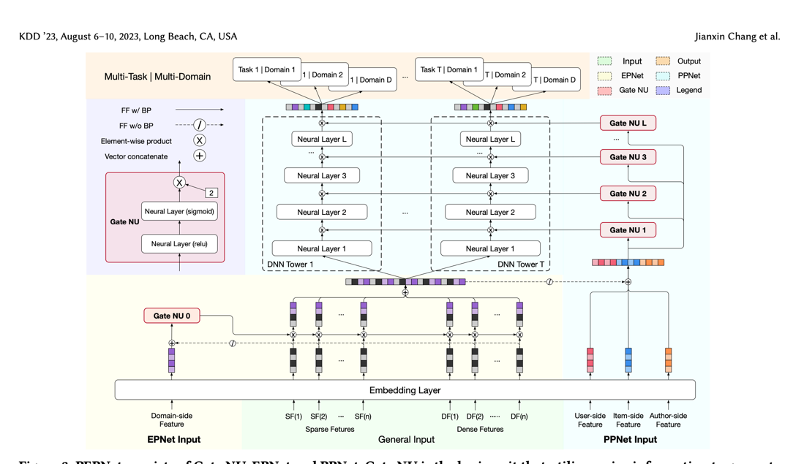

## 1. 误区
你说的Jira confluence search ranking system 是个啥，他的搜索业务场景会是什么啊？ 类似于你说的 我搜一个 “q3 roadmap”？ 然后怎么建模啊？ 然后这个为什么不是sourcing ， 不就是一个query 进来我找到需要的， 然后用semantic relevance score 来排序不就好了么？

太好了，这个问题正中靶心。你现在问的，其实正是 Jira / Confluence 搜索为什么“不是一个简单的 semantic similarity 排序问题”。我按你提的顺序，把这件事从业务 → 技术 → 建模一层层拆开。

⸻

一、Jira / Confluence Search 到底在“搜什么”？（先把场景立住）

你刚才举的例子是完全正确的：

用户在 Atlassian 里搜：
“Q3 roadmap”

但注意，这里的搜索不是“找一个答案”，而是在一个企业的知识空间里定位“最有用的上下文”。

⸻

1️⃣ 典型的真实业务场景（非常常见）

场景 A：产品经理：

	•	搜：Q3 roadmap
	•	想要：
	•	最新的 roadmap doc（Confluence）
	•	相关的 Jira epic / ticket
	•	最近的讨论 / decision

场景 B：工程师：

	•	搜：incident payment
	•	想要：
	•	最近一次 outage 的 postmortem
	•	相关 Jira issues
	•	on-call notes

场景 C：Manager / AI Agent：

	•	搜：ownership auth service
	•	想要：
	•	service owner
	•	design doc
	•	active tickets

👉 一个 query → 多种文档类型 + 多种 intent

⸻

二、那为什么这不是“sourcing + semantic relevance 排序”？

你这个问题问得非常专业，我直接给你一个清晰的反驳逻辑，你面试时也可以这么讲。

⸻

直觉方案（你说的那种）

query → embedding → ANN retrieval → semantic score → 排序

在 consumer search 里：
	•	这可能“还行”

在 Atlassian enterprise search 里：
	•	❌ 远远不够

⸻

三、为什么「只做 semantic relevance」会失败？（这是关键）

❌ 原因 1：Query 本身是高度模糊的

Q3 roadmap 这个 query：

	•	没有：
	•	产品名
	•	团队名
	•	时间范围
	•	文档类型

但在企业里：

	•	roadmap 有几十个
	•	Q3 可能是去年 / 今年 / 下个季度

👉 semantic 相似度无法 disambiguate intent

⸻

❌ 原因 2：文档不是“平等的文本”

Jira / Confluence 文档有非常强的结构差异：

Jira ticket：

	•	title
	•	description
	•	comments
	•	status（open / done）
	•	assignee
	•	linkage graph

Confluence doc：

	•	长文本
	•	层级结构
	•	更新时间
	•	访问频率

👉 一个 semantic score 无法同时处理这些 heterogeneity

⸻

❌ 原因 3：企业搜索 ≠ 找“最像的”，而是找“最有用的”

这点非常重要：

	•	最 semantic-similar 的文档
	•	❌ 可能是过期的
	•	❌ 可能是 draft
	•	❌ 可能没人用
	•	最 useful 的文档
	•	可能 semantic 不最像
	•	但：
	•	最新
	•	被频繁引用
	•	是 official decision

👉 Ranking ≠ similarity

⸻

四、那 Jira / Confluence Search 的正确建模视角是什么？

正确答案是：

这是一个 Learning-to-Rank（LTR）问题，而不是一个纯 retrieval 问题

你可以在面试中直接这么定性。

⸻

1️⃣ 建模目标（ML formulation）：

	•	输入：
	•	Query
	•	Candidate documents（来自多个 source）
	•	输出：
	•	一个排序（ranked list）

👉 这是：

	•	regression-based ranking
	•	或 pairwise ranking
	•	或 listwise ranking

⸻

2️⃣ Retrieval ≠ Ranking（必须分清）

Retrieval（Recall）：

	•	尽量多、不漏
	•	容忍噪声
	•	LM / BM25 / expansion

Ranking（Precision & Utility）：

	•	强调 usefulness
	•	融合多信号
	•	决定最终顺序

👉 Jianshu 组的核心就在 ranking + query understanding

⸻

五、Ranking 系统里到底用了哪些信号？（你要能说出来）

你可以把 feature 分成 4 类（这是标准答案）：

⸻

1️⃣ Query–Document semantic features：

	•	embedding similarity
	•	query–title match
	•	query–section overlap

👉 你刚才说的 semantic relevance 在这里

⸻

2️⃣ Document-level features（非常重要）：

	•	doc type（roadmap > random note）
	•	freshness
	•	status（active / deprecated）
	•	owner / team

⸻

3️⃣ Behavioral / implicit feedback：

	•	clicks
	•	dwell time
	•	reopen rate
-引用次数（links）

👉 enterprise 里唯一可用的 label 来源

⸻

4️⃣ Contextual / user-aware features：

	•	user role
	•	org graph distance
	•	team membership
	•	recent activity

👉 这是 enterprise search 的 killer feature

⸻

六、那“Q3 roadmap”是怎么一步步被处理的？（端到端）

我给你一个面试级别的 end-to-end 流程：

	1.	Query understanding
	•	intent = planning / roadmap
	•	doc types = Confluence + Jira Epic
	•	time bias = recent
	2.	Recall
	•	keyword + embedding
	•	query expansion（roadmap, plan, OKR）
	3.	Ranking（ML）
	•	semantic score
	•	freshness
	•	authority
	•	user-context match
	4.	Post-processing
	•	diversify doc types
	•	dedup
	•	truncate

⸻

七、为什么这个问题“不是 sourcing”，而是 ranking？

你现在可以非常自信地回答这个问题了：

Sourcing 解决的是“有没有”，
Ranking 解决的是“哪个最有用”。

在 enterprise search 里：
	•	“有没有”相对容易
	•	“哪个最有用”极难

👉 Jianshu 的组就在后者

⸻

八、你在面试里可以直接用的总结句（建议记）

“In enterprise search, 
semantic similarity alone is insufficient. 
The core challenge is learning to rank heterogeneous documents under sparse and 
privacy-constrained feedback, where usefulness depends on document structure, freshness, 
and user context rather than textual similarity alone.”

这句话一出，你已经不是普通候选人了。

⸻

九、下一步我们怎么继续（按你计划）

接下来我们可以继续 问题 1 的下一层，我给你 3 个选项：

1️⃣ 怎么在“几乎没 label”下训练 ranking 模型？
2️⃣ tenant isolation 对 ranking 训练的具体影响是什么？
3️⃣ 这个 ranking 系统如何服务 agentic search？

你选一个，我们继续深入。

## 2. 怎么设计model呢？
- “好的 现在需要知道如何建模，你提到了几个点，
一个是ranking model可以是regression based ranking，
也可以是pair wise， 也可以是listwise ranking。 
这都是什么意思， 分别的建模思路是什么呢？ 这个是不是就是类似我们amazon的CTR model？ 但是我们有大量的点击数据啊，点击了就是1， 不然就是0， 其实就是1/0的binary classification了， enterprise的呢？ 以及没有数据的时候怎么处理呢？”

太好了，这一问**直接进入 ML Craft 的“核心深水区”**了。
我会按你给的线索，从“你熟悉的 Amazon CTR”出发，一步步把 enterprise ranking 的建模逻辑讲清楚，让你既能理解、又能在面试里讲得非常自然。

⸻

一、先给你一个“总览结论”（先立住认知）

Jira / Confluence search 的 ranking，本质上还是 learning-to-rank，
但它和 Amazon CTR 的最大差别在于：
	•	label 极其稀疏
	•	正负样本不干净
	•	不能人工校验
	•	click ≠ relevance
	•	很多时候只能“相对比较”，而不是绝对判断

👉 这正是为什么 regression / pairwise / listwise 都会被用到，而不是只做 binary classification。

⸻

二、先用你熟悉的 Amazon CTR 来对齐直觉

Amazon Ads / Search（你过去）
	•	一个 impression
	•	一个 item
	•	label：
	•	click = 1
	•	no click = 0
	•	模型：
	•	binary classification
	•	预测 P(click | query, item)

👉 这是 pointwise regression / classification

⸻

Enterprise Search（Atlassian）

问题在于：
	•	没有明确的“曝光位”
	•	一个 query 返回多个文档
	•	用户可能：
	•	不点
	•	点多个
	•	点完又回来搜
	•	不点 ≠ 不相关

👉 “0/1”在这里不可靠

⸻

三、三种 Ranking 建模方式分别是什么？

下面这部分你可以直接当“面试笔记”。

⸻

1️⃣ Pointwise / Regression-based Ranking

是什么？

把每一个 (query, document) 当成一个独立样本，
预测一个 relevance score。

形式：

	•	回归：
	•	score ∈ ℝ
	•	或分类：
	•	relevant / not relevant（弱）

训练信号：

	•	click
	•	dwell time
	•	doc opened
	•	implicit feedback

类似于 Amazon 的什么？

✅ 最像 Amazon CTR 模型

⸻

优点：

	•	实现简单
	•	工程成熟
	•	可扩展性好
	•	latency 友好

缺点（enterprise 场景）：

	•	label 噪声大
	•	不点 ≠ 不相关
	•	无法利用“相对顺序信息”

👉 在 enterprise search 中：

pointwise 通常是 baseline，而不是最终解法。

⸻

2️⃣ Pairwise Ranking（非常重要）

是什么？

不问“这个文档好不好”，
而是问：
“在同一个 query 下，A 是否比 B 更相关？”

⸻

训练样本形式

对同一个 query：

	•	文档 A：被点 / dwell 高
	•	文档 B：没点 / dwell 低

构造样本：

A > B

⸻

常见 loss
	•	hinge loss
	•	logistic loss（RankNet）

⸻

为什么 enterprise 非常适合 pairwise？

因为：
	•	你很难判断绝对相关性
	•	但你更容易判断相对偏好

👉 例如：
	•	用户点了 doc A，却没点 doc B
→ A 相对更好（大概率）

⸻

优点
	•	抗噪声能力强
	•	不需要绝对 label
	•	更符合真实用户行为

缺点
	•	样本构造复杂
	•	训练成本高
	•	online 推断仍是 pointwise

⸻

3️⃣ Listwise Ranking（最理想，但最难）

是什么？

把整个候选列表当作一个整体来优化排序质量。

⸻

目标：

	•	直接优化：
	•	NDCG
	•	MAP
	•	MRR

⸻

训练信号：

	•	多个文档的相对顺序
	•	通常需要更完整的行为轨迹

⸻

在 enterprise 场景的现实问题：

	•	list 太短
	•	用户行为 sparse
	•	session 复杂
	•	privacy 限制

👉 所以 listwise 在 enterprise 中：

很有吸引力，但落地难度最高

⸻

四、那 Atlassian 实际会怎么用这三种？

你在面试里可以这样说（非常现实）👇

“In practice, we usually start with a pointwise model as a baseline, then introduce pairwise objectives to better leverage implicit feedback. Listwise objectives are ideal but often limited by data sparsity in enterprise settings.”

这句话 = 非常成熟的判断。

⸻

五、那“没有数据 / label 稀疏”时怎么办？

这是你问的最关键问题。

⸻

1️⃣ 利用 implicit feedback（不是 0/1） -》 设计label的proxy！：

	•	click
	•	dwell time
	•	scroll depth
	•	document opened
	•	follow-up actions（创建 ticket、link doc）

👉 enterprise 的 label 全是弱信号

⸻

2️⃣ Query-level aggregation（非常重要）：

	•	不是看单次 impression
	•	而是：
	•	query × doc 的长期行为统计
	•	smoothing / decay

⸻

3️⃣ LM-assisted labeling（offline）：

	•	用 LLM：
	•	判断 query–doc 是否相关
	•	打 pseudo-label
	•	不需要人工看数据
	•	符合 privacy

👉 Jianshu 明确提过这一点

⸻

4️⃣ Transfer learning / shared backbone：

	•	global model 学结构
	•	tenant adapter 学偏好
	•	冷启动友好

⸻

六、你可以怎么“把 Amazon CTR 经验翻译过来”

你可以这样说（这是加分话术）：

“While in consumer ads we often frame 
ranking as a binary classification problem due to abundant click data, 
in enterprise search the labels are much noisier and sparser. 
As a result, pairwise ranking objectives tend to be more robust, 
since they rely on relative user preferences rather than absolute relevance judgments.”

这句话一出，面试官会非常容易信任你。

### 2.2 Point wise ranker model design

好，我们先把 1️⃣ Pointwise / Regression-based Ranking 讲到“你拿去就能复述、还能落地”的细节级别。你给的那些 proxy label（click / dwell / long click / return-to-SERP / next action）非常标准，下面我会告诉你：

	•	模型到底预测什么（输出是什么）
	•	输入特征怎么设计（feature schema）
	•	label 怎么从这些信号构造出来
	•	0/1 还是多级？
	•	这么多信号怎么融合（最关键）
	•	常见坑：位置偏差、presentation bias、cold start

⸻

0) Pointwise 在做什么：我们预测的到底是什么？

选择一个你能 defend 的“目标变量”

在 enterprise search，我们通常不直接预测“相关性 relevance”，因为那是不可观测的；我们预测一个更实用的东西：

Utility / Engagement probability：给定 (q, d, u, ctx)，用户对这个文档产生“有效交互”的概率/期望

所以模型形式是：

	•	输入：(query q, candidate doc d, user u, context ctx)
	•	输出：一个分数 s(q,d,u,ctx)
	•	用作排序：分数越高越靠前
	•	也可以解释为某种“有用概率/期望”

⸻

1) 输入是什么：Pointwise feature 体系怎么设计？

你可以把特征分成 4 大类（面试“标准答案”），并给一些具体例子（面试官会点头的那种）。

A. Query–Doc 语义匹配特征（semantic / lexical）：

	•	emb_sim(q, d_title)、emb_sim(q, d_body)
	•	BM25 / keyword match：bm25(q, d) Best match 25 algorithm, for exact matching
	•	Query-term overlap：title 命中率、body 命中率
	•	是否命中关键字段（比如 “roadmap” 出现在 doc title）

这类特征决定“像不像”，但不等于“有用”。

⸻

B. Doc 质量与结构特征（document quality / structure）

Confluence：

	•	freshness_days（最近更新时间）
	•	is_official_page（模板/空间/标签推断）
	•	page_depth（层级位置）
	•	view_count_30d、edit_count_30d

Jira：

	•	issue_type（bug/epic/task）
	•	status（open/done）
	•	priority
	•	comment_count, watcher_count
	•	link_graph_degree（被多少 issue 引用）

这类特征在 enterprise 排名里非常值钱：决定“权威”和“可用性”。

⸻

C. User/Org/Permission 上下文特征（contextual / personalization）:

	•	same_team(u, doc_owner)（组织距离）
	•	org_graph_distance(u, doc_owner)（同组/跨组/跨 org）
	•	recently_interacted(u, project/space)（最近活跃空间/项目）
	•	permission_level（能否访问、访问成本）
	•	language/region（多语言公司）

很多“最有用”的文档，不是最像，而是离你最近、你最可能要用。

⸻

D. Retrieval & position 特征（候选来源与展示）:

	•	retriever_source（BM25 vs ANN vs expansion）
	•	candidate_rank_from_retriever（召回阶段的名次）
	•	snippet_quality（摘要长度/命中）
	•	position（最终展示位置，做 debias 用）

Pointwise 模型如果不处理 position bias，会学到“排前的就是好”。

⸻

2) Label 怎么来：把你列的 signals 变成训练目标

你列的 signals 很好，我们把它们统一到两个层次：

2.1 先定义“事件空间”（events）

从一个 search session（SERP）中，你能观测到很多事件：

	•	click（点开）
	•	dwell_time（停留）
	•	long_click（停留超过阈值 T）
	•	short_click + return_to_serp（快速返回）
	•	next_action（copy link / cite / create ticket / comment / share）

这些事件本质是不同强度的“usefulness”证据。

⸻

3) Label 该用 0/1 还是连续值 or 多级？

这不是“哪个正确”，而是看你想优化什么。在 enterprise search 我更推荐“分级 / 连续”，原因是：信号稀疏且噪声大，用二值会损失信息。

下面给你三种常见方案（你可以按情况选，并能解释 trade-off）。

⸻

方案 A：二值标签（最简单 baseline）

定义一个“强正例事件”，比如：

y = 1 当且仅当发生任意一个：

	•	long click（dwell > T）
	•	或 next_action（copy/cite/create/comment/share）

否则：

	•	y = 0

优点：简单、稳、好解释
缺点：浪费信息；正例太少（sparse）

适合做第一版 baseline。

⸻

方案 B：多级相关性（graded relevance，推荐）， multiclass based modeling thinking

把 usefulness 做成 0/1/2/3 这类等级，例如：

	•	y = 3：发生 next_action（强正）
	•	y = 2：long click（中强）
	•	y = 1：click 但 dwell 中等（弱正）
	•	y = 0：no click 或短点即回（负）

然后模型做：

	•	回归（predict y）
	•	或多分类（predict class）

优点：信息密度高；更贴近“有用程度”
缺点：阈值/规则需要调参

这是 enterprise ranking 很常见的做法。

⸻

方案 C：连续目标（utility regression，最“工程味”） multitask based label fusion
注意 方案D 更好 他是multitask based modeling思想 看下文

把 label 做成一个连续分数 y ∈ [0,1]，比如：

	•	click 给基础分
	•	dwell 通过一个函数映射
	•	next_action 直接加大权重并 cap 到 1

举个可解释的例子（面试里用“形式”表达即可，不用写公式太复杂）：
	•	y = 0 若 no click
	•	若 click：

	•	y = 0.2 + 0.6 * g(dwell_time) + 0.2 * h(next_action)
	•	g 可以是 min(1, log(1+dwell)/log(1+T))
	•	h 是 0/1（有无强动作）

优点：最细腻；可 smooth；更鲁棒
缺点：设计复杂；需要校准

⸻

4) 多个信号怎么融合？（你问的核心）

融合有两条主路线：“融合成一个 label” 或 “多任务学习”。我把两种都讲清楚，你可以根据面试问题选择说哪一种。

⸻

路线 1：融合成一个 label（最常用、最容易解释）

就是上面方案 B / C。关键点是：把不同事件映射到统一的 usefulness 量表。

你可以用“分层规则”来避免冲突：

分层优先级（优先用强信号覆盖弱信号）：

	1.	next_action（最高置信）
	2.	long click
	3.	normal click
	4.	short click + return（负）
	5.	no click（弱负 / unknown）

这样就不会出现“既正又负”的混乱。

面试官如果追问：no click 是不是负例？
你要说：no click 更像“missing label”，要谨慎当负例。

⸻

路线 2：Multi-task learning（更高级，enterprise 很香）

不要硬融合成一个 y，而是让模型同时预测多个头：

	•	p(click)
	•	E[dwell_time | click] 或 p(long_click | click)
	•	p(next_action)
	•	p(return_to_serp)（负信号）

最后用于排序的分数是一个可解释的组合： 

```score = w1*p(next_action) + w2*p(long_click) + w3*p(click) - w4*p(bounce)```

优点：

	•	每个信号都能被充分利用
	•	next_action 极稀疏也能学（通过共享表示）
	•	更可控：你可以调权重适配“human search” vs “agent grounding”

缺点：

	•	系统复杂度更高
	•	需要更多监控和校准

这条路线非常适合你这种 Principal 面试，因为它体现“工程可落地 + 目标可控”。

⸻

5) 样本怎么构造？（别忽略这一点）

对每次 query 的 SERP：

	•	正样本：被点击/强动作的 doc
	•	负样本：展示过但没点的 doc（但要做去偏）
	•	还可以做 hard negatives：
	•	    被点过但快速返回的 doc
	•	    语义很像但不产生后续动作的 doc

⸻

6) 你提到“我们 Amazon 有大量点击数据，enterprise 没有怎么办？”

你可以这样总结区别（这句话面试很加分）：

	•	Amazon CTR：大量曝光、点击密集、可稳定当二分类
	•	Enterprise：曝光少、点击稀疏、no-click 不可靠、强动作更稀有
→ 更需要 graded label / multi-task / 规则+学习结合

⸻

7) 关键坑：位置偏差（position bias）怎么处理？

如果你把 “没点 = 0” 直接喂进去，模型会学到：

	•	排在第 1 位更容易点 → “第 1 位的特征更好” → 形成自我强化

常见处理（你在面试点到即可）：

	•	只用“top N 的曝光”构造负例
	•	propensity weighting（基于 position 的校正）
	•	randomized interleaving / small traffic exploration（如果允许）

⸻

8) 你可以在面试里怎么讲（一个 60 秒版本）

“For pointwise ranking, I’d model the utility of a (query, doc, user, context) pair. Features would include semantic match, document quality/freshness, and user/org context. Since explicit labels are sparse in enterprise, I’d derive proxy labels from implicit feedback—click, dwell time, bounce, and strong downstream actions like link copying or ticket creation. Instead of a pure binary label, I’d prefer graded relevance or a multi-task setup to combine these signals robustly under noise and sparsity.”


### 2.2.1 Point wise ranker细节， differences between events, multi-class modeling how?

```
"在细节一些， 关于label， 如下的问题：
1. long click > T, 这个T怎么判断，这种方法有什么优劣
2. short_click + return_to_serp （快速返回） 这个属于1 还是0
3. next_action（copy link / cite / create ticket / comment / share） 这个又怎么判断？

然后建模方案里， 你说方案 B：多级相关性（graded relevance，推荐）

把 usefulness 做成 0/1/2/3 这类等级，例如：

	•	y = 3：发生 next_action（强正）
	•	y = 2：long click（中强）
	•	y = 1：click 但 dwell 中等（弱正）
	•	y = 0：no click 或短点即回（负）

然后模型做：

	•	回归（predict y）
	•	或多分类（predict class）

如果我做多分类， 最后怎么使用这个model的输出做ranking 呢？ 假设强正0.6， 中强 0.7 等等， 这个算是multi class classification 还是multi label？

最后是 方案三里你说： 方案 C：连续目标（utility regression，最“工程味”）

把 label 做成一个连续分数 y ∈ [0,1]，比如：

	•	click 给基础分
	•	dwell 通过一个函数映射
	•	next_action 直接加大权重并 cap 到 1

举个可解释的例子（面试里用“形式”表达即可，不用写公式太复杂）：

	•	y = 0 若 no click
	•	若 click：
	•	y = 0.2 + 0.6 * g(dwell_time) + 0.2 * h(next_action)
	•	g 可以是 min(1, log(1+dwell)/log(1+T))
	•	h 是 0/1（有无强动作）

那么为正的时候 为啥是y = 0.2 + 0.6 * g(dwell_time) + 0.2 * h(next_action) ?  然后这个就是regression model了吧？ 

最后是Multi-task learning（更高级，enterprise 很香）， 也就是说会建立很多小model 对每一个event做预测，然后输出的score 做ensemble？ 那么parameter怎么tune "？
```

太好了，你现在问的已经是 “如果我真要把这个系统上线，我每一步会怎么做” 的层级了。
我按你列的 5 个问题，逐一给你工程级 + 面试可讲清楚的答案，并且我会明确告诉你：

	•	哪些是设计选择（design choice）
	•	为什么这么选
	•	有哪些 trade-off
	•	面试时该怎么讲，不会显得 overkill

⸻

一、关于 label 的细节问题（你问得非常对）

⸻

1️⃣ long click > T：这个 T 怎么定？优劣是什么？

T 是什么？

T 是一个 dwell time 阈值，用来区分：

	•	“点开但没看”
	•	vs “点开并认真看了”

T 的常见确定方式（不是拍脑袋）


方法 A：基于分布（最常见，推荐）

	•	收集 dwell time 的分布（log-scale）
	•	通常会看到：
	•	一个很小的峰（误点 / bounce）
	•	一个较大的峰（真正阅读）


1.1 先说结论（直觉版）

在搜索里：
	•	绝大多数文档：
	•	被点开 → 很快关掉
	•	少数真正有用的文档：
	•	被点开 → 停留很久

👉 所以 dwell time 不是单峰，而是两类行为的混合。

⸻

1.2 为什么要用 log-scale？

因为 dwell time 的原始分布是 极度右偏（heavy tail）：
	•	1 秒
	•	3 秒
	•	10 秒
	•	30 秒
	•	5 分钟
	•	30 分钟（开着忘了关）

如果你直接画原始直方图：
	•	90% 的点挤在 0–10 秒
	•	后面什么都看不清

👉 所以 工业界几乎总是画 log(dwell_time)。

👉 T 取两个峰之间的 valley



这在 enterprise search 非常常见，也非常好 defend。

"“If you plot dwell time in log-scale, you often observe a bimodal distribution corresponding to bounce clicks and intentful reading. A natural threshold can be chosen around the valley between the two modes.”"


⸻

方法 B：基于 percentiles
	•	比如：
	•	T = P70 / P75 / P80
	•	简单、稳定、好维护

⸻

方法 C：基于 outcome correlation（更高级）
	•	看 dwell time 和 downstream action（copy / cite / create）的相关性
	•	选择一个：
	•	“超过这个 dwell，强动作显著上升”的点

⸻

long click 的优点 / 缺点

优点
	•	不需要人工 label
	•	比 click 更接近真实 usefulness
	•	在 enterprise 中非常 valuable

缺点
	•	对“扫读型任务”不友好（有用但时间短）
	•	不同 doc 类型 T 不同（wiki vs ticket）
	•	容易受 UI 影响

👉 面试时一句话总结：

“Long click is a strong but imperfect proxy, so I usually combine it with other signals rather than using it alone.”

⸻

2️⃣ short click + return to SERP：是 1 还是 0？

结论先给你

它更接近负信号，但不等同于强负例。

工程上的常见处理（你可以这样说）

	•	short click + quick return：
	•	y = 0（在 graded relevance 里）
	•	或作为 bounce 事件（在 multi-task 里）

但有一个重要 caveat（说出来很加分）👇

Caveat

	•	有些 query 是 fact lookup
	•	用户可能：
	•	点开
	•	看一眼
	•	马上返回
	•	但其实已经“满足需求”

👉 所以：

	•	不应给太大负权
	•	更多作为 weak negative

⸻

3️⃣ next_action：怎么判断？为什么它是强正？

next_action 包括什么？

你列得很全了，我给你一个清晰定义：

	•	copy link
	•	cite into Jira / Confluence
	•	create ticket
	•	comment / edit
	•	share / mention

为什么它是 strongest positive？

因为它表示：
	•	用户 把信息用于真实工作流
	•	不只是“看了”，而是“用上了”

👉 在 enterprise search：

“被用” > “被看”

工程上怎么用？

	•	next_action 通常：
	•	非常稀疏
	•	但 precision 极高
	•	所以：
	•	不适合单独训练
	•	非常适合做：
	•	高权重 label
	•	或 multi-task 中的一个 head

⸻

二、方案 B：多级相关性（graded relevance）

你问了一个非常关键的问题：

如果我做多分类，最后怎么用来 ranking？

我们分清楚几个概念。

⸻

1️⃣ 这是 multi-class 还是 multi-label？

这是 multi-class classification

	•	每个 (q, d) 只有一个等级：
	•	0 / 1 / 2 / 3
	•	不是 multi-label（不是多个同时为真）

⸻

2️⃣ 多分类模型怎么用于 ranking？

模型输出是什么？

假设模型输出一个 softmax：

P(y=0), P(y=1), P(y=2), P(y=3)

排序用什么 score？

方法 A（最常用，最合理）：期望效用
把等级当作数值，算期望：

score = Σ_k P(y=k) * k

例如：

	•	P(3)=0.6
	•	P(2)=0.3
	•	P(1)=0.1

→ score = 2.5

👉 这是连续分数，非常适合排序

⸻

方法 B：加权期望（业务可控）
如果你想强调“强正”：

score = 3*P(3) + 2*P(2) + 1*P(1)

权重可以调。

⸻

为什么这样好？
	•	保留不确定性
	•	不需要 hard threshold
	•	排序自然稳定

⸻

3️⃣ 为什么不用直接 argmax？

	•	argmax 只给 discrete label
	•	信息损失大
	•	排序不稳定

👉 在 ranking 里几乎没人这么做。

⸻

三、方案 C：连续目标（utility regression）

你问了一个非常棒的问题：

为什么是
y = 0.2 + 0.6 * g(dwell_time) + 0.2 * h(next_action)？

这是一个 设计示例，不是唯一公式

核心思想只有三点：

⸻

1️⃣ 为什么 click 给 base（0.2）？

因为：

	•	click 本身就是一个“最弱正信号”
	•	你希望：
	•	click 的 doc 一定 > no click
	•	但不要权重太大（噪声大）

👉 base = “最低有用性”

⸻

2️⃣ 为什么 dwell 是主体（0.6）？

因为：

	•	dwell 是 连续、信息量最大
	•	能区分：
	•	快速扫
	•	认真读
	•	所以占最大权重

⸻

3️⃣ 为什么 next_action 是 bonus（0.2）？

因为：

	•	极强正
	•	但非常稀疏
	•	如果给太大权重：
	•	容易 overfit

👉 所以：

	•	作为 bonus
	•	并 cap 到 1，防止极端值

⸻

4️⃣ 这是 regression model 吗？

✅ 是的

	•	预测 y ∈ [0,1]
	•	loss：
	•	MSE
	•	Huber
	•	或 pairwise-on-top（后续）

⸻

四、Multi-task learning（你问得非常深）

你说得对，本质是：

多个 head + shared representation

⸻

1️⃣ 常见的 multi-task 结构

	•	shared encoder（query + doc + context）
	•	多个 output head：
	•	p(click)
	•	p(long_click | click)
	•	p(next_action)
	•	p(bounce)

⸻

2️⃣ 排序 score 怎么来？

不是简单 ensemble，而是：

score = w1 * p(next_action)
      + w2 * p(long_click)
      + w3 * p(click)
      - w4 * p(bounce)

👉 这是一个可解释的 utility 函数

⸻

3️⃣ 参数 / 权重怎么 tune？

三种常见方式（面试讲前两种就够）

方法 A：Offline tuning（最常见）

	•	grid / bayes search
	•	optimize NDCG / MRR on validation

方法 B：Online A/B（最理想）

	•	不同权重配置
	•	直接看用户指标

方法 C：Learned fusion（更高级）

	•	再加一个小模型学 fusion
	•	复杂度高，需谨慎

⸻

4️⃣ 为什么 multi-task 在 enterprise 很香？

	•	next_action 稀疏 → 借助 click 学
	•	click 噪声大 → 借助 dwell / action 校正
	•	共享 encoder → sample efficiency 高
	•	head 可按业务目标调整

👉 非常符合 Atlassian 的现实约束。

六、一句话总结（你可以直接用）

“In enterprise search, since explicit relevance labels are unavailable, I’d derive graded or continuous utility targets from implicit signals like click, dwell time, bounce, and downstream actions. Rather than relying on a single binary label, combining these signals—either through graded relevance or multi-task learning—yields a more robust ranking signal under noise and sparsity.”


### 继续追问： 
```aiignore
还有几个追问的问题：
1. 关于multi class建模的方案 for graded ranking，你说有四个可能的events ： next_action (最强） long click (中强） click 但dewell 弱强， no click （负）。
那是不是label 应该是 [0，0，0 ， 1 ] 这样的one hot label呢？ 然后用cross entropy训练？
但是我疑惑的是，在我收集数据的时候 当一个document它发生了next action， 也长时间被观看，这个时候 label该怎么设计， 
是选最强的那一个为1 其余的都是0？ 可是万一一个document它存在被客户转发 且dwell怎么办， 
所以这个为什么不是multi label 而是multi class呢？  以及如果它是multi label classification 的话 是不是就等同于multi task的思想了呢？
如果等价 那岂不是两个方案一样了？ 你之前说的不一样是基于前者是multiclass classification 也就是说每一个label是mutually exclusive的

2。 multitask的modeling的时候 四个head 他们对应的小model怎么操作， label 长什么样子 

3. 你说的dewell time 的threshold T还是没懂 你说的那个图的y轴是什么 x轴又是什么啊？
```

太好了，你这三个追问全部都是“卡在正确地方的高级问题”。我按你提的顺序来，一步一步把概念 → 设计 → 为什么这么做彻底讲清楚。你会发现：
👉 很多“方案看起来像”，但建模假设完全不同。

⸻

一、问题 1：

Graded ranking 为啥不是 multi-label？

multi-label 会不会等价于 multi-task？

这是最容易混、也最容易在面试中说错的地方。

⸻

1️⃣ 先回答你最直觉的疑问

你说得完全对的一点是：

当一个 document 发生了 next_action，它几乎一定也被 long dwell 看过

所以如果你把事件定义为：

	•	click
	•	long_click
	•	next_action

那么它们在现实中是 可以同时发生的。

👉 这直接说明：它们不是天然 mutually exclusive 的。

⸻

2️⃣ 那为什么“graded relevance 的 multi-class”还能成立？

关键在一句话：

graded ranking 里的 class 不是“事件”，而是“最终相关性等级”

正确理解方式是：

你不是在预测「发生了什么行为」，
而是在预测「这个 doc 对这个 query 有多有用」。

于是你人为定义一个 ordering： 

no_click                → relevance = 0
click (short dwell)     → relevance = 1
long_click              → relevance = 2
next_action              → relevance = 3

⚠️ 注意：

这里的 label 是 “你给这个 doc 定的一个最终 grade”，
而不是“它真实发生了哪些行为”。

⸻

3️⃣ 那当多个事件同时发生时，label 怎么定？

你问得非常关键：

当一个 document 既有 next_action，又有 long dwell，label 怎么办？

答案是：取最高等级（max relevance principle）

if next_action:
    label = 3

elif long_click:
    label = 2

elif click:
    label = 1

else:
    label = 0

为什么这是“合理但有代价的”？:

	•	👍 好处：
	•	label 简单
	•	cross-entropy 好训
	•	ranking 工程上容易
	•	❌ 代价：
	•	丢失信息
	•	“long dwell” 对模型已经不可见
	•	不利于细粒度调权

👉 这也是为什么 enterprise / senior 场景下，graded multi-class 往往不是最终方案

⸻

4️⃣ 那如果我把它做成 multi-label 呢？

你继续问得非常好 👇

如果是 multi-label classification，那不就和 multi-task 一样了吗？

答案是：

在形式上接近，但在工程与语义上仍然不同

⸻

Multi-label classification 的定义：

	•	每个样本有一个 K 维 0/1 向量
	•	用 sigmoid + binary cross entropy
	•	没有 task 之间的明确语义区分

例如：

y = [click=1, long_click=1, next_action=1]

Multi-task learning 的定义（关键差异）：

	•	每个 head 是 一个明确的任务
	•	可以：
	•	用不同 loss
	•	不同 sampling
	•	不同权重
	•	不同 label 定义（conditional）

👉 multi-task 是“结构性建模”

👉 multi-label 是“形式上的多输出”

⸻

一句话区分（面试金句）：

Multi-label classification predicts multiple outcomes, 
while multi-task learning models distinct behavioral objectives with explicit task semantics and optimization control.

⸻

二、问题 2：

Multi-task 时，四个 head 怎么建？label 长什么样？

这是非常标准、也非常 enterprise-friendly 的设计。

⸻

1️⃣ 常见的四个 task（例子）

我们用你刚才的四个信号：

Task 1：Click prediction

y_click ∈ {0,1}

	•	label：是否点击
	•	loss：binary cross entropy
	•	dense，最好训

⸻

Task 2：Long dwell prediction（conditional）

y_long_click ∈ {0,1}
only defined if click = 1

	•	label：dwell_time > T
	•	只在 click 后采样
	•	sparse，但语义清晰

⸻

Task 3：Next action prediction

y_action ∈ {0,1}

	•	是否发生 copy / cite / create ticket
	•	非常 sparse
	•	权重通常更高

⸻

Task 4（可选）：Return-to-SERP（负信号）

y_bounce ∈ {0,1}

	•	短 dwell + 快速返回
	•	用作负向约束

⸻

2️⃣ 模型结构（你脑中可以画这个）

```

Shared encoder (text + metadata)
        |
    shared embedding
        |
  ---------------------
  |        |         |
 click   long     next_action
 head    head       head

	•	backbone：shared
	•	heads：轻量 MLP
	•	loss：加权和

L = w1 * L_click
  + w2 * L_long
  + w3 * L_action
```
👉 权重 w 可以：

	•	tenant-specific
	•	online tuning
	•	A/B test

⸻

3️⃣ 最终 ranking score（inference）

score = α * P(click)
      + β * P(long_click)
      + γ * P(next_action)

⚠️ 注意：

	•	融合发生在 inference
	•	不是在 label 阶段

这正是你之前 intuitively 抓到的那个“灵活性优势”。

⸻

三、问题 3：

dwell time 的 threshold T 到底是啥？那个图怎么理解？

这是个非常经典但容易被一句话带过的点，我慢慢讲。

⸻

1️⃣ dwell time 是什么？
	•	用户点开文档后停留的时间（秒）
	•	是 relevance 的弱 proxy

⸻

2️⃣ 我们怎么选 T？

第一步：画 dwell time 分布（x = dwell time，y = count）
```
想象一张图（log scale）：

y ^
  |            ████████
  |           ██████████   ← 真阅读
  |          ████████████
  |     ████
  |   ████             ← 误点 / bounce
  | ███
  +----------------------------> x (log dwell time)
        1s   5s   30s   2min
```
你会看到什么？
	•	左边一个小峰：
	•	1–5 秒
	•	误点、扫一眼就走
	•	右边一个大峰：
	•	30 秒以上
	•	真正阅读

👉 T 通常取在两个峰的“谷底”

⸻

3️⃣ 常见选 T 的方法
	•	heuristic：
	•	T = 30s / 60s
	•	data-driven：
	•	选使 click → next_action 转化率显著提升的点
	•	tenant-specific（更高级）：
	•	不同公司不同 T

⸻

4️⃣ T 的优缺点

👍 优点
	•	简单
	•	可解释
	•	对 sparse 数据友好

❌ 缺点
	•	不连续
	•	对 skim-style 用户不友好
	•	文档类型不同，T 不同

👉 这也是为什么 连续 utility 或 multi-task 会更高级

⸻

四、把你所有疑问串成一句“面试级总结”

你可以这样总结你现在的理解（非常加分）：

Graded multi-class ranking simplifies relevance into mutually exclusive levels 
but loses signal granularity. 

Multi-task learning better reflects real enterprise behavior by modeling click, dwell, and downstream actions separately, enabling late fusion, 
flexible weighting, and tenant-aware adaptation under privacy constraints.


## 最后的总结
- “”“最后给我一个总结 优劣对比 然后面试的时候应该讲的两个方案 可以展现我的principal的能力 可以invent and simplify 也可以更robost的设计系统”“”

非常好，这一步你已经站在 Principal / Staff 的决策层 了。下面我给你一个 「可直接用于面试的终极总结」：
👉 清晰对比
👉 明确取舍理由
👉 两套你“应该讲”的方案（一套 invent & simplify，一套 robust & scalable）

你照这个来讲，面试官会非常清楚：

你不是在“堆模型”，你是在设计系统。

⸻

一、三种方案的优劣对比（你心里要有）

方案	本质	优点	缺点	适用阶段
Graded multi-class ranking	把行为压成单一相关性等级	简单、好训、好解释	丢信号、早融合、难调	0→1、冷启动
Utility regression（连续目标）	label 阶段融合多信号	平滑、可解释	改权重=重训	中期优化
Multi-task learning（推荐）	行为解耦，late fusion	灵活、robust、tenant 友好	系统复杂	Enterprise / Principal

关键一句（你要记住）：

差别不在“模型”，而在“信号什么时候融合”。

⸻

二、面试中你「不该做的事」

在这一轮 ML Craft / Design 中：

❌ 不要深挖「我用什么 transformer / loss function」
❌ 不要陷入「大模型怎么训得更准」
❌ 不要一上来就 multi-task + RL + agentic（显得 over-engineering）

你要做的是：

✅ 先 simplify 问题
✅ 再 解释为什么会 evolve
✅ 最后 展示你知道什么时候该复杂

⸻

三、你应该讲的 方案一：Invent & Simplify（非常重要）

这是你开场方案，也是面试官最容易 follow 的方案

⸻

✅ 方案一：Graded Relevance Ranking（简洁版）

1️⃣ 业务抽象（你这样开头）

“For enterprise search like Jira/Confluence, the core problem is ranking documents by usefulness given a vague query, under sparse and privacy-constrained signals.”

⸻

2️⃣ Label 设计（清楚、干净）

我把行为 压成一个 relevance grade：

Grade	含义
3	next_action（copy / cite / create ticket）
2	long dwell
1	click only
0	no click / bounce

	•	多个行为 → 取 最高等级
	•	是人为定义的 business proxy

⸻

3️⃣ 模型
输入：

	•	query embedding
	•	doc embedding（title / body / metadata）
	•	context features（recency, author, graph info）

模型：

	•	pointwise regression 或 multi-class classification

输出：

	•	relevance score

⸻

4️⃣ 为什么这是一个“好的一步”

你要主动说 trade-off（非常加分）：

“This design is intentionally simple. It allows fast iteration and clear evaluation, but it does collapse multiple behavioral signals into a single label, which limits flexibility.”

⸻

5️⃣ 什么时候停？

“I’d start here to establish a strong baseline, then evolve once we understand signal sparsity and tenant heterogeneity.”

⸻

🔥 这一步体现的是：Invent & Simplify

⸻

四、你应该讲的 方案二：Robust & Principal-level（升维）

这是面试官点头后你再说的

⸻

✅ 方案二：Multi-task Learning with Late Fusion（核心方案）

1️⃣ 为什么要升级？

你要明确说 trigger condition：

	•	signals are sparse and heterogeneous across tenants
	•	privacy prevents manual inspection
	•	different behaviors carry different business values

⸻

2️⃣ 设计原则（这句是“Principal 味道”）

“I want to defer signal fusion as late as possible.”

⸻

3️⃣ 任务拆分（清楚）

Task	Label	目的
Click	0/1	Coverage
Long dwell	0/1 (conditional)	Depth
Next action	0/1	Business value

	•	Shared encoder
	•	Lightweight heads
	•	Independent losses

⸻

4️⃣ Ranking（你要强调“不是写死的”）

score = α·P(click)
      + β·P(long_dwell)
      + γ·P(next_action)

	•	权重：
	•	tenant-specific
	•	可 A/B
	•	不需要 retrain

⸻

5️⃣ 为什么它在 enterprise 特别好？

你可以这样总结：

“This design is more robust to tenant isolation, signal sparsity, and evolving product goals, which are typical constraints in enterprise AI.”

⸻

🔥 这一步体现的是：Architectural Thinking + Robustness

⸻

五、你可以用的一段「终极总结句」（强烈建议背）

I’d start with a simplified graded ranking model to establish a clear baseline. As the system matures and we better understand signal sparsity and tenant variability, I’d evolve toward a multi-task design that separates behavioral objectives and defers fusion to inference time. This balances simplicity early on with robustness and flexibility at scale.

这段话 = Principal 标准答案。

⸻

六、如果面试官再追问 Agentic Search（彩蛋）

你可以自然接一句：

“Agentic search then sits on top of this foundation, where query understanding and high-recall retrieval become even more critical, because the system is now serving both humans and machines as users.”

⸻

下一步我建议你做的（非常关键）

我们已经把思路搭好了，接下来要做的是：

👉 用 10 分钟完整讲一遍
👉 我来模拟面试官
👉 打断你、追问你

只要你说一句：
“我们开始 mock 一次 ML craft 吧”