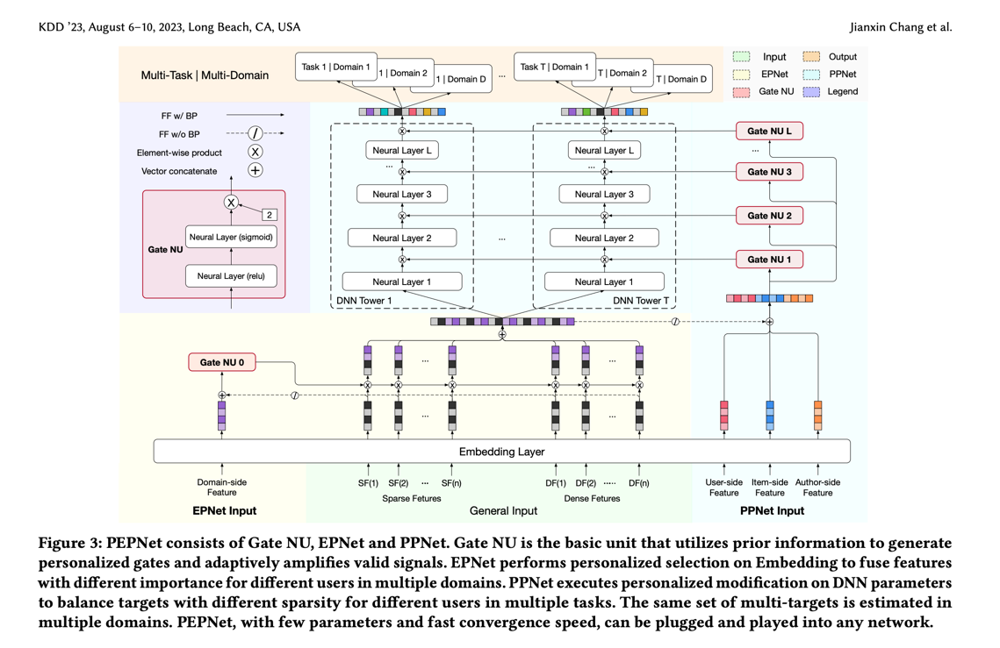

## 0. 梗概

总体结构（你先在心里记住）

开场 30s

→ 合理假设（install / conversion）
→ ranking 分解（CTR × CVR）

V0：能上线的最小系统

→ features / storage / training / serving

V0 的问题暴露

→ domain heterogeneity / CVR 稀疏 / seesaw

V1：multi-task（CTR + CVR）

V2：PEPNet（EPNet + PPNet）

系统 & lifecycle

→ drift / PSI / monitoring / fallback / retrain

⸻

开场（最关键，防 Uber 式“jump”）

你说（英文，建议背）

“I’ll start with a reasonable assumption to ground the design:

the primary ranking objective is installs, i.e. conversions.
So at ranking time we decompose the problem into predicting pCTR and pCVR (given click), and rank by expected value, typically
score = bid × pCTR × pCVR, with pacing and frequency handled as policy outside the model.”

你脑子里在做什么
	•	你没有问一堆问题
	•	你给了 industry-standard assumption
	•	你把 model vs policy 先分清楚了

可能追问

Why not predict installs directly?

你答

“We could, but decomposing into CTR and CVR gives better sample efficiency and debuggability, especially when CVR is sparse.”

⸻

V0：最简单、能上线的 CTR / CVR 系统

V0 目标

先交付一个 production-ready baseline，再用数据驱动复杂化

⸻

V0 模型设计

你说

“For V0, I’d build two simple binary classifiers:
a CTR model trained on impressions, and a click-conditioned CVR model trained on clicked samples.
Both can be logistic regression or a small DNN, focusing on robustness and calibration.”

⸻

V0 Feature 设计（你要非常清楚）

1️⃣ General features（shared）

Sparse ID → embedding lookup（在线）

	•	user_id / user_bucket
	•	campaign_id / creative_id / advertiser_id
	•	app_id / game_id
	•	geo_id / device_id / os_id

输入形态：ID → index → embedding table（不是 one-hot）

Dense 数值特征
```
Feature	处理
bid / budget	log + clip
session depth	bucket / linear
time since last impression	log
fatigue stats	clip + normalize
historical CTR / CVR (1d/7d)	clip + linear
```

⸻

Feature Engineering & Storage（system 感）

你说

“I separate features by freshness.
Heavy aggregates like historical CTR/CVR and fatigue stats are computed offline or nearline and stored in a feature store.
Request-time features come directly from the ad request.
Online serving only does lightweight lookups and transforms to meet latency constraints.”

你脑子里

	•	feature store（KV）
	•	key：campaign_id / creative_id / placement_id
	•	value：stats 向量
	•	refresh：5min / 1h / 1d

⸻

V0 Training & Serving

	•	CTR：impression → click
	•	CVR：click → conversion
	•	score：bid × pCTR × pCVR
	•	policy：pacing / freq cap / budget outside model

⸻

V0 暴露的问题（这是你升级的“合法理由”）

你说

“After shipping V0, I’d look at slice performance and online metrics.
In practice, three issues often show up.”

三个问题（一定要说）

	1.	Domain heterogeneity
	•	不同 placement / format / game 表现差异巨大
	•	某些 slice AUC / calibration 很差
	2.	CVR 极度稀疏
	•	PR-AUC 低
	•	长尾广告学不动
	3.	Domain seesaw
	•	优化一个 placement，另一个掉

⸻

V1：Multi-task（CTR + CVR）

你说

“The first upgrade is multi-task learning.
I introduce a shared bottom network with two heads: CTR and CVR.
CTR provides dense supervision and stabilizes representation learning for sparse CVR.”

关键点

	•	shared bottom
	•	two heads
	•	weighted BCE / focal loss
	•	CVR negative sampling（clicked but no conversion）

⸻

V1 仍然不够 → 引出 PEPNet（不是凭空跳）

你说（非常重要）

“However, even with multi-task learning, we still see strong domain seesaw and calibration gaps across placements.
This suggests the issue is not just data sparsity, but domain heterogeneity conflicting inside shared parameters.”

👉 这句话就是 PEPNet 的合法入口

⸻

V2：PEPNet（重点讲）

一句话先定死（你必须说）

PEPNet is a shared multi-task CTR/CVR model with controlled domain- and instance-conditioned gating.
EPNet modulates embeddings by domain, and PPNet modulates hidden units by instance.

⸻

PEPNet Forward（清晰走一遍）

Step A：Shared embedding E

	•	sparse → embedding lookup
	•	dense → normalize / project
	•	concat → E

⸻

Step B：EPNet（Domain Gate）

输入

	•	placement / format / game cluster / geo / device
	•	stop-grad(E)

输出

	•	δ_domain ∈ (0, γ)^D（γ=2）

作用

	•	O_ep = E ⊙ δ_domain

直觉

“Same general feature, different sensitivity under different domains.”

⸻

Step C：Shared bottom + CTR/CVR heads

⸻

Step D：PPNet（Instance Gate）

输入

	•	user propensity bucket
	•	advertiser tier
	•	campaign objective
	•	creative type / quality
	•	stop-grad(O_ep)

作用

	•	每层 hidden：H′ = H ⊙ δ_instance

直觉

“Different users and advertisers activate different parts of the network, especially for sparse CVR.”

⸻

Backprop（一定要讲清楚）

你说

“We apply stop-gradient on the gate inputs.
The gates are trained via the loss, but they cannot shape the representation they condition on.
This prevents shortcut learning and stabilizes training.”

⸻

为什么 γ=2（你必须能解释）

“Using γ × sigmoid allows both attenuation and amplification, while keeping 1 as a natural no-op and bounding the maximum amplification for stability.”

⸻

为什么 PEPNet 比 attention / multi-tower 更适合 Unity

你说

“Compared to per-domain towers or unconstrained attention, PEPNet provides controlled adaptation.
It avoids model explosion, supports cold-start fallback, and is easier to debug and roll out incrementally.”

⸻

系统 & 生命周期（Meng Li / VP 会重点听）

Drift Detection（PSI 一定要讲）

你说

“We monitor feature drift using PSI, quantiles, and missing rates.
PSI compares the distribution of a feature online versus training.”

PSI 例子（你可以讲）
	•	fatigue_1h 在训练时大多 <3
	•	UI 改版后，大量流量集中在高频曝光
	•	PSI > 0.25 → population drift

⸻

Monitoring Metrics

Data
	•	feature missing
	•	PSI
	•	quantiles

Prediction
	•	pCTR / pCVR distribution
	•	calibration gap（eCTR vs aCTR）

Business
	•	installs
	•	CTR / CVR
	•	revenue / eCPM
	•	latency

⸻

Fallback Strategy（非常重要）

你说

“PEPNet allows graceful fallback.
If a domain drifts or a new domain appears, we can set EPNet gates to all-ones and fall back to the shared model.
Similarly for PPNet with unseen users or advertisers.”

⸻

Retraining Strategy
	•	周期性 full retrain（shared model）
	•	快速增量 retrain（gate only）
	•	A/B + canary rollout

⸻

收尾（非常像 Staff / Principal）

你说（英文）

“To summarize, I start with the simplest deployable CTR/CVR system, observe real failure modes, and progressively introduce multi-task learning and PEPNet as targeted solutions.
The key is that PEPNet is not about making the model bigger, but about making adaptation controlled, observable, and operationally safe across the full ML lifecycle.”

⸻

最后给你一句“控场反问”（必用）

“Does this match the kind of heterogeneity you see across placements or game genres at Unity?
If so, I can go deeper into how we’d define domains or design the gating features.”

⸻

如果你愿意，下一步我可以把这整套内容压缩成：
	•	45 分钟 Chen Xue 面试专用追问树
	•	每一节点：
最强回答（1 句）+ 一个 Unity 例子 + 一句反问控场

这会让你在 system design 里 完全不被牵着走。


### Unity 为什么很适合 + 为什么 multihead 不适合

B1) Unity 场景为何适合 PEPNet（你 proposal 怎么讲）

中文（要点）
Unity Ads 的 domain 异质性很强且变化快：

	•	ad format：rewarded / interstitial / banner / playable
	•	placement/surface：不同入口/时机/位置
	•	game cluster / genre：RPG、card、casino、hyper-casual
	•	geo/device/network：体验差异大

同样的通用特征（fatigue、历史 CTR、session depth、creative quality）在不同 domain 的意义不同。
EPNet 正好做 domain-conditioned reweighting；PPNet 则针对 user/item/advertiser 差异，帮助 CVR/价值类稀疏任务。

英文口述

“Unity is highly heterogeneous across formats, placements, game genres, and device/network conditions. The same generic signals like fatigue or historical CTR can mean different things under different domains. EPNet provides domain-conditioned modulation on shared embeddings, and PPNet provides instance-conditioned modulation inside towers, which is particularly helpful for sparse CVR and value prediction.”


## Ranking policy
	•	E[value] = pCTR * pCVR * E[value | conv]（或业务定义）

## Features
E2) Feature / domain / PEPNet 输入到底长什么样（onehot？raw text？）

我给你一个“面试可落地”的写法：

General features（进 shared embedding E）

	•	ID 类 sparse：用 embedding lookup，不是 one-hot
	•	user_id / user_bucket
	•	ad_id / creative_id / campaign_id / advertiser_id
	•	app_id / game_id（可选）
	•	geo_id / device_id / os_id
	•	dense 数值：raw float + normalize / bucket + linear projection
        •	bid/budget/pacing
        •	fatigue stats（exposure count, recency）
        •	historical ctr/cvr aggregates（多个 window）
        •	session depth / time-of-day
        •	文本/多模态（可选）：creative text、app tags
        •	offline encoder → dense embedding（不建议在线大模型）

EPNet domain features（进 EP gate）

	•	format_id、placement_id、surface_id（ID embedding）
	•	game_genre / cluster（ID embedding 或多标签 tags embedding）
	•	domain-level stats（dense）：avg ctr/cvr, traffic density, position distribution

PPNet priors（进 PP gate）

	•	user propensity bucket / cohort（ID）
	•	advertiser tier / campaign type（ID）
	•	user×domain 或 ad×domain 的轻量 bucket（可选，防过拟合）

## Metrics
指标分三层（面试非常加分）

A. 模型指标（离线）

	•	CTR head：AUC/logloss、calibration(ECE)
	•	CVR head：PR-AUC/logloss（更重要）、ECE
	•	slice：format/placement/game cluster/geo/device

B. 线上业务指标（A/B）

	•	user-side：CTR、CVR、install rate、retention proxy（若有）、complaint/hide rate
	•	advertiser-side：ROAS、CPA、spend、pacing stability、conversion volume
	•	platform-side：eCPM / revenue / fill rate

C. 系统健康 & guardrails

	•	latency p95/p99
	•	crash rate
	•	budget overspend / pacing violations


## PSI 检测漂移
好，这个问题非常关键，而且 PSI（Population Stability Index）在 Unity / Ads / Ranking 面试里是“必问监控点”。我给你从直觉 → 数学 → 怎么算 → 怎么用 → 面试怎么说一步步讲清楚。

⸻

一句话直觉版（先背）

PSI 衡量的是：线上数据的分布，和模型训练时看到的数据分布，差得有多远。
它不是看均值变没变，而是看整个分布形状有没有变。

⸻

1️⃣ PSI 是在比较什么？

PSI 比较的是 同一个 feature 在两个时间/人群上的分布差异：

	•	基准分布（Expected）：
通常是 训练集、训练时的验证集、或 上线初期的稳定分布

	•	当前分布（Actual）：
当前线上一小时 / 一天 / 一周的数据

注意：
PSI 不是比较两个不同 feature，而是同一个 feature 在两个时间段。

⸻

2️⃣ PSI 怎么算（核心公式）

公式非常简单（但含义很深）：

$\text{PSI} = \sum_{i=1}^{K} (A_i - E_i) \cdot \ln\left(\frac{A_i}{E_i}\right)$

其中：

	•	K：分桶数（bins）
	•	E_i：第 i 个桶在 Expected（训练）分布中的比例
	•	A_i：第 i 个桶在 Actual（线上）分布中的比例

⸻

3️⃣ 具体计算步骤（一步一步）

我们用一个 fatigue_1h 的真实例子来算。

Step 1：对 feature 分桶（非常重要）

比如 fatigue_1h（过去 1 小时曝光次数）：

Bucket	范围:
```
B1	0
B2	1
B3	2–3
B4	4–6
B5	≥7
```

⚠️ 分桶一定要固定，通常用训练集的分位数来定。

⸻

Step 2：统计比例

训练期（Expected）

Bucket	比例 E
```
B1	0.40
B2	0.30
B3	0.20
B4	0.08
B5	0.02
```

线上当前（Actual）
```
Bucket	比例 A
B1	0.20
B2	0.25
B3	0.25
B4	0.20
B5	0.10
```

⸻

Step 3：代入公式逐桶算

我们算其中一个桶（B1）：

$(A - E) \cdot \ln(A / E)
= (0.20 - 0.40) \cdot \ln(0.20 / 0.40)
= (-0.20) \cdot \ln(0.5)
= (-0.20) \cdot (-0.693)
= 0.1386$

对所有桶算一遍，加起来：

$\text{PSI} \approx 0.35 \quad (\text{假设})$

⸻

4️⃣ PSI 数值怎么解读（面试必背）
```
PSI 值	含义	动作
< 0.1	稳定	不用管
0.1 – 0.25	轻微漂移	观察 / slice
> 0.25	严重漂移	必须调查
```
英文标准说法：

“A PSI above 0.25 usually indicates significant population drift and triggers investigation or mitigation.”

⸻

5️⃣ PSI 能发现什么？不能发现什么？

能发现的

	•	feature 分布整体变形（shift）
	•	长尾突然变大 / 小
	•	placement / UI 改版导致用户行为模式变了
	•	新 domain 大量流量注入

不能发现的

	•	feature 和 label 关系变了（那是 concept drift）
	•	单点异常（PSI 是分布级指标）

👉 所以 PSI ≠ 万能，但它是第一道报警。

⸻

6️⃣ PSI 在 Unity / Ads 里的真实用法

常监控的 feature

	•	fatigue stats（exposure count / time since last exposure）
	•	historical CTR / CVR aggregates
	•	placement position / ad format
	•	session depth
	•	bid / price bucket

场景例子（面试很好用）

“After a placement UI change, we observed PSI > 0.3 on fatigue-related features. Although model AUC stayed stable offline, online CTR dropped. This indicated a population shift rather than model bug.”

⸻

7️⃣ PSI 高了怎么办？（这才是面试官关心的）

你一定要讲 “不是看到 PSI 就 retrain”，而是分层应对：

7.1 快速止血（Fallback）

	•	对 drift feature：
	•	clamp
	•	replace with default / mean
	•	或 EPNet gate fallback = 1（不调制）

7.2 中期修复

	•	触发 增量训练 / 快速 retrain
	•	更新 aggregation window / feature definition

7.3 长期治理

	•	feature 重设计（更稳健）
	•	domain-aware modeling（例如 PEPNet）

英文

“PSI is a detection signal, not an automatic retraining trigger. We usually apply short-term fallbacks, then decide whether incremental or full retraining is needed.”

⸻

8️⃣ PSI vs 你之前困惑的那个“ectr/actr gap”

你之前问得非常对：

为什么 impression 上升、fatigue 变大、CTR 反而掉？

解释：

	•	模型是在 旧分布 下学的
	•	新 placement 改版 → 用户被更频繁曝光
	•	fatigue 分布右移（PSI 报警）
	•	模型 低估了 fatigue 的负效应
→ eCTR 看着还高，但 实际 CTR 掉了（calibration break）

这正是 PSI + calibration monitoring 一起用的原因。

⸻

9️⃣ 面试一句话总结（你可以直接背）

“PSI measures distribution shift of a feature between training and serving populations by comparing bucketed proportions. It helps us detect population drift early. A PSI above 0.25 usually triggers investigation, but mitigation depends on business impact and whether the drift affects model calibration or ranking quality.”

## Questions Group 1
好，我们把你这 15 个问题当成一次“把逻辑钉死”的深挖。我会用同一条主线回答：PEPNet 并不是“不会有冲突”，而是把冲突从“难以控制的表示学习冲突”降级成“受控的调制冲突”，并且让你在系统层面有清晰的 fallback/监控/迭代手段。

我按你的编号回答（每条：核心差异/直觉 → 怎么讲 → 英文一句话）。

⸻

1) “PEPNet 也会学 domain，为什么它就不会 seasaw？它和 concat domain 有啥本质差别？”

你问得非常对：PEPNet 也在学 domain 条件化，所以不可能“完全没有冲突”。差别在于：冲突发生的位置、表达自由度、以及对 shared 表示的破坏程度完全不同。

关键差别 1：表达力被限制（modulation vs remapping）

	•	concat + attention：domain 信号进入 backbone，模型可以学到任意复杂的 domain-specific 表示变换（remapping）。这会让 backbone 的参数被 domain 强烈牵引，导致 domain A/B 梯度拉扯更激烈。
	•	EPNet gate：只允许对 E 做 element-wise scaling（逐维缩放），而且是 bounded（0~2）。
它不能任意旋转空间、不能做复杂 cross-feature remap，只能“放大/缩小维度”。

直觉：你给 domain 的“方向盘”只允许轻踩油门/刹车，而不是直接让它把车开到另一条路。

关键差别 2：stop-grad 改变了“谁能塑造表示”

	•	concat + attention：domain 信号参与表示学习，domain 可通过梯度塑造 embedding/backbone 学成 domain 喜欢的样子 → 更容易互相伤害。
	•	PEPNet：gate 可以读 E，但 stop-grad 让它不能通过输入路径去操纵 E 怎么学。
表示学习更“通用”、更不容易被某个 domain 绑架。

关键差别 3：更容易做 slice 稳定性与 fallback

	•	concat+attention：domain 影响散落在全网各处，很难控制“只修 domain，不动全局”
	•	PEPNet：domain 差异主要在 gate 上，你可以：
	•	只更新 gate（增量学习）
	•	gate fallback 到 1（退回 shared baseline）
	•	分 domain 校准

✅ 所以 PEPNet 不是消灭冲突，是把冲突变成可控、可回滚、可局部更新的形式。

英文一句话

“PEPNet doesn’t eliminate interference, but it constrains domain effects to bounded modulation and prevents gates from shaping representation learning through the gate-input path, which makes cross-domain behavior more stable and easier to control.”

⸻

2) “spurious shortcut 的意思是不是冷启动新 domain 会崩？EPNet 新 domain 可以 fallback 1？”

对，你理解到点上了：concat+attention 更容易把 domain_id 当成 shortcut（相当于直接记忆 base rate），新 domain/新分布来时会崩，并放大 seesaw。

PEPNet 的改进是：

	•	gate 有天然安全态：δ≈1（不改动）
	•	新 domain 如果缺少 id embedding 或 meta feature，直接退回 shared baseline
	•	随着数据累积，再慢慢学 gate（增量训练）

但注意：如果 EPNet 的输入只有纯 domain_id embedding，新 domain 仍然冷启动。为了更“可泛化”，你会在 Unity 里用：
	•	game genre cluster、format、placement type 这种可共享的 domain meta features
而不是只靠 domain_id。

英文

“Yes, shortcut learning is a major issue for concat+attention. With PEPNet we can safely fall back to neutral gating (delta≈1), and we improve generalization by using domain meta-features like format and genre clusters rather than only raw domain IDs.”

⸻

3) user_id / campaign_id 这些 embedding 是某种模型输出吗？怎么训练？

不是另一个模型输出。就是本模型里可训练的 embedding table 参数。

训练方式：

	•	你有训练样本 (features, y_ctr, y_cvr)
	•	forward：lookup embedding → backbone → heads → loss
	•	backward：loss 的梯度直接更新 embedding table（像 word embedding 一样）

如果你担心 “user_id 太多、长尾更新慢”：

	•	不一定用 raw user_id，可用 user_bucket/cohort
	•	或 hashing trick（feature hashing）
	•	或只对头部用户保留 embedding，其余走 bucket

英文

“ID embeddings are learned parameters within the model, trained end-to-end from CTR/CVR losses via standard backprop, similar to word embeddings.”

⸻

4) dense feature 有哪些？每个适合哪种处理？linear projection 一定更好吗？

常见 dense（Unity 例子）

	•	bid, budget_remaining_ratio, pacing_rate
	•	impressions_1h, clicks_1d, ctr_7d, cvr_7d
	•	fatigue（recency、frequency）
	•	session_depth, time_since_last_ad, network_latency
	•	creative_completion_rate（若有）

哪种处理适合谁（面试最清晰的决策规则）

A) log / z-score：适合长尾计数类

	•	impressions/clicks 这种 heavy-tail
        log1p(x) 再 z-score

B) bucketize + embedding：适合强非线性/阈值型特征

	•	bid、latency、session_depth 往往不是线性关系 -> bucketize 更稳健

C) linear projection：不是“替代 normalize”，而是把多个 dense 组合成向量

正确顺序是：

	•	先 transform（log、clip、normalize、bucket）
	•	再把 dense 向量 d 用线性层投到 embedding 维度：E_dense = W d

linear projection 并不“更好”，它只是把 dense 变成可 concat 的向量。
真正影响效果的是：你怎么做 transform 和 bucket/clip。

英文

“Dense features typically need log/clip/normalization first; bucketization is great for non-linear threshold effects. A linear projection is then used to map the processed dense vector into an embedding space for concatenation—it’s not a replacement for normalization.”

⸻

5) 7day CTR 是啥？为什么模型里还要输入 CTR/CVR？

7d CTR 可以有很多粒度（从粗到细）

	•	ad-level CTR（creative/campaign 的历史）
	•	placement-level CTR（该入口的 base rate）
	•	advertiser-level CTR
	•	cross 特征（更强但更稀疏）：(user cohort, placement) CTR、(campaign, placement) CTR

工业里通常会选可用性和稳定性更好的统计粒度，避免太稀疏。

“都训练 CTR 了，为啥还喂 CTR？”

因为你喂进去的是 历史统计 / 先验信号，模型输出的是 在当前上下文下的后验预测。
历史统计能：

	•	加速收敛（尤其长尾 ID）
	•	提供稳定先验（cold start）
	•	捕捉长期质量差异（creative quality）

你要注意一个坑：target leakage

	•	训练样本的 CTR label 来自当前曝光
	•	你输入的 7d CTR 必须是“在当前样本之前的窗口”统计，不能包含当前样本，否则泄漏。

英文

“We feed historical CTR/CVR as prior signals, while the model predicts context-conditioned posterior probabilities. This improves convergence and cold start, but we must avoid leakage by ensuring aggregates are computed strictly from past data.”

⸻

6) PPNet 在 Unity = user/author modifier？哪些 feature 适合？intuition？

你可以把 PPNet 在 Unity 里解释为：个体差异调度器。

适合 PPNet 的输入（instance priors）

	•	user side：new vs returning、propensity bucket、recent engagement intensity
	•	advertiser side：tier、objective（install/purchase）、budget class
	•	creative side：type（video/playable）、quality bucket
	•	environment：device class、network class（会影响完成率→转化）

intuition：这些因素决定了“哪类信号更可信、更重要”，PPNet 让 tower 在不同实例上用不同“子网络”。

英文

“PPNet acts as an instance-conditioned controller. Priors like user propensity, advertiser tier/objective, and creative type modulate which hidden units matter, which is especially useful for sparse conversion learning.”

⸻

6.1 是否可以引入 attention 更好？让 domain/CTR 信号 attend 到 user/author？

可以，但你要把它讲成 V3，并明确 tradeoff：

	•	attention 表达力更强，但：
	•	更慢（latency）
	•	更难控（更易 shortcut）
	•	更难 debug
	•	PEPNet 的卖点是 受控调制 + 低成本

面试里建议：

	•	V0：interaction（DCN/attention）
	•	V2：PEPNet（稳定+可控）
	•	V3：在 PPNet 内部引入轻量 attention 或 low-rank interaction（谨慎）

英文

“Attention is a possible V3 for richer interactions, but it increases latency and can amplify shortcut learning. PEPNet is a controlled, low-cost conditioning mechanism; I’d only add attention if we see persistent residual errors in specific slices.”

⸻

7) EPNet 的 feature 应该是什么？intuition？

EPNet 的输入应该是 domain definition + domain meta，而不是“会随用户变的东西”。

Unity 常见：

	•	format_id, placement_id
	•	game_genre_cluster / app_cluster
	•	geo_bucket, device_bucket（如果它们主要体现 domain 分布差异，也可以算 domain-side）
	•	domain-level aggregates（该 placement 的 base CTR/CVR、曝光结构）

intuition：这些信号决定“这个域里哪些通用维度更重要”。

英文

“EPNet should take domain-defining signals—format, placement, genre clusters—and optionally domain-level base-rate statistics, to learn how generic embeddings should be reweighted under each domain.”

⸻

8) 联合训 CTR+CVR 的动机：click 是 prior，对 domain/广告类型偏好也影响 CVR？

对。你这句话在面试里很好：

CTR 是 CVR 的上游 prior + 提供稠密训练信号。
尤其当你用 pCVR = P(conv|click) 时，CTR 与 CVR 更相关。

英文

“CTR provides dense supervision and captures upstream relevance and intent signals, which are strong priors for click-conditioned CVR.”

⸻

8.1 两个 head 的 loss 怎么设计？

最常见：

	•	L = w_ctr * BCE(y_ctr, p_ctr) + w_cvr * BCE(y_cvr, p_cvr)
	•	如果 CVR 极稀疏：
	•	对 CVR 用 class weighting 或 focal loss
	•	或动态权重（GradNorm/uncertainty）

英文

“We use a weighted sum of binary cross-entropies across heads, with imbalance handling on CVR via class weights or focal loss, and optionally dynamic weighting to balance gradients.”

⸻

9) CVR head 能 negative sampling 吗？怎么采样？

能，但要小心：负采样会改变 base rate，需要校准。

两种常用：

	1.	downsample negatives（随机下采样 0）
	2.	hard negatives：从高 pCTR 或高曝光但未转化的样本里采一些（更有信息）

训练后要：

	•	做概率校准（temperature / isotonic）
	•	或在 loss 里用采样修正权重（importance weight）

英文

“Yes, we can downsample CVR negatives or use hard negatives, but we must correct the shifted base rate via calibration or importance weighting.”

⸻

10) 周期性全训 vs 近实时只更新 gate：为什么可行？是不是因为 gate 不 backprop 到主网？

这里要纠正一个误解：
不是因为 gate 没有梯度到主网（主网当然有自己的梯度）。
“只更新 gate”可行的原因是：

	•	gate 是轻量参数，更快收敛
	•	它负责 domain/instance 的再权重，对漂移/新 domain 的适配最敏感
	•	你可以冻结 backbone/embedding，避免全模型频繁更新带来的风险与成本

stop-grad 的作用是让 gate 的学习更“局部”，不会通过输入路径扭曲表示学习，但并不是“没有梯度”。

英文

“We can update only gates because they are small, adapt quickly to domain shifts, and we can freeze the backbone for stability. Stop-gradient improves locality, but the key reason is controlling risk and latency of frequent full retrains.”

⸻

11) 为什么 score = bid * pCTR * pCVR_click * value_install？

这是 expected value（期望收益）的标准形式。

	•	bid：每次转化/点击的出价（或 eCPA/eCPI 的映射）
	•	pCTR：曝光变点击的概率
	•	pCVR_click：点击变安装/购买的概率
	•	value_install：每次安装的价值（可常数，也可预测）

如果 Unity 的计费是按 impression 或 click，形式会变，但“期望收益”思想不变。

英文

“This is expected value scoring: bid represents value per outcome, multiplied by the probabilities along the funnel (CTR and click-conditioned CVR) and optionally the conditional value of conversion.”

⸻

12) 为什么不用 two-stage（先 CTR 再 CVR）？“只在点击后学习”怎么实现？

two-stage 有两种常见版本：

版本 A：建模上分解

	•	Stage1：预测 CTR，筛出 top-K（更可能点击的广告）
	•	Stage2：在这些候选上预测 CVR 或 expected value，最终排序

版本 B：数据上条件化

	•	Stage2 的训练数据只用 click 样本（因为你学的是 P(conv|click)）
	•	这样 CVR 标签更干净，但样本更少，需要 CTR 共享表示或更强正则

你可以说：

	•	two-stage 的 tradeoff 是：延迟更高、误差传播、但更模块化更可控
	•	如果 Unity latency 或 candidate 很大，two-stage 是合理 V1

英文

“Two-stage can first optimize CTR to prune candidates, then optimize CVR/EV on a smaller set. For click-conditioned CVR, the second-stage training can use clicked samples only, but it increases latency and introduces error propagation.”

⸻

13) drift 观测：是猜测还是能直接观测 fatigue 分布？fallback 怎么设？

fatigue 分布是直接可观测的，因为它就是 feature 值。你不需要靠 eCTR 暴跌去猜。

你应该怎么讲“观测链路”

	•	我们对关键 feature（fatigue、bid、latency）直接做分布监控（PSI、分位数）
	•	同时对 pCTR/pCVR 做输出分布监控
	•	同时对线上 KPI 做监控

13.1 default 怎么设？

	•	缺失时：用一个合理的 bucket 或 中性值（例如疲劳=0 或 median bucket），更推荐 bucket 化后用 “unknown bucket”
	•	异常值：clip 到训练范围（cap）

英文

“We don’t guess drift—we monitor feature distributions directly (PSI/quantiles) and use safe defaults like unknown buckets or clipping to training ranges.”

13.2 你指出的逻辑问题：模型提升 CTR 却导致 impression 上升→fatigue 上升？

这里要澄清：impression 上升通常是 policy/traffic 变化，不是模型目标本身造成的。
比如 placement 改版、流量涨、频控规则改了，这会导致 fatigue 分布 shift。此时可能出现：

	•	真实 aCTR 下降（用户疲劳）
	•	但模型 pCTR 还以旧分布预测 → 校准变差（pCTR 与 aCTR gap 变大）
这就是你说的 “eCTR 和 aCTR gap 变大”——完全正确，这是典型表现之一。

英文

“Impression increases are often driven by policy or traffic shifts, not the model objective. The key symptom is calibration drift—predicted CTR no longer matches actual CTR under the new fatigue distribution.”

⸻

14) 清晰总结：每个模块需要哪些 feature、intuition、影响、以及离线/在线存储

我给你一张“面试口述版”：

Shared Embedding/Backbone（学通用表示）

	•	features：user/ad/campaign IDs、context、dense stats
	•	intuition：学习通用 relevance/intent/fatigue/quality 表示
	•	storage：
	•	IDs 在线 lookup（embedding 常驻内存）
	•	dense stats 多数离线/近线聚合到 feature store，在线 key lookup

EPNet（domain gate）

	•	features：format/placement/genre cluster、domain base rates
	•	intuition：域内敏感维度重标定，稳住跨域
	•	storage：domain meta 多是静态/近线，可缓存

PPNet（instance gate）

	•	features：user propensity cohort、advertiser tier/objective、creative type/quality
	•	intuition：按实例激活不同 hidden units，帮稀疏任务
	•	storage：cohort/tiers 多可离线生成；在线缺失走 unknown bucket

英文一句话

“Backbone learns generic representations, EPNet reweights embeddings by domain-defining signals, and PPNet reweights hidden units by instance priors; heavy aggregates live in feature stores while request context is computed online.”

⸻

15) 为什么 CTR 用 AUC/logloss，CVR 用 PR-AUC/logloss？

因为 CVR 极不平衡（正样本很少）：

	•	AUC 在极不平衡时可能“看起来很好”，但对正类检出能力不敏感
	•	PR-AUC更关注 precision/recall，对稀疏正类更敏感

logloss 两者都用，因为它衡量概率拟合和校准。

英文

“CVR is highly imbalanced, so PR-AUC is more informative than ROC-AUC for positive-class performance, while logloss remains useful for probabilistic fit and calibration.”


