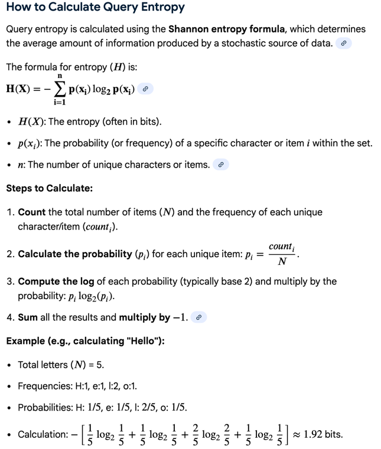

## Highlevel 面试思路
你这个问题问得非常到位，而且已经在“Principal 面试正确姿势”的门口了。
我先给你一个结论版，然后给你一套可以直接照着用的最佳话术 + 结构化框架，最后我会点评你现在的面试方法哪里已经对、哪里需要微调。

⸻

一句话结论（先给你定心丸）

是的，你理解得完全对，而且是 Principal 级别的正确打开方式：

ML system design 面试的核心不是“我会多少模型”，
而是：我是否能先对齐业务目标 → 约束 → trade-off，
再把系统拆成模块，控制节奏，引导对话。

你现在做的事情，本质是在做三件事：

	1.	主动定义目标函数（success metric）
	2.	把模糊问题转化成一组合理的 assumption
	3.	用这些 assumption 自然“推导”出系统结构

👉 这正是 Principal MLE 的核心能力。

⸻

第一部分：你给的开场话术，对不对？

给你一个【最佳开场话术模版】🔥（强烈建议背）
```
“Before jumping into a solution, I want to align on the goal and constraints first.”

“My assumption is that the goal of Atlassian search is to 
maximize successful search sessions rather than just raw relevance.”

“By successful session, I mean: the user finds 
the right document with minimal reformulation, 
under a bounded latency and retrieval cost.”

“So the optimization target is not unlimited recall, 
but bounded recall: retrieving enough relevant documents 
for downstream ranking to work, without exploding latency.”
```
⚠️ 这几句话非常重要，因为你在主动定义 loss function。

⸻

第二步：自然引出 Atlassian 的业务结构（你这一步是对的）

你现在的思路是对的，我们帮你 sharpen 成面试版
```
🔹【业务 assumption 话术】

“Given Atlassian’s product surface, 
I assume we have two dominant corpora:

• Jira issues, which are structured, short, graph-connected, but semantically sparse
• Confluence pages, which are long-form, contextual, and semantically rich

“Different query types interact with these corpora very differently.”


🔹【用 query 类型举例（非常关键）】

“Some queries are already well-structured, for example:
‘Q3 roadmap design by Alice’ — this naturally maps to a 
Confluence page, and the query itself is a good semantic anchor.”

“Other queries are vague but relational, like:
‘tickets blocking Q3 roadmap’.
Here the target is Jira issues, but the query itself 
lacks enough context to retrieve tickets directly.”
```
👉 这一句直接把 multi-hop 的 necessity 讲清楚了。

⸻

第三步：自然“推导”出三个 QU 模块（而不是硬拆）

这是你现在已经在做、但可以更漂亮的一步

🔹【模块推导话术】
```
“Given these differences, I think Query Understanding is less about one model, and more about a decision system that answers three questions.”

然后你 pause 一下，再说：
	1.	Where should we search? → Routing / Intent Understanding
	2.	What constraints should apply? → Semantic Constraint Extraction
	3.	How should we search? → Planning / Orchestration
👉 这一步非常像 Principal 在带 design review。
```

第四部分：10 分钟讲完整 workflow 的【节奏控制话术】

你说得非常对：不能一开始就钻进细节。

```
🔹【过渡话术（非常有用）】

“Let me first walk through the high-level flow end-to-end, and then we can dive deep into any module you find most interesting.”

⸻

高层架构 Flow（你可以边画边讲）

Query
  ↓
[Module A] Intent / Routing
  ↓
[Module B] Constraint Extraction
  ↓
[Module C] Planning / Orchestration
  ↓
Retrieval → Ranking
```

⸻

第五部分：每个模块的【高层话术（不进细节版）】
🟦 Module A：Routing / Intent Understanding（高层）

```
“The goal here is not just classification, 
but deciding the candidate pool under latency constraints.”

“So this module outputs probabilities 
over Jira / Confluence / Both, 
which then feeds into a routing policy 
— single route, cascade, or parallel.”

“This already hints that it’s a model + policy problem, 
not just a model.”

（点到为止，不讲 threshold、PR curve）
```
⸻

🟩 Module B：Semantic Constraint Extraction（高层）

```
“This module turns a vague query into a retrieval-ready 
structure — entities, time windows, and relations like ‘blocking’ or ‘owned by’.”

“The key value is reducing ambiguity before retrieval, 
especially under privacy constraints where we can’t rely on manual labeling.”
```
⸻

🟨 Module C：Planning / Orchestration（高层）
```
“This is where we decide whether the query itself is a sufficient anchor, 
or whether we need multi-hop or graph-augmented retrieval.”

“This decision is driven by uncertainty, query entropy, 
and session frustration signals, 
and can evolve from learned determinstic to LLM-assisted planning.”
```
⸻

🔚 收尾一句（极重要）
```
“That’s the high-level flow. Happy to dive deeper into routing, planning, 
or evaluation — whichever you prefer.”

👉 这句话 = 你在控场。
```
⸻

🟨 第六部分：如果面试官点名要“深入某个模块”，你怎么切换？

你说得也完全对：
深入 = 建模 + feature + label + evaluation

我给你一个 通用切换模版，任何模块都适用：
```
“Sure. For this module, I’ll break it down into four parts:
objective, features, supervision signal, and evaluation.”
```
然后展开。

⸻

示例：如果她点名 Orchestration / Planning（你刚刚问的）

🎯 Objective

	•	maximize recall gain per ms
	•	reduce reformulation

🧠 Features

	•	query entropy
	•	route margin
	•	session frustration
	•	corpus sparsity
	•	graph connectivity

🏷️ Labels

	•	from replay logs:
	•	reformulation count
	•	anchor usage
	•	multi-click path

📊 Evaluation

	•	offline: hit@K, MRR under latency buckets
	•	online: session success, reformulation rate, P95 latency


## Model细节
下面这份就是给你“随时能 dive deep”的讲稿级材料：每个 module 我都按同一套骨架写——

	1.	建模目标（objective）
	2.	输入/特征（features）：每个 feature 的 intuition + 怎么做 feature engineering
	3.	label / supervision：怎么从 logs 拿、怎么去噪、冷启动怎么做
	4.	模型选择（v0→v1→v2）：为什么这样演进
	5.	评估（offline + online）：指标、切片、Ablation、guardrail
	6.	enterprise/tenant 隐私约束下的注意点

为了便于你面试时控场，我也把每个模块的输出写成“产物”（例如 routing 输出不是 hard decision，而是 scores + policy inputs）。

⸻

### Module A：Routing / Intent Understanding（决定搜哪类 corpus）

1) Objective
```
	•	Primary：把 query 路由到正确的候选池（Jira / Confluence / Both / +可扩展：People / Attachments / Slack connectors 等）
	•	Secondary：为后续 planner 提供 uncertainty（是否需要多路、是否需要 LLM 介入）
	•	Trade-off：routing 错了会造成 catastrophic recall loss；routing 过于保守（全都 Both）会 latency/cost 爆炸
```
产物（输出）：

	•	p(jira), p(conf), p(both)（multi-label 或 3-class）
	•	uncertainty：margin / entropy / calibration score
	•	optional：候选池优先级建议（Jira-first / Conf-first）

⸻

2) Features（带 intuition + engineering）

A. Universal / Shared backbone features（不看 tenant 内容，跨 tenant 通用）

(a) Query text embedding

	•	intuition：routing 的核心是“query 语义更像 ticket 还是 page”
	•	engineering：
	•	直接喂 raw query text 给 encoder（small transformer / distilled BERT / bi-encoder）
	•	也可加：subword、char n-gram（对 ABC-123、ENG-4567 这种 ticket key 很友好）

(b) Lexical shape / pattern features

	•	intuition：Jira 有强结构模式，Confluence 更像自然语言标题/主题
	•	engineering（可做成稀疏特征拼到 MLP / 或作为 prompt 特征）：
	•	是否包含 PROJ-\d+（issue key）
	•	token 数、平均 token 长度
	•	是否含时间词（Q3 / 2025 / last week）
	•	interrogative pattern（what/how/where）→ 更像 Confluence/knowledge query
	•	action verb（fix/implement/ship）→ 更像 Jira task intent（但不绝对）

(c) Relationship keyword flags

	•	intuition：blocking/depends on/assigned to 等关系词强指向 Jira graph
	•	engineering：关键词表 + 轻量 stemming / synonym table（blocker/dependency/gating）

⸻

B. Tenant-aware but “non-UGC content” features（适合 tenant head / adapter）

这里的关键是：不读文档内容，只用统计/元信息，仍能捕捉 heterogeneity。

(d) Tenant corpus priors (P(click_doc_type | tenant, last_30d))

	•	intuition：某些公司 Jira-heavy，有些 Confluence-heavy；先验能显著提升路由
	•	engineering：
	•	P(click_doc_type | tenant, last_30d)
	•	query→doc_type 的历史分布 entropy（只存聚合）
	•	作为特征喂给 head：jira_prior, conf_prior

(e) Tenant jargon → doc_type association（统计层）

	•	intuition：同一 token 在不同公司含义不同；head 学到“这个 tenant 的 shorthand”
	•	engineering：
	•	统计某些 token（如 “RFC”, “PRD”, “SOP”）在该 tenant 中最终成功点击落在哪类 doc
	•	仅存 token→type 的聚合，不存具体文档 得到了一个query 对不同type doc的概率向量

⸻

C. Session / user-context features（谨慎使用，作为 ambiguous breaker）

(f) Session history doc-type

	•	intuition：query 很短（如 “Q3”）时，上一跳用户刚点的是 page 还是 ticket 很关键
	•	engineering：
	•	last clicked doc type
	•	last K queries
	•	session age / reformulation count（也可喂到 planner）

面试里你可以强调：这些特征必须 tenant-internal，并做 privacy gating。

⸻

3) Labels（怎么拿 & 去噪 & 冷启动）

基本监督信号：session replay logs（implicit）

对 (tenant, query)：

	•	label 取 “最终有效交互” 的 doc type
	  •	click + dwell ≥ T → positive
	  •	next_action（copy/link/comment/create）→ stronger positive
	  •	如果 session 里出现 “Conf → Jira” 的典型路径：可打 both（multi-label）或 needs_multi_route

去噪策略（非常重要）

	•	只用 long dwell / next action 构造高 precision 训练集（seed）
	  •	用 teacher（LLM 或高成本规则）对 short click 做 re-label / filtering
	  •	对 highly ambiguous query（短 query）降低权重或单独 bucket 训练

冷启动（新 tenant / 新产品）

	•	先验：global model（shared backbone）+ 默认 routing policy（e.g., parallel top-1 route）
	•	自适应：tenant head 用少量 session 聚合 stats warm-up（几百~几千次 query 就能动）

⸻

4) Models（v0→v2）:
```
	•	v0：规则（issue key / keyword）+ fallback both
	•	v1：multi-label classifier（shared encoder + MLP）
	•	v2：shared encoder + tenant adapter/head（LoRA/IA3/小 MLP head）+ calibrated uncertainty
	•	optional：mixture-of-experts（按 tenant cluster / industry cluster）
```
⸻

5) Evaluation（offline / online）

Offline

	•	multi-label: micro/macro F1、PR-AUC（每类）、calibration（ECE/Brier）
	•	关键切片：
	•	query length（1-2 tokens）
	•	issue-key pattern vs natural language
	•	tenant size（data-rich vs tail tenants）
	•	ablation：去掉 tenant prior / session features，看提升是否来自 leakage

Online（更重要）

	•	session success rate（定义：一次 query 以内成功 long click / next action）
	•	reformulation rate ↓
	•	latency（P50/P95）、retrieval cost（请求次数、候选池大小）
	•	guardrail：如果 routing confidence 低 → 自动 both 或调用 planner


### Module B：Semantic Constraint Extraction（抽结构化约束：entity/time/relation）

1) Objective

把 query 从自然语言 → 结构化约束 JSON，用于：

	•	filter（scope 缩小，提高 precision，降低 retrieval cost）
	•	normalize（alias、时间窗、owner、project）
	•	为 planner 提供“是否有关系约束”的信号（比如 blocking）

产物（输出）：
```
{
  "entities": {"person": "...", "project": "..."},
  "time_window": "...",
  "relations": ["blocking", "owned_by"],
  "confidence": {...}
}
```

2) Features（intuition + engineering）

A. Query text & syntax features（通用）

(a) Token-level embedding + NER

	•	intuition：抽 person/project/time 本质是 NER + normalization
	•	engineering：
	•	encoder + token classification head（BIO tagging）
	•	时间解析用规则/库（last week, yesterday）→ 输出标准时间窗

(b) Dependency / pattern cues

	•	intuition：关系词常出现在特定句法结构中
	•	engineering：
	•	规则：X blocking Y，owned by X
	•	轻量 relation classifier：输入 query embedding → 输出 relation types

⸻

B. Tenant metadata dictionaries（tenant 内但不是内容正文）

(c) Entity dictionary match

	•	intuition：企业内部 project/team 名字是强 signal（但跨 tenant 差异巨大）
	•	engineering：
	  •	dictionary from tenant metadata（project list/user list）
	  •	fuzzy match + alias table（“roadmap”→具体 page space?）
	  •	输出 normalized entity id（不是原文）

⸻

C. ```Session context（ambiguity resolution）```

(d) Recent entities / topics

	•	intuition：短 query 的 entity 往往来自 session 上下文
	•	engineering：last clicked page title embedding（不暴露内容给工程师，只在线算）+ entity cache id

⸻

3) Labels / supervision

Constraint extraction 常见难点是 “没有人工标注”。

方法 1：Distant supervision（强推荐 v0）

	•	从 clicked doc 的 metadata 推断约束
	•	clicked Jira issue 的 assignee → person constraint
	•	issue 的 project key → project constraint
	•	doc 的 updated_at / created_at 与 query 的 time window 是否一致 → time label

注意：不需要读正文，只用结构字段。

方法 2：LLM pseudo-label（v1）

	•	给 LLM 输入 query + clicked doc metadata（不含正文）→ 生成 JSON 约束
	•	用它训练小模型（distill），上线用小模型

去噪

	•	只用高置信行为（next_action / long dwell）
	•	约束 label 用 soft label（概率）而不是硬标签（更稳）

⸻

4) Models（v0→v2）
```
	•	v0：规则 + dictionary
	•	v1：token classification（NER）+ relation classifier（multi-label）
	•	v2：shared encoder + tenant adapter（特别是 entity alias）+ calibration
```
⸻

5) Evaluation

Offline

	•	entity extraction：precision/recall/F1（按 entity 类型）
	•	relation：PR-AUC / F1
	•	downstream impact（最重要）：
	•	加 constraints 后 candidate pool size ↓
	•	recall@K 是否不降（或可控下降）
	•	ranking MRR 是否提升

Online

	•	reformulation ↓（用户不用反复加过滤词）
	•	time-to-success ↓
	•	retrieval cost ↓

### Module C：Planning / Orchestration（决定 direct vs multi-hop vs graph）

1) Objective

用最少的额外 latency/成本，最大化 session success（尤其是 vague/tail queries）

Planner 做的不是“找文档”，而是“选策略”：

	•	direct retrieval（query→docs）
	•	anchor-first multi-hop（query→anchor page→target tickets）
	•	graph-augmented（先查依赖关系/人/org）

产物（输出）：
```
{
  "plan_type": "direct | anchor_first | graph_first",
  "routes": ["conf", "jira"],
  "num_hops": 1|2|3,
  "rewrite": "...",
  "filters": {...},
  "confidence": ...
}
```

⸻

2) Features（这是面试深挖高频）

A. Query uncertainty / entropy（通用、便宜，做 gating）

(a) Routing margin / entropy

	•	intuition：margin 小 → 说明 query 模糊，适合 multi-route 或 LLM
	•	engineering：用 Module A 输出即可（免费）
	•	from Module A's outputs to calculate the margin

(b) Retrieval preview signals（可选）

	•	intuition：用一个 cheap first-pass retrieval 试探“直搜有没有希望”
	•	engineering：
	•	对 direct retrieval 先跑 top-20
	•	看分数分布：top1-top20 是否很平（flat = 语义不确定）
	•	这是很强的 planner feature

⸻

B. Query type & constraint complexity

(c) Relation flags（blocking/owned_by）

	•	intuition：关系型 query 通常需要 graph 或 multi-hop
	•	engineering：来自 Module B

(d) Entity availability

	•	intuition：如果包含 project/person/time，适合先做 filter；如果没有 entity 且 query 很短，可能需要 anchor-first
	•	engineering：Module B 输出 + query length

⸻

C. Session frustration / navigation patterns（tenant 内）

(e) Reformulation count / time-to-first-success

	•	intuition：历史上同类 query 经常反复改写 → direct 失败概率高
	•	engineering：
	  •	aggregated per query cluster：avg reformulation
	  •	per session：当前已 reformulate 次数

(f) “Conf → Jira” transition likelihood（强特征）

	•	intuition：很多任务型问题先找 roadmap page 再找 tickets
	•	engineering：
	  •	从 session 图统计转移概率：P(Jira click | Conf click, query_cluster)

⸻

D. Corpus structure (不看正文，只看“可索引元信息”)

(g) Query entropy proxy

	•	intuition：high entropy  短、语义弱 → direct semantic retrieval 难
	•	engineering：
	

(h) Graph density

	•	intuition：graph 密集的 tenant，用 graph-first 更划算
	•	engineering：
	•	avg degree（issue links）
	•	dependency edges count

⸻

3) Labels（怎么从 logs 造“策略标签”）

Planning 的 label 不是人工“这题需要 multi-hop”，而是从行为推断：

(A) direct-success label
```
	•	query 后 首轮检索 就出现：
	•	click + long dwell / next_action
	•	reformulation = 0 或很低
→ label：direct
```

(B) anchor-first necessity label（典型）
```
	•	session pattern：
	•	query → click Confluence（roadmap）→ 再 click Jira（相关 tickets）
	•	或 query 多次 reformulate 后才命中
→ label：anchor_first
```

(C) graph-first label
```
	•	query 包含 person/org/time，且用户最终通过 “people / org / assigned tickets” 路径成功
→ label：graph_first
```

注意：label 去噪
	•	只对高置信 session 打标签（长 dwell/next_action）
	•	对 “多路径都发生” 用 soft label（分布式标签）更稳

⸻

4) Models（v0→v2→LLM hybrid）
```
	•	v0：规则策略（短 query + low margin → anchor-first；关系词 → graph）
	•	v1：multi-class policy model
	•	输入：上述 features
	•	输出：plan_type（direct/anchor/graph）+ num_hops
	•	v2：contextual bandit / cost-sensitive classifier
	•	直接优化 success - λ * latency
	•	LLM planner（只在 high-entropy bucket）
	•	输入是 结构化摘要（route scores + constraints + preview stats）
	•	输出 bounded plan（最多 2 hops / 必须返回 JSON）

面试里强调：LLM 不是 always-on，用 gating 控制成本。
```

5) Evaluation（你之前卡住的点，这里给你“细节版”）

Planner 的价值不是“更聪明”，而是：
	1.	同样的 latency/cost 下，session success 更高
	2.	同样的 success 下，latency/cost 更低
	3.	在 tail / vague query 上提升更明显（否则 planner 没必要）

所以 evaluation 必须是 效果 vs 成本 的 trade-off 证明，而不是单看 hit@K。

#### Offline：Replay ablation（证明 marginal gain/ms）

固定 ranker / retrieval，引入 planner 策略对比：
```
	•	direct only
	•		+	routing
	•		+	constraints
	•		+   planning（anchor/graph）

指标：
	•	hit@K（基于 clicked doc）
	•	MRR@K
	•	success@1（是否一次就命中）
	•	estimated latency（每个动作给成本：一次检索=1 unit，LLM=5 units）

计算：
	•	Δhit@K / Δlatency
	•	Δsuccess_session / Δlatency

切片：
	•	query length=1-2（Q3 类）
	•	relation queries（blocking）
	•	new tenant（cold start）

Online：
	•	session success rate ↑
	•	reformulation rate ↓
	•	time-to-success ↓
	•	P95 latency guardrail
	•	cost（LLM invoke rate、extra hops rate）
```
⸻

#### Evaluation 细节

0) 你要证明的到底是什么（面试官真正想听）

Planner 的价值不是“更聪明”，而是：

	1.	同样的 latency/cost 下，session success 更高
	2.	同样的 success 下，latency/cost 更低
	3.	在 tail / vague query 上提升更明显（否则 planner 没必要）

所以 evaluation 必须是 效果 vs 成本 的 trade-off 证明，而不是单看 hit@K。


1) Offline 评估：Replay + Counterfactual 风格（最关键）

1.1 建立 replay dataset（session-level）

从日志里抽 session，定义：

	•	q0：原始 query
	•	q1, q2...：reformulation 序列
	•	clicked_doc：最终有效 doc（最好是 long dwell/next action）
	•	doc_type_path：用户点击路径（Conf→Jira / Jira→Jira / etc）
	•	success：是否成功（后面定义）

成功（success）定义建议：

	•	success = 1 如果在 session 内出现：
	•	next_action（copy/share/comment/create ticket等）
	•	或 long dwell（超过阈值 T）
否则 success=0

这样比 click 更稳，噪声更小。

⸻

1.2 离线对比哪些系统（Ablation ladder）

你要做一个阶梯式对比，才能证明 planner 的边际贡献：

	•	Baseline：Direct retrieval only（query 当 anchor）
	•	+ Routing：如果 route 不确定，dual-route
	•	+ Constraints：加结构化过滤
	•	+ Planning：让 planner 决定 direct vs anchor-first vs graph-first（multi-hop）

planner 的价值 = 最后一跳带来的 Δsuccess / Δcost。

⸻

1.3 离线指标怎么定（效果 + 成本）

(A) Retrieval-quality proxies（基于 clicked doc）
在每个 session，用系统输出的候选集合 TopK 评估：

	•	Hit@K：clicked doc 是否在 TopK
	•	MRR@K：clicked doc 排名倒数（如果你有 ranker/打分）
	•	Recall@K：如果有多个“有效 doc”定义

Planner 主要提升 recall，不一定提升 top-1，所以 Hit@K 很重要。

(B) Session-level success proxy（更贴近业务）

	•	Success@1-step：是否 一次检索 就命中有效 doc（强指标）
	•	Expected reformulations saved：基于历史 session pattern（比如 planner 选择 anchor-first 是否能减少后续 reformulation）
	•	Session success rate：在预算范围内是否能完成成功动作

(C) 成本 / latency proxy（你之前卡住的点就在这里）
离线无法直接测真实 latency，但可以用 cost model（面试可以这么说）：

给每个动作一个单位成本：

	•	C_retrieval：一次检索（比如 1 unit）
	•	C_rerank：一次重排（比如 0.5 unit）
	•	C_LLM：一次 LLM planner 调用（比如 5-10 units）
	•	C_graph_lookup：一次 graph service 调用（比如 0.2 unit）

然后每个 session 的 total cost：

	•	Cost(session) = Σ action_costs

最终比较：

	•	Success per cost：success_rate / avg_cost
	•	Δsuccess / Δcost（Planner 的 ROI 指标）
	•	或者明确说：优化目标是最大化
    •	E[success] - λ * E[cost]

这句话一出，你就像 Principal：你在讲“cost-sensitive decision system”。

⸻

1.4 “多跳”离线怎么评估（你问的 multi-hop tradeoff）

对于 multi-hop，你要比较的是：

	•	Direct：1 hop，成本低，但 Hit@K 低（ticket 语义稀疏）
	•	Anchor-first：2 hops，成本高一点，但 Hit@K 大幅提升

所以离线看：

	•	Hit@K 提升了多少
	•	成本增加了多少
	•	算 ΔHit@K / ΔCost

这就是你之前说的理解：多走几步换更高 hit rate ——完全对。

⸻

2) Online 评估：A/B + Guardrails（面试官会追问）

离线证明之后，线上你要验证真实用户行为，关键 KPI：

2.1 North-star metrics（用户体验）

	•	Session success rate（next_action/long dwell）
	•	Reformulation rate（是否减少改写）
	•	Time-to-success（从 query 到成功动作的时间）

2.2 System guardrails（成本与风险）

	•	P95 latency
	•	LLM invoke rate（planner 调用比例）
	•	Average hops / query
	•	Retrieval QPS / cost

2.3 关键在线切片（enterprise 很重要）

	•	short queries（<=2 tokens）：Q3 / roadmap / status
	•	relation queries：blocking / dependency
	•	tenant size：head tenants vs tail tenants
	•	doc type：Jira-heavy vs Conf-heavy tenants

⸻

3) 你面试里可以用的“总结句”（把 evaluation 一句话打穿）
```
“For planning/orchestration, 
I won’t evaluate it as a pure model metric. 
I evaluate it as a decision policy: 
how much incremental session success we gain per millisecond and per retrieval cost, 
especially on ambiguous tail queries.”

然后补一句：

“Offline I replay sessions and compute 
ΔHit@K / ΔCost. 

Online I validate through session success, reformulation, 
time-to-success, with P95 latency and LLM-call-rate as guardrails.”
```

### 你问的“graph 的 label 怎么看？”（补一句你刚缺的）

你可以这样回答（很自然）：

“Graph-first is inferred when the successful sessions consistently traverse structured edges — like assignee/org edges or issue-link dependency edges — before landing on the final clicked documents, especially for people/time queries. We don’t need content; we just need the navigation pattern over metadata and links.”

