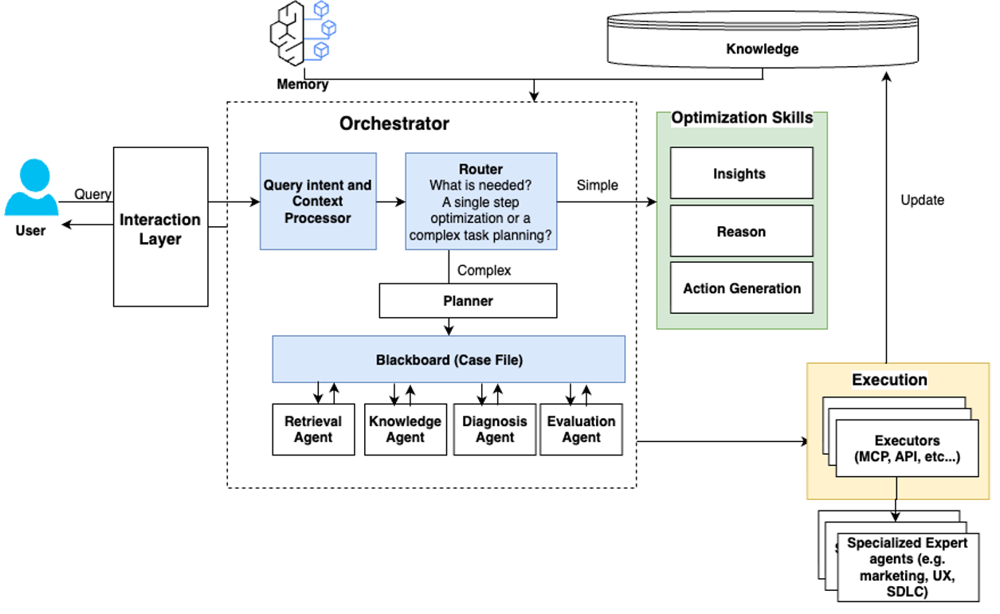
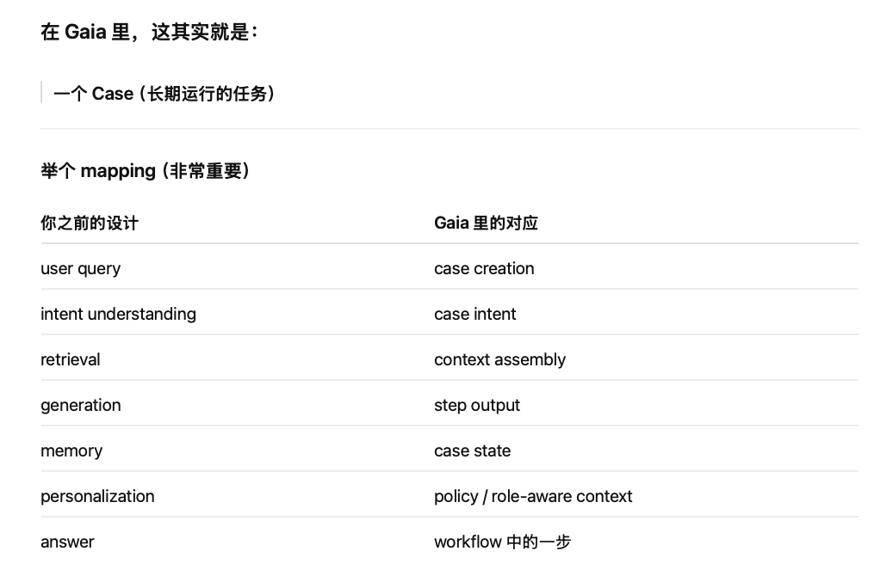

# Enterprise Collaborator 
一句话定位

Gaia Intelligence = 面向企业的人机协作操作系统的大脑层。

它的目标是解决企业 agent 落地的“最后一公里”问题：不是只自动化一个 isolated step，而是让 AI 真正参与跨团队、跨系统、跨时间的 end-to-end workflow。 

⸻

## 1) 它到底在解决什么问题

A. 企业里 agent 迟迟不能 scale 的根因

文档反复强调 6 个底层痛点：

	•	工作不是单步，而是长链路、多依赖、会动态变化
	•	AI 没有组织上下文，就会 output 漂、要求和设计 drift
	•	真正 workflow 永远是 human judgment + AI execution
	•	局部低效会在 network 里被放大成系统性拖累
	•	LLM 非确定、昂贵，所以必须有 visibility 和 control
	•	如果这些不解决，AI 只能做低价值边角活，不能进入核心工作流  

B. 所以 Gaia 的核心价值不是“回答问题”

而是两件事：

	•	intelligent orchestration
	•	continuous optimization

也就是既要把事做完，又要越做越好。 

⸻

2) 系统总架构脑图


```
Layer 1: User Interaction Layer

接多模态输入，主动追问，输出 summary / visualization / recommendation，并且显示 confidence / uncertainty。 

Layer 2: Orchestrator

核心 planner / coordinator。负责：
	•	intent understanding
	•	task decomposition
	•	workflow selection / creation
	•	routing to AI or human
	•	根据 outcome 动态重规划  

Layer 3: Knowledge Management System

不是普通 RAG，而是组织级 knowledge layer：
	•	business / org context: including goals, org structure, and optimization
	•	team operational knowledge, such as institutional context, goals, roles, and functions, and guardrails
	•	runtime context, including agent registration info, project shared contexts based on recency, 
	•	冲突知识 resolution -> should esclate to human to resolve them
	•	provenance / uncertainty preservation  

Layer 4: Optimization Layer

分两部分：
	•	Insights：看 usage pattern / quality / team collaboration pattern
	•	Reasoning + Action Generation：做 root-cause diagnosis，形成 hypothesis，决定修什么、怎么修、是否自动修  

Layer 5: Task Executor

真正执行动作：
	•	API / MCP
	•	trigger agent
	•	update skill files
	•	route to third-party agents
	•	human approval
	•	rollback / audit / traceability  
```

## 简单的task level orchestration v.s workflow orchestration
### task level 
先给你最短版结论：

你现在想的是

一个 feature：

	•	用户提问
	•	intent understanding
	•	走 summary / guidance / generation
	•	根据任务取不同 context
	•	LLM 输出
	•	结合 memory / personalization

这个没错。这个可以叫：

task-level orchestration

### Workflow orchestration
不仅做这一轮回答，而是：

workflow-level orchestration

也就是：

	•	这个任务后面还有什么步骤
	•	下一步该谁做
	•	如果结果不对怎么办
	•	如果 context 变了要不要重跑
	•	哪些中间结果还能复用
	•	哪些决策要让人 approve

⸻

最关键区别

Task level's设计的是：

“这次回答怎么生成”

Gaia 想做的是：

“这件事怎么一路被做完，并且越做越好”

```angular2html
earlier design is valid for a task-level AI assistant.
It covers intent understanding, context retrieval, generation policies, and personalization for producing a good response or recommendation.

But Gaia goes one level higher.
It is not only deciding how to answer the current request — it is managing how the entire workflow progresses over time.

So in Gaia, orchestration is not just routing a request to the right context or prompt policy.
It also needs to maintain persistent task state, track decisions and intermediate outputs, coordinate multiple agents or humans, and decide how to recover or adapt when conditions change.

That’s why the original design is a good foundation, but not sufficient by itself for a long-horizon operational system.

```



## Business use case

User: I’m taking over project Atlas Or “Okay, create a launch recovery plan.”

```
→ create Case
→ build initial context
→ generate summary
→ identify blockers
→ propose plan
→ detect conflict
→ update assumptions
→ replan
→ track progress
→ learn better policy
```

所以这里很需要的是:
✅ Challenge 1: long horizon

	•	项目不是一次理解完
	•	blocker 会变
	•	plan 会变
	•	需要持续更新

⸻

✅ Challenge 2: multi-agent

	•	retrieval agent
	•	planning agent
	•	analysis agent
	•	human reviewer

⸻

✅ Challenge 3: knowledge conflict

	•	doc vs ticket vs meeting notes 不一致

⸻

✅ Challenge 4: personalization

	•	PM vs engineer 看不同东西

⸻

✅ Challenge 5: optimization

	•	哪种 plan 更有效
	•	哪种 workflow rework 少


## Simple Case mock for task oriented agent

一、这题的本质是什么

这个问题表面上是在问：

“How would you design an AI teammate system?”

但她实际在看四件事：

1. 你会不会先定义问题

不是一上来讲模型，而是先讲：

	•	用户是谁
	•	用例是什么
	•	成功指标是什么

2. 你是不是 system thinker

她不想听你只讲一个 LLM。
她想听的是一整套系统：

	•	data sources
	•	retrieval
	•	reasoning
	•	memory
	•	planning
	•	action / execution
	•	evaluation
	•	safety / trust

3. 你有没有 product sense

这个 system 是给 external enterprise customers 用的，不是 demo。
所以你必须提：

	•	latency
	•	permission / access control
	•	reliability
	•	cost
	•	grounding
	•	observability

4. 你有没有 science breadth

不要求你必须真的做过 agent 产品，但要看你是否理解：

	•	RAG
	•	memory
	•	personalization
	•	planning
	•	ranking
	•	evaluation

⸻

二、你可以直接背的高质量 narrative

下面这版是你可以直接背的。风格是：清晰、像 senior applied scientist、不过度浮夸。

⸻

English narrative

That’s a very interesting problem.
I would think about this system as building an AI teammate rather than just a chatbot. The goal is not only to answer isolated questions, but to help users complete real work, such as understanding project context, finding the right documents, and supporting execution planning.

I would start by clarifying the core use cases, because the design depends a lot on them. From your example, I see at least three major scenarios:
	1.	Knowledge onboarding – helping a new team member quickly understand a project, its history, owners, and current status.
	2.	Cross-team visibility – helping someone understand what another teammate or PM is working on.
	3.	Execution support – helping the team generate plans, identify dependencies, and track next steps.

Based on that, I would design the system with five main layers.

First, the data and knowledge layer.
The system needs to connect to enterprise data sources such as documents, wikis, tickets, meeting notes, chats, calendars, and task systems. I would normalize these sources into a unified knowledge layer with document text, metadata, ownership information, timestamps, and access permissions. Permissions are especially important, because for enterprise use the system must never retrieve content the user is not allowed to see.

Second, the retrieval layer.
I would use a hybrid retrieval architecture. Dense retrieval is useful for semantic matching, while sparse retrieval like keyword or BM25 is useful for exact names, acronyms, or identifiers. Then I would use reranking to improve precision. For enterprise use cases, retrieval quality is often the most important component, because users need trustworthy grounding before they will rely on planning or reasoning outputs.

Third, the reasoning and orchestration layer.
I would have an orchestrator that first classifies user intent: is the user asking for search, summary, status understanding, or planning support? Based on that intent, it decides which tools to call. For example, if a user says, “I’m new to project X, help me understand it,” the system should retrieve key documents, identify owners, summarize the timeline, and generate a concise onboarding view. If the user asks, “What should we do next for launch readiness?” then the system should retrieve the latest project status, open risks, task dependencies, and use that grounded context to draft an execution plan.

Fourth, the memory and personalization layer.
The system should maintain short-term state within a session, such as what project the user is discussing and which documents have already been reviewed. It can also maintain longer-term memory, such as the user’s role, team context, preferred level of detail, and frequently referenced projects, as long as that is privacy-safe and permission-aware. For enterprise scenarios, personalization should be less about personal taste and more about work relevance: the same question from an engineer, PM, or manager may require different views and different summaries.

Fifth, the action and feedback layer.
Beyond answering questions, the system should support lightweight actions, such as drafting a project summary, generating next-step recommendations, surfacing blockers, or proposing an execution plan. In later stages it could integrate with systems like Jira or internal task trackers, but I would start with read-heavy assistance before moving to higher-risk write actions.

For evaluation, I would separate it into multiple levels.

At the retrieval level, I would measure recall, precision, reranking quality, freshness, and permission correctness.
At the answer level, I would measure grounding, faithfulness, factual accuracy, and citation usefulness.
At the workflow level, I would measure user outcomes such as time to onboard, time to find relevant documents, reduction in repeated questions, and whether teams complete planning tasks faster.

One thing I would be very careful about is hallucination and trust. For an AI teammate, trust is everything. So I would make the system grounded by default: retrieve first, cite sources, distinguish between facts and suggestions, and avoid presenting unsupported planning outputs as truth.

If I had to prioritize an MVP, I would start with the onboarding and project understanding use case, because it has high value, relatively clear evaluation, and lower risk than autonomous execution. Once retrieval, grounding, and summarization are reliable, I would expand into planning support and more agentic behaviors.

So overall, my design principle would be: start from high-value workflows, build a strong retrieval and grounding foundation, add memory and personalization carefully, and only then expand toward more agentic planning and execution support.

⸻

三、中文理解版

你脑子里要这样理解这套回答：

这不是一个聊天机器人，而是一个 AI teammate。
它要做三件事：

	1.	帮新人快速理解项目
	2.	帮团队知道谁在做什么
	3.	帮团队做 execution planning

所以系统设计必须有五层：

	•	数据层
	•	检索层
	•	推理/编排层
	•	memory/personalization 层
	•	action/feedback 层

然后评估也要分层：

	•	retrieval 好不好
	•	回答准不准
	•	workflow 效率有没有提升

最后强调：

	•	企业场景 permissions 很重要
	•	hallucination 不能乱说
	•	一开始先做 onboarding / understanding，再做 planning / execution

⸻

四、面试时更自然、更像真人说出来的版本

如果你不想背太长，就背这版。

⸻

Compact version

I would design this as an AI teammate system rather than a pure chat assistant.
The main use cases I hear are: helping new team members onboard, helping people understand project status across teams, and helping generate execution plans.

Architecturally, I would break it into five parts.

First is the knowledge layer, which connects to enterprise sources like docs, tickets, wikis, meeting notes, and task systems, with strong permission control.

Second is the retrieval layer, where I would use hybrid retrieval: semantic retrieval for conceptual matching, keyword retrieval for exact entities, and reranking for precision.

Third is the orchestration layer, where the system identifies whether the user needs search, summary, status understanding, or planning, and then calls the right tools.

Fourth is memory and personalization. The system should remember session context, and over time it can learn the user’s role, team context, and preferred level of detail, so the same project can be explained differently to an engineer versus a PM.

Fifth is the action layer, where the system does more than answer questions — for example, generate a project summary, identify blockers, or draft an execution plan.

For evaluation, I would measure retrieval quality, grounded answer quality, and workflow impact like time to onboard or time to find information.

I would start with project understanding and onboarding first, because strong retrieval and grounding are the foundation. Once trust is established, I would expand toward planning and more agentic support.

⸻

五、这题每个知识点分别讲解

下面是你后面可能被追问的部分。

⸻

1. 什么是 agent / orchestrator

很多人一提 agent，就说“LLM can call tools”。这个太浅了。

更好的理解是：

Agent = 能基于目标做多步决策的系统

它不只是回答一个问题，而是会：

	•	理解目标
	•	拆解子任务
	•	选择工具
	•	根据结果继续下一步
	•	最后给出一个完成任务的结果

在这个 case 里 agent 可能怎么工作

比如用户问：

“I’m joining project Apollo next week. Can you help me get up to speed?”

agent 不是直接吐一段 summary。
它可能走这样的流程：

	1.	识别 intent：onboarding
	2.	识别实体：project Apollo
	3.	调用 search/retrieval 工具找文档
	4.	找 owner / 最近状态 / open risks / milestones
	5.	聚合信息
	6.	输出 onboarding summary
	7.	追问：要不要我再给你一个 30-60-90 day ramp plan

所以 agent 的重点不是模型本身，而是 workflow orchestration。

⸻

2. 什么是 state / memory

这是你特别问的点。这里一定要分清：

A. State

通常是当前会话里的状态

例如：

	•	当前讨论的项目是 Apollo
	•	用户已经看过两份文档
	•	用户刚才说他是新加入的 engineer
	•	当前任务是“理解 launch blockers”

这些信息只在当前任务/当前 session 非常有用。

举例

用户先问：

“Can you summarize project Apollo?”

然后又问：

“What are the blockers?”

系统知道 “the blockers” 指的还是 Apollo。
这就是 session state。

⸻

B. Memory

通常是跨会话保留的信息

例如：

	•	用户是 PM 还是 engineer
	•	用户常看哪几个项目
	•	用户喜欢 high-level summary 还是 technical detail
	•	用户所在公司/team 的结构和术语
	•	用户经常关注 launch readiness, risk, staffing 等问题

为什么 memory 重要

因为企业里的“同一句话”对不同人含义不同。

例如：

“What’s the status of project X?”

对 engineer：

	•	更需要 technical blockers
	•	dependency
	•	owner
	•	unresolved bugs

对 PM：

	•	milestone
	•	timeline risk
	•	stakeholder alignment
	•	staffing / launch readiness

所以 memory 的价值不是“像朋友一样记住你”，而是：

让系统逐渐知道你在工作中需要什么视角

⸻

C. 常见 memory 设计方式

1）Short-term memory

保存当前对话上下文
一般做法：

	•	conversation buffer
	•	summarized context
	•	task state object

2）Long-term memory

保存跨会话信息
一般做法：

	•	profile store：结构化 user profile
	•	memory store：向量库/文档库
	•	project-specific memory：按项目保存摘要、事件、偏好

3）Working memory

很多 agent 系统里还会有 working memory：

	•	当前计划
	•	已完成步骤
	•	下一步要调用的工具
	•	中间检索结果

这个更像 agent 的 scratchpad。

⸻

D. 对这个岗位，memory 应该怎么落地

对 enterprise 场景，我会说：

I would keep memory selective and useful.
For this use case, memory should capture role, project context, frequently accessed entities, preferred summary depth, and prior workflow context — not arbitrary personal information.

也就是说，记忆重点应该是：

	•	role-aware
	•	task-aware
	•	org-aware
	•	permission-aware

而不是记一堆杂乱聊天内容。

⸻

3. personalization 在这个 case 里怎么做

你提到不同公司有不同风格，这个点非常好。

这里你可以这么理解：

personalization 不只是“记住用户”

而是让系统适应：

1）用户角色

	•	engineer
	•	PM
	•	manager
	•	leadership

2）团队风格

	•	有的公司写文档很全
	•	有的公司大量信息在 Slack / meetings
	•	有的公司强调 roadmap
	•	有的公司强调 execution tracker

3）组织语言

	•	同一个词在不同公司含义不同
	•	同一个项目状态模板不同
	•	某些团队特别看重 launch blockers，某些团队看重 experiment readouts

⸻

personalization 怎么实现

方法一：显式 profile

直接维护 user / org profile

例如：

	•	role = PM
	•	prefers = concise summary + risks + owners
	•	top projects = Apollo, Hermes

方法二：隐式 learned preference

从历史交互中学习：

	•	这个人经常点开什么文档
	•	喜欢看什么级别的总结
	•	经常追问哪些信息

方法三：organization template

针对不同公司或团队建立 org-specific template：

比如输出 project status 时，自动按这个 org 的习惯组织：

	•	Objective
	•	Current status
	•	Owners
	•	Risks
	•	Dependencies
	•	Next milestones

这就是你说的“不同公司风格需要 personalization”。

⸻

4. 什么是 RAG

这是必考。

定义

RAG = Retrieval-Augmented Generation

意思是：

在 LLM 生成回答之前，先去检索外部知识，再让模型基于检索到的内容回答。

不是只靠模型参数里的记忆。

⸻

普通 LLM vs RAG

普通 LLM

用户问：

“What happened in project Apollo last month?”

模型只能靠：

	•	训练时见过的知识
	•	当前 prompt

如果 Apollo 是公司内部项目，它根本不知道。

⸻

RAG

系统先去：

	•	搜 docs
	•	搜 tickets
	•	搜 meeting notes
	•	搜 status updates

把这些内容找出来，再给模型总结。
所以模型是在“看着材料做回答”。

⸻

RAG 的核心流程

	1.	文档切块 chunking
	2.	建 embedding index / keyword index
	3.	用户 query 改写
	4.	retrieval 找相关文档
	5.	reranking
	6.	把 top documents 连同 prompt 一起送给 LLM
	7.	LLM 生成 grounded answer

⸻

5. 为什么 RAG 可以减少 hallucination

这个很关键，你要能讲得自然。

hallucination 本质是什么

模型在没有足够事实依据时，依然会生成“像真的一样”的内容。

原因包括：

	•	参数记忆不包含该知识
	•	prompt 里没给足够信息
	•	模型倾向于补全而不是承认不知道

⸻

RAG 为什么有帮助

因为它给模型提供了外部证据。

原来模型是：

“凭印象回答”

现在变成：

“先查资料，再基于资料回答”

所以 hallucination 会下降，原因有三层：

1）减少无依据猜测

如果 retrieval 找到了真实文档，模型就不需要自己编。

2）把回答约束在上下文内

prompt 可以明确说：

answer only using retrieved context

这样模型更容易 grounded。

3）支持 citation / evidence

用户可以看到来源，系统也能检查回答是否和证据一致。

⸻

但你要注意：RAG 不是万能的

这是高级一点的说法，面试官会喜欢。

你可以说：

RAG reduces hallucination, but it does not eliminate it.
If retrieval misses key documents, or if the retrieved context is noisy, stale, or conflicting, the model can still generate inaccurate answers.

也就是：

	•	检索错了，回答还是会错
	•	文档过时了，也会错
	•	多份文档冲突，也会错
	•	模型总结错了，也会错

所以企业场景里，retrieval quality is product quality。

⸻

6. planning / execution support 怎么做

这个岗位很可能会涉及 planning agent，但你不需要把它讲得很玄。

本质

planning 不是让 AI 自己瞎做事，而是：

根据项目现状、依赖、风险、负责人、截止时间，辅助生成一个可执行的 plan

⸻

一个合理的 planning pipeline

Step 1

收集上下文：

	•	project status
	•	milestones
	•	blockers
	•	dependencies
	•	owners
	•	open tasks

Step 2

生成 candidate plan
例如：

	•	next 2 weeks goals
	•	priority ordering
	•	dependency resolution
	•	risk mitigation

Step 3

约束校验
看是否：

	•	缺 owner
	•	dependency 顺序不对
	•	deadline 不现实
	•	已知 blocker 没被考虑

Step 4

human review
企业里一开始最好是：

	•	AI draft
	•	human approve

不是一上来 autonomous execution。

⸻

你在面试里可以这样说

I would start with planning assistance rather than full autonomy.
The system can synthesize current project context, propose next steps, identify blockers and dependencies, and draft an execution plan for human review.
That creates value while keeping the risk manageable.

这句很好背。

⸻

7. evaluation 怎么做

这个点特别重要，因为很多人只会讲 architecture，不会讲 evaluation。

你一定要分层讲。

⸻

A. Retrieval evaluation

评估检索是不是找对了材料

指标：

	•	Recall@K
	•	Precision@K
	•	MRR / NDCG
	•	freshness
	•	permission correctness

企业里很重要的一点是：
	•	有没有把不该看的内容召回出来
这个必须为零容忍。

⸻

B. Answer quality evaluation

评估回答是不是 grounded

指标：

	•	factual accuracy
	•	faithfulness
	•	citation correctness
	•	completeness
	•	usefulness

可以结合：

	•	human evaluation
	•	LLM-as-judge
	•	gold QA set

⸻

C. Workflow evaluation

评估有没有真的提升效率

指标：

	•	onboarding time reduction
	•	fewer repeated questions
	•	faster document discovery
	•	improved planning speed
	•	user satisfaction / return usage

⸻

这题你最好的说法

I would not evaluate this system only by model metrics.
The real success metric is whether it improves team productivity: for example, reducing time-to-context for new members, reducing repeated coordination overhead, and helping teams move from information gathering to execution faster.

这句非常像这个 team 想听的。

⸻

六、你可以主动补的一些高级点

这些是加分项，但不要一次讲太多。

⸻

1. Permission-aware retrieval

企业场景必须提。

The retrieval layer must be permission-aware, because enterprise trust breaks immediately if the system surfaces content the user should not access.

⸻

2. Freshness

团队状态是动态的，项目状态很快过时。

For project understanding and execution planning, freshness matters a lot.
I would explicitly model timestamp and recency, and weight recent status documents, task updates, and meeting notes more heavily.

⸻

3. Entity resolution

同一个项目可能有简称、代号、子模块。

The system should resolve entity aliases, owners, project names, and related workstreams, otherwise retrieval quality will degrade.

⸻

4. Start with read, then write

非常像成熟产品思维。

I would start with read-heavy assistance like retrieval, summarization, and planning drafts before allowing write actions such as task creation or workflow updates.

⸻

七、你这题最适合的答题风格

因为你没有真的做过 agent，所以最稳妥的策略不是装很深，而是：

把自己定位成一个 system-minded applied scientist

我理解 agent 系统的组成、tradeoff 和 evaluation，虽然我过去未必直接 owning 一个 agent platform，但我有 retrieval / ranking / personalization / LLM system design 的经验，可以把这些能力迁移到这个场景。

这个定位是对的。

⸻

八、你可以背的“结束收束句”

回答快结束时，用这句非常好：

So overall, I would start from a high-value workflow like onboarding and project understanding, build a strong retrieval and grounding foundation, add memory and role-aware personalization carefully, and then expand into planning support and more agentic capabilities over time.

这句很稳。

⸻

九、你下一轮最可能被追问的问题

我建议你接下来按这个顺序练：

追问 1

How would you design the memory layer for this system?

追问 2

Why is RAG important here, and what are its limitations?

追问 3

How would you evaluate whether this AI teammate is actually useful?

追问 4

How would you personalize the system for different users or companies?

⸻

我们下一步最适合直接练第一个：

“How would you design memory / state for this AI teammate system?”

我会继续按你要的格式，直接给你可背诵 narrative + 中文拆解。

