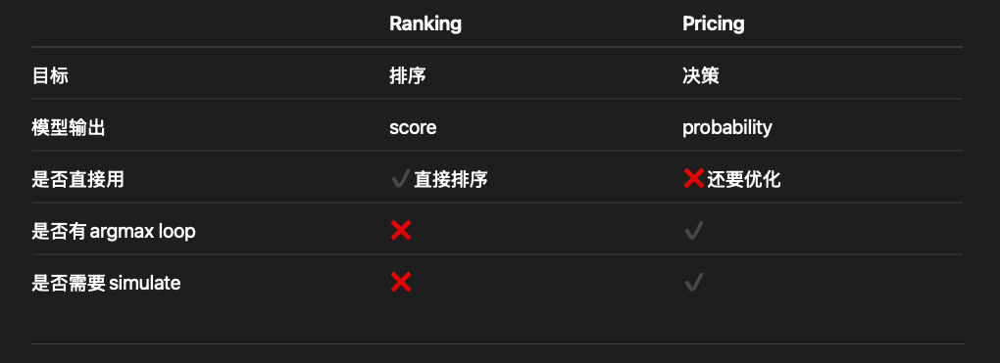

# Pricing system design

## 🧠 Section 1 — Consolidated Summary（快速抓思路）

问题本质（最重要）

👉 不是 regression 问题

👉 是一个：

decision-making problem under uncertainty 也就是用
We are not predicting price directly because there is no ground-truth optimal price. Instead, we learn a demand model P(book | x, price), and then simulate candidate prices to optimize expected revenue. This allows us to reason about counterfactual pricing decisions rather than imitating historical pricing policies.

---

Objective

	•	primary：
	    •	    maximize revenue
$Revenue = price \cdot P(book \mid x, price)$

	•	guardrails：
        •	occupancy（不能太贵没人订）
        •	host trust（不能太波动）
        •	marketplace balance

---

```
Pipeline（你脑子里要有这张图）

Listing + Context
      ↓
Demand Model: P(book | x, price)
      ↓
Price Simulation (try multiple prices)
      ↓
argmax price * P(book | x, price)
```

---

⚠️ 关键坑（你刚刚卡住的点，我帮你提前补）

❗坑1：price从哪来？

👉 answer：

	•	price 是 candidate variable
	•	inference 时“枚举 + simulate”

⸻

❗坑2：单个listing数据太少？

👉 answer：

	•	训练是 impression-level 全局训练
	•	不是 per-listing

⸻

❗坑3：新listing怎么办？

👉 answer：

	•	用 similar listing + content features
	•	cold-start + exploration

⸻

Evaluation（重点帮你补）

👉 分两层：

1️⃣ Model层（预测是否准）

	•	PR-AUC（booking sparse）
	•	calibration

⸻

2️⃣ Decision层（price是否好）⭐关键

👉 offline做：

$E[price \cdot P(book)]$

👉 或 counterfactual replay：

	•	用历史数据：
	•	模拟不同price → model预测booking
	•	compare expected revenue

⸻

👉 online：

	•	revenue
	•	booking rate
	•	occupancy

---

## 🔧 Section 2 — Technical Deep Dive

⸻

1️⃣ Training Data（你刚刚的困惑点）

⸻

正确粒度：impression-level ⭐

每条样本：

$(listing, context, shown\ price) \rightarrow booking\_label$

⸻

为什么这样？

👉 因为：

	•	user decision是在这个粒度发生的
	•	price影响 decision

⸻

⚠️ 你刚刚的误区（必须避免）

❌ 错误：

per listing train

✅ 正确：

所有 listing 混在一起 train

⸻

2️⃣ Model（核心）

⸻

学的是：

$P(book \mid x, price)$

⸻

### Feature（精简但关键）

A. listing / host

	•	location
	•	amenities
	•	review score / count
	•	host reliability（cancel / response）

⸻

B. context

	•	dates / seasonality
	•	demand（search volume）
	•	nearby competition price

⸻

C. 🔥 cross / price features（最重要）

	•	price percentile in area
	•	price vs similar listings
	•	price deviation

⸻

👉 一句总结：

The model learns price elasticity conditioned on listing and context.

⸻

### 3️⃣ Optimization（核心亮点）


inference做：

for p in candidate_prices:
    $score = p * P(book | x, p)$

pick argmax


⸻

candidate prices 怎么来？

	•	local percentiles（p10, p50, p90）
	•	similar listing price range
	•	around host input price


### 4️⃣ Evaluation（重点补清楚）


🧠 问题：你刚刚不懂的地方

👉 怎么验证：

argmax price * P(book)

⸻

#### 方法1：offline simulation（推荐你说）

⸻

Step 1：固定一个样本（historical context）

你有：

	•	listing
	•	context
	•	historical price p_0
	•	label（book or not）


Step 2：模拟多个价格

p_1, p_2, ..., p_k

用模型算：

$P(book | x, p_i)$


Step 3：算 expected revenue

$R(p_i) = p_i \cdot P(book | x, p_i)$


Step 4：比较
	•	baseline：historical price
	•	new：model推荐 price

👉 比较：
	•	avg expected revenue
	•	distribution


⚠️ 注意（加分）

👉 这是 counterfactual：

	•	历史只发生了一个 price
	•	其他 price 是模拟


面试一句话（必须会）

Offline, I would simulate different candidate prices and compute expected revenue using the demand model, then compare it against the historical policy.


#### 方法2：counterfactual replay（简化讲）

👉 用历史 exposure：

	•	模拟不同 price → model预测 outcome
	•	aggregate expected revenue


#### 方法3：online（最终验证）

👉 A/B test：

	•	booking rate
	•	revenue
	•	occupancy

⸻

### 5️⃣ Cold Start（必须说）

⸻

新 listing：

	•	用 similar listing
	•	用 content features（embedding）
	•	initialize price range

⸻

再：

	•	exploration（小范围试价）

⸻

### 6️⃣ Exploration（非常加分）

⸻

为什么需要：

👉 不探索 → 永远学不到 elasticity

⸻

方法：

	•	price jitter（±10%）
	•	bandit

⸻

⸻

## 🎤 Section 3 — Full Mock Answer（可直接说）

⸻

Thanks, this is a great question. Let me first clarify the objective.

I see pricing as closely related to ranking problems I’ve worked on, since both involve modeling user behavior such as conversion probability using rich features.

The key difference is that here price becomes a controllable variable, so the model needs to learn how booking probability changes with price, which is essentially learning price elasticity.

From a modeling perspective, I would start with approaches I’m familiar with, such as building a strong demand model using rich features and potentially deep learning architectures with attention to capture complex interactions between listing, context, and price.

Then I would place that model inside a decision layer that simulates different price candidates and selects the one that optimizes expected revenue.

Over time, I would iterate not only on model quality but also on the decision layer, for example improving price candidate generation and adding controlled exploration to better learn the demand curve.I would not treat pricing as a pure regression problem. Instead, I would formulate it as a decision problem, where the goal is to choose a price that maximizes expected business outcomes such as revenue or occupancy.

Concretely, I would build a demand model that predicts the probability of booking conditioned on listing features, context, and a candidate price. Then at inference time, I would simulate a set of candidate prices and select the one that maximizes expected revenue, which is price multiplied by booking probability.

For training data, I would construct samples at the impression level. Each sample corresponds to a listing shown under a specific context and price, with a label indicating whether it resulted in a booking. This allows the model to learn price elasticity across listings and contexts.

Importantly, the model is trained globally across all listings, not per listing, so even listings with limited history can benefit from shared patterns learned from similar listings.

For features, I would include listing attributes such as location, amenities, and reviews, host reliability signals such as cancellation rate and response time, contextual signals such as seasonality and local demand, and critically, price-relative features such as price percentile within the local market.

For evaluation, I would first evaluate the demand model using metrics like PR AUC and calibration, since booking is sparse. Then for the pricing decision itself, I would use offline simulation: for each historical context, I would evaluate multiple candidate prices using the model and compute expected revenue, and compare that to the historical pricing policy. Ultimately, I would validate the system using online experiments measuring revenue, booking rate, and occupancy.

For cold start listings, I would initialize pricing based on similar listings using content and location features, and then refine through controlled exploration as real user interactions come in.

Finally, I would include exploration in the system, for example by slightly perturbing prices, so that we can continuously learn the demand curve and avoid getting stuck in suboptimal pricing policies.

⸻

## 那么同样的model 这个system和 ranker system 有什么差异？ 
你这个问题问得非常好，而且这是一个很关键的理解跃迁点——
如果你把这个讲清楚，面试官会觉得你是 真的懂 ML system，而不是套模板。

我先直接给你结论，然后帮你建立一个“脑内模型”。

⸻

✅ 一句话结论（面试可说）

Yes, both problems use similar modeling techniques like classification or CVR-style models, but the key difference is that search ranking is a scoring problem, while pricing is a decision optimization problem where the model is only one component inside a larger decision loop.

⸻

🧠 核心区别（你必须理解）

1️⃣ Search Ranking：Scoring Problem

你在做的是：

$Score(i) = P(click / book \mid x_i)$

👉 然后：

	•	直接排序
	•	结束

⸻

pipeline

features → model → score → rank

👉 模型 = 核心

⸻

2️⃣ Pricing：Decision + Simulation Problem

你在做的是：

$P(book \mid x, price)$

👉 但重点不是这个！

👉 而是：

$price^* = \arg\max price \cdot P(book \mid x, price)$

⸻

pipeline

features → model → simulate → optimize → decision

👉 模型只是中间一环

⸻

🔥 关键本质差异（面试最重要）



⸻

🧠 为什么你会觉得“很像”

因为：

👉 两个都用了：

	•	classification model
	•	CVR-style modeling
	•	feature engineering
	•	deep model / GBDT

👉 但：

model role不同

⸻

🔁 更深一层理解（非常加分）

Ranking

👉 model学的是：

$ f(x_i) $

👉 independent scoring

⸻

Pricing

👉 model学的是：

$f(x, price)$

👉 conditional function

👉 你要回答：

“如果价格变了，概率会怎么变？”

⸻

🧠 为什么 pricing 更难（面试加分点）

1️⃣ Action-dependent model

	•	price 是 decision variable
	•	不只是 feature

⸻

2️⃣ Counterfactual problem

	•	你只观测到一个 price
	•	但要预测所有 price

⸻

3️⃣ Optimization layer

	•	argmax
	•	multi-objective

⸻

4️⃣ Exploration

	•	不试就不知道 elasticity -> the change of price / change of likelihood

⸻

👉 面试一句话（很强）：

Pricing is fundamentally a policy optimization problem under partial feedback, while ranking is a supervised scoring problem.

⸻

🔁 那 pricing 有没有 model iteration？

👉 有的，但逻辑不一样

⸻

Ranking 的 iteration

	•	GBDT → DL → attention → gating
👉 focus：

	•	feature interaction
	•	representation power

⸻

Pricing 的 iteration（你可以这么讲）

Iteration 1（baseline）

	•	simple demand model（GBDT）

⸻

Iteration 2

	•	better features（price elasticity）
	•	calibration

⸻

Iteration 3（更高级）

	•	causal model（price effect）
	•	debiasing

⸻

Iteration 4（高级）

	•	bandit / RL
	•	dynamic pricing

⸻

👉 重点：

pricing 的进化在于 decision quality，不只是 model complexity

⸻

🧠 一个类比（你可以用）

👉 非常好用：

⸻

Ranking

像考试打分：

	•	每个学生打分
	•	排名

⸻

Pricing

像定商品价格：

	•	不只是预测销量
	•	而是：

👉 “这个价格卖多少最好？”

⸻

🔥 最终你可以这么说（面试高分版）

⸻

That’s a great observation — both systems often use similar underlying models such as CVR-style classifiers, but the role of the model is quite different.

In ranking, the model directly produces a score that is used to order items, so it’s essentially a scoring problem.

In pricing, the model predicts a conditional probability $P(book \mid x, price)$, but the final goal is to choose a price that maximizes an objective such as revenue. So the model is embedded inside a decision loop where we simulate different prices and optimize over them.

Because of that, pricing introduces additional challenges such as counterfactual estimation, since we only observe one historical price, and exploration, since we need to learn price elasticity over time.

So while the modeling techniques may look similar, pricing is fundamentally a decision optimization problem, whereas ranking is a direct scoring problem.

## 那么如果没做过causal 等等 面试怎么说更好？
你这个问题非常关键，而且你现在的状态是典型“IR强 → decision ML弱”的阶段，这完全正常。
我帮你把这块讲清楚，并且给你一个**“不用会causal/bandit也能答很强”的策略**。

⸻

✅ 一、你面试到底要不要讲 causal / bandit？

👉 结论：不需要硬讲

你现在最优策略是：

✅ 必须讲清楚的（你已经有优势）

	•	feature engineering ✔️
	•	DL / attention ✔️
	•	ranking / CVR modeling ✔️
	•	system design ✔️

⸻

⚠️ 可选轻点一下（不要深讲）

	•	exploration（简单一句）
	•	elasticity（简单解释）

⸻

❌ 不要：

	•	强行讲 causal inference（会露怯）
	•	强行讲 bandit 细节

⸻

✅ 二、你应该怎么“自然展现自己”（很关键）

你现在的正确打法不是：

❌ “我不会pricing”
❌ “我不懂causal”

👉 而是：

“这个问题本质和我之前做ranking很像，我会先用我熟悉的方式把问题建出来”

⸻

🎯 你可以这样说（非常适合你）

⸻

I haven’t worked directly on pricing systems, but I see strong similarities with ranking problems I’ve worked on.

In my previous work, we also model user engagement or conversion probability conditioned on rich features. Here, the key difference is that price becomes an additional variable that influences user behavior.

So I would first focus on building a strong demand model using techniques I’m familiar with, such as deep learning models with rich feature interactions, including attention-based architectures to capture complex relationships between listing features, context, and price.

Then, I would place that model inside a decision layer that simulates different price candidates and optimizes for business objectives such as expected revenue.

⸻

👉 这个回答非常好，因为：

	•	✔️承认没做过pricing（真实）
	•	✔️把自己强项迁移过来（关键）
	•	✔️自然过渡到decision层

⸻

✅ 三、你问的重点：price elasticity 是啥？

👉 这个你必须会（但不复杂）

⸻

🧠 一句话理解

**price elasticity = 价格变化对需求的影响**

⸻

举个直观例子（你面试可以说）

假设：
```
price	booking prob
$100	0.6
$120	0.4
$150	0.1
```

👉 可以看到：

	•	price ↑ → demand ↓  👉 这就是 elasticity

⸻

用公式说（不用复杂）

$Elasticity = \frac{\Delta P(book)}{\Delta price}$

⸻

在你的模型里体现在哪？

👉 其实你已经在做了！

你训练的是：

$P(book \mid x, price)$

👉 这本质就是：

学 price → demand 的关系

⸻

面试一句话（够了）

Price elasticity refers to how sensitive booking probability is to changes in price. In our setup, the demand model implicitly learns this relationship because price is included as an input feature.

⸻

✅ 四、你刚刚说的 DL / attention 要不要讲？

👉 可以讲，但方式要对

⸻

❌ 不要这样讲（太IR）

我用attention because feature很多

⸻

✅ 正确讲法（结合pricing）

⸻

Since price interacts with many other factors such as location, demand, and listing quality, I would expect strong feature interactions.

So beyond a simple GBDT baseline, I would consider deep learning models with embedding layers for different feature groups, and potentially attention mechanisms to capture interactions between listing features, context, and price, especially when modeling non-linear price sensitivity across different market segments.

⸻

👉 这样你就不是在“秀模型”，而是在：

👉 解释为什么模型适合这个问题

⸻

✅ 五、你要不要讲 model iteration？

👉 要，但换个角度讲（不是ranking那种）

⸻

你可以这样讲：

⸻

I would iterate the system in stages.

First, I would build a simple demand model using a strong baseline like GBDT.

Then, I would improve feature representation and interaction modeling using deep learning architectures.

In later iterations, I would focus more on decision quality, such as better price candidate generation, calibration of the demand model, and potentially adding controlled exploration to better learn price elasticity over time.

⸻

👉 这句话非常 staff：

	•	不只是model
	•	有decision
	•	有evolution

⸻

✅ 六、你现在的最优策略总结

⸻

🎯 面试中你要做到：

1️⃣ 把问题变成你熟悉的

👉 “this is similar to ranking”

⸻

2️⃣ 用你强项撑住

👉 DL + feature + system

⸻

3️⃣ 轻点关键新概念

👉 elasticity（必须）
👉 exploration（一句话）

⸻

4️⃣ 不要假装会不会的

👉 不讲causal细节

⸻

🔥 最终给你一段“完美融合你背景”的话术

⸻

I see pricing as closely related to ranking problems I’ve worked on, since both involve modeling user behavior such as conversion probability using rich features.

The key difference is that here price becomes a controllable variable, so the model needs to learn how booking probability changes with price, which is essentially learning price elasticity.

From a modeling perspective, I would start with approaches I’m familiar with, such as building a strong demand model using rich features and potentially deep learning architectures with attention to capture complex interactions between listing, context, and price.

Then I would place that model inside a decision layer that simulates different price candidates and selects the one that optimizes expected revenue.

Over time, I would iterate not only on model quality but also on the decision layer, for example improving price candidate generation and adding controlled exploration to better learn the demand curve.
