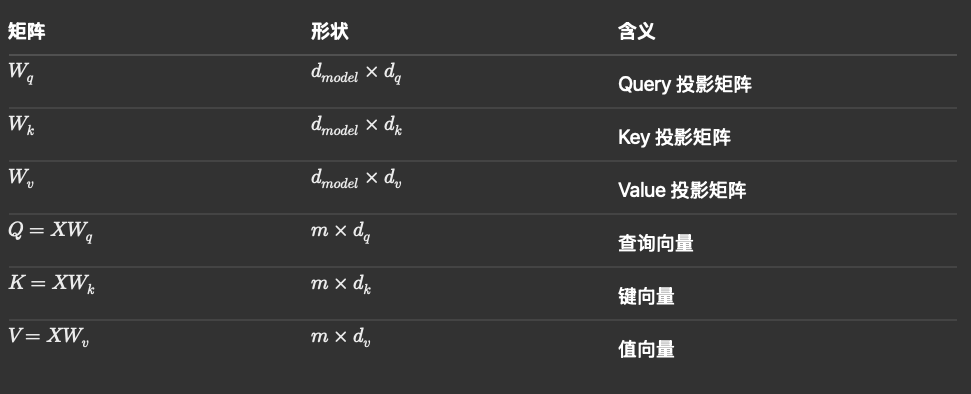
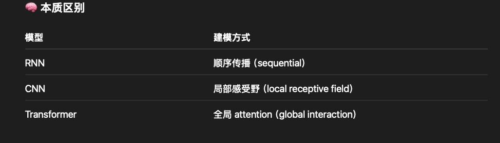

## Learning Rate & Optimization Stability


🧮 Update Rule

$\theta_{t+1} = \theta_t - \eta \nabla J(\theta_t)$

其中：

$\eta$ = learning rate

$\nabla J$ = gradient

⸻

🧠 行为分析

🔴 LR 太大（Large η）

	•	更新步长过大 → overshoot minimum
	•	在最优点两侧来回跳 → loss fluctuation / oscillation
	•	极端情况：直接 divergence

👉 本质：

step size > curvature scale（步子比地形变化还大）

⸻

🔵 LR 太小（Small η）

	•	每次更新很小 → 收敛极慢
	•	容易卡在：
	•	saddle point
	•	flat region

⸻

⚖️ Tradeoff
```
LR	Behavior	问题
大	快	不稳定 / oscillation
小	稳	收敛慢
```

⸻

🧠 直觉解释（强记忆点）

👉 “在山谷找最低点”：

	•	LR 大 → 一步跨太远 → 左右横跳
	•	LR 小 → 一步太短 → 爬半天

⸻

📌 实践技巧

	•	LR schedule（decay）
	•	Adam / RMSProp（adaptive LR）
	•	warmup（deep learning 常用）

🔹 How to answer Q1: Learning Rate

The learning rate controls the step size of parameter updates during optimization.

	•	If the learning rate is too large, the model may overshoot the optimal point, causing the loss to oscillate or fluctuate instead of converging.
	•	If it is too small, the updates become very slow and the model may take a long time to converge or get stuck in flat regions.

So in practice, we want a balance between fast convergence and stable optimization, and we often use techniques like learning rate scheduling or adaptive optimizers such as Adam.


-----

## Gradient Vanishing in Deep Networks

⸻

🧮 Backprop 核心公式（链式法则）

$\frac{\partial L}{\partial x_1} = \frac{\partial L}{\partial x_n} \cdot \prod_{i=1}^{n} \frac{\partial x_i}{\partial x_{i-1}}$

⸻

🧠 核心机制

	•	梯度是 逐层相乘
	•	如果每层导数 < 1（比如 sigmoid）

👉 会发生：

$(0.5)^{10} \approx 0.001$

→ 指数级衰减

⸻

📍 哪一层更容易 vanishing？

👉 靠近输入端（early layers）更严重

原因：

	•	距离 output 更远
	•	被乘的次数更多

⸻

📌 Activation 影响

导数最大：
$Sigmoid: \sigma'(x) = \sigma(x) * (1 - \sigma (x))\le 0.25$

$TanH : \tanh'(x) = 1- tanh^2(x) \le 1$

所以对于sigmoid来说它的vanish problem远远大于tanH但即使如此tanh依旧有vanish的问题
→ 每层都在缩小梯度

⸻

ReLU
	•	导数 = 1（正区间）

→ 不会持续缩小

⸻

⚠️ Vanishing vs Exploding

```
类型	原因	结果
Vanishing	<1 连乘	→ 0
Exploding	>1 连乘	→ ∞
```

⸻

🧠 解决方案

	•	ReLU / Leaky ReLU
	•	BatchNorm
	•	Residual Connection（ResNet）
	•	Xavier / He Initialization

⸻

🧠 直觉解释

👉 “梯度像接力传球”：

	•	每一层都丢一点
	•	传到前面 → 几乎没了

🔹 How to answer Q2: Gradient Vanishing

Gradient vanishing is more severe in layers closer to the input layer.

	•	During backpropagation, gradients are computed via the chain rule, which involves multiplying gradients across layers.
	•	If each layer contributes a factor smaller than 1, the gradient shrinks exponentially as it propagates backward.

As a result, early layers receive very small gradients and learn very slowly.
This is why modern deep networks use ReLU activations and residual connections to help gradients flow more effectively.

⸻

✅ 速记版（你脑子里记）

	•	LR large → overshoot → oscillation
	•	LR small → slow convergence
	•	Gradient = chain rule multiplication
	•	Early layers → more multiplications → vanishing
	•	Fix → ReLU / ResNet / BN

---

## Gradient Explosion

⸻

🧮 原因（链式法则）

$\prod_i \frac{\partial x_i}{\partial x_{i-1}}$

👉 如果每一项 > 1：

$1.5^{10} \approx 57$

👉 指数增长

⸻

❗关键点（面试容易问）

👉 “导数不是都 <1 吗？”

答案：

❌ 错的假设！

⸻

📌 哪些情况导数 >1？

1️⃣ 权重矩阵（最主要）

$\frac{\partial x_i}{\partial x_{i-1}} = W_i$

👉 如果：

	•	weight magnitude > 1
	•	spectral norm > 1

→ gradient amplify

3️⃣ RNN（经典场景）

	•	长序列
	•	recurrent multiplication

👉 特别容易 explosion

⸻

🧠 解决方法

	•	Gradient clipping（最重要）
	•	初始化（Xavier / He）
	•	BN / LayerNorm


Gradient explosion happens when gradients grow exponentially during backpropagation.
This is usually due to repeated multiplication of large weights, especially in deep networks or RNNs.
It’s not mainly caused by activation functions, but by weight matrices with large norms.

----

##  Adam Optimizer（为什么更稳定）

⸻

🧮 Update Rule（核心三步）

1️⃣ 一阶动量（Momentum）

$m_t = \beta_1 m_{t-1} + (1 - \beta_1) g_t$

👉 作用：

	•	平滑梯度（减少震荡）
	•	类似“速度累积”

⸻

2️⃣ 二阶动量（RMSProp思想）

$v_t = \beta_2 v_{t-1} + (1 - \beta_2) g_t^2$

👉 作用：

	•	记录梯度平方（估计 variance）
	•	控制每个参数的步长

⸻

3️⃣ Bias Correction + Update

$\theta_{t+1} = \theta_t - \eta \frac{\hat{m}_t}{\sqrt{\hat{v}_t} + \epsilon}$

👉 作用：

$\hat{m}_t$：去 bias 的 momentum because at the early stage the momentum is approaching 0

$\hat{v}_t$：去 bias 的 variance, same motivation above

$\epsilon$：防止除 0

⸻

🧠 为什么更稳定（本质）

👉 三个层面：

1️⃣ Momentum（β₁）

	•	减少梯度方向抖动
	•	类似“低通滤波器”

2️⃣ Adaptive LR（vₜ）

	•	大梯度 → step 变小
	•	小梯度 → step 变大

👉 自动调节每个参数的学习率

3️⃣ Bias Correction

	•	early stage 更准确（否则初期偏小）

⸻

📌 和其他 optimizer 对比

```
Optimizer	核心特点
SGD	      无记忆，噪声大
Momentum	平滑方向
RMSProp	   adaptive LR
Adam	   Momentum + RMSProp（最常用）
```

⸻

Adam is more stable because it combines both momentum and adaptive learning rate.

	•	The first moment estimate smooths the gradient direction, reducing oscillations.
	•	The second moment estimate scales the update based on gradient magnitude, so each parameter has its own adaptive learning rate.
	•	Bias correction ensures accurate estimates in early training.

Compared to SGD, Adam converges faster and is more robust to noisy gradients.

---
## 🧩 Residual Connection（ResNet 为什么有用 for gradient vanishing issue）

⸻

🧮 核心结构

$ y = F(x) + x$

⸻

🧠 本质作用

1️⃣ 解决 gradient vanishing

反向传播：

$\frac{\partial y}{\partial x} = \frac{\partial F(x)}{\partial x} + 1$

👉 即使 $\frac{\partial F}{\partial x} \to 0$：

👉 梯度仍然 ≥ 1（有 shortcut）

⸻

2️⃣ Easier optimization

	•	不再学习 $H(x)$
	•	而是学习 residual：

F(x) = H(x) - x

👉 easier function（更接近 0）

⸻

3️⃣ 深层网络可训练

	•	没有 resnet → depth ↑ → performance ↓
	•	有 resnet → depth ↑ → performance ↑

⸻

Residual connections help by introducing a shortcut path for gradients.
Instead of learning a direct mapping, the network learns a residual function.
During backpropagation, gradients can flow directly through the identity path, which mitigates vanishing gradients.


--- 
## 🧩 3️⃣ Sigmoid Saturation

⸻

🧮 Sigmoid

$ \sigma(x) = \frac{1}{1 + e^{-x}} $

导数：

$\sigma'(x) = \sigma(x)(1 - \sigma(x)) $

⸻

🧠 Saturation 现象

当：

•	$x \gg 0$ → $\sigma(x) \approx 1$
	
•	$x \ll 0$ → $\sigma(x) \approx 0$

👉 导数：

$\sigma'(x) \approx 0$

⸻

📌 后果

	•	梯度 ≈ 0
	•	参数几乎不更新
	•	training 停滞

Sigmoid saturation happens when inputs are very large or very small.
In those regions, the derivative becomes close to zero, which leads to vanishing gradients.

⸻

## 🧩 4️⃣ LR Fluctuation vs SGD Noise

⸻

🧠 区别本质
```
类型	            来源	           特点
LR fluctuation	step 太大	有规律 oscillation
SGD noise	  数据采样	     随机 jitter
```

⸻

📌 对比

LR 大

	•	deterministic oscillation
	•	左右跳

⸻

SGD

	•	stochastic
	•	noisy，但有助 escape local minima

LR fluctuation and SGD noise are different. Large learning rates cause deterministic oscillations due to overshooting.
SGD noise comes from stochastic sampling and introduces randomness, which can actually help exploration.

---

## Optimizer Details: SGD/RMSProp / Adam 是什么

⸻

A. 识别的问题

这一段其实包含 4 个紧密相关的问题：
	1.	SGD 有什么问题，为什么会引出 Momentum？
	2.	Momentum 是什么，每一个 term 在干什么？
	3.	RMSProp 是什么，每一个 term 在干什么？它想解决什么问题？
	4.	Adam 是什么，为什么通常更稳定？它和 Momentum / RMSProp 的关系是什么？

⸻

B. 中文思路总览

这几个 optimizer 最好不要孤立记，而要按“演化链”来理解：

SGD → Momentum → RMSProp → Adam

主线是这样的：

	•	SGD (Stochastic Gradient Descent)：最基础，但更新方向 noisy，而且对 learning rate 很敏感。
	•	Momentum：解决 SGD 更新方向抖动（oscillation）的问题，让更新更平滑、更能沿着稳定方向前进。
	•	RMSProp：解决“不同参数、不同维度梯度尺度差异很大”导致统一 learning rate 不合适的问题，让每个参数有自己的自适应步长。
	•	Adam：把 Momentum 和 RMSProp 合起来，既平滑方向，又自适应调步长，所以通常更稳定、更好训。

一句话抓本质：

	•	Momentum 管方向（direction smoothing）
	•	RMSProp 管步长（adaptive step size）
	•	Adam = both

⸻

C. 英文口述回答（可直接讲）

I usually explain these optimizers as an evolution from SGD.

Plain SGD updates parameters directly using the current mini-batch gradient. The problem is that the gradient can be noisy, especially in mini-batch training, so the optimization path may zig-zag and become unstable.

Momentum was introduced to address that issue. It keeps an exponential moving average of past gradients, so instead of reacting only to the current gradient, it accumulates a notion of velocity. This helps smooth the update direction, reduce oscillation, and accelerate training along consistent directions.

RMSProp addresses a different problem. In practice, different parameters can have very different gradient magnitudes. If we use the same learning rate for all parameters, some dimensions may update too aggressively while others move too slowly. RMSProp keeps an exponential moving average of squared gradients and uses it to normalize the update, so each parameter gets its own adaptive effective learning rate.

Adam combines both ideas. It tracks the first moment, which is the momentum-like moving average of gradients, and the second moment, which is the moving average of squared gradients. So it both smooths the direction and rescales the step size. That is why Adam is often more stable and easier to tune in practice.

One more detail is bias correction. Since both moving averages start from zero, they are biased toward zero in the early steps. Adam corrects for that, which makes the estimates more accurate at the beginning of training.

速记要点

	•	SGD is noisy and sensitive to learning rate
	•	Momentum smooths direction
	•	RMSProp adapts per-parameter step size
	•	Adam = Momentum + RMSProp
	•	Bias correction improves early training stability

⸻

D. 扩展细节

🧩 1️⃣ SGD（Stochastic Gradient Descent）

🧮 更新公式

$\theta_{t+1} = \theta_t - \eta g_t$

其中：
$\theta_t：参数（parameters)$

$\eta：学习率（learning rate）$

$ g_t = \nabla_\theta J(\theta_t)：当前 mini-batch 的梯度（current gradient）$

⸻

🧠 它在做什么

SGD 的意思就是：

	•	每一步只看当前 batch 的梯度
	•	然后沿着负梯度方向更新参数

直观上就是：

“当前这一小批数据告诉我往哪走，我就立刻往哪走。”

⸻

⚠️ SGD 的核心问题

1. 梯度噪声大（gradient noise）

因为 mini-batch 只是全数据的一小部分，所以当前梯度 g_t 只是对真实梯度的 noisy estimate。

结果：

	•	每一步方向可能抖动
	•	loss curve 经常上下波动
	•	在狭长曲面上会 zig-zag

2. 统一 learning rate 不够灵活

所有参数共享一个 $\eta$。

但现实里不同维度的梯度尺度可能差很多：

	•	有的维度梯度很大
	•	有的维度梯度很小

如果用同一个 learning rate：

	•	大梯度维度可能 overshoot
	•	小梯度维度可能几乎不动

⸻

🎤 回答话术

Plain SGD is simple, but it has two major issues in practice. First, the mini-batch gradient is noisy, so updates can oscillate a lot. Second, all parameters share the same learning rate, even though different dimensions may have very different gradient scales. These issues motivate Momentum and adaptive optimizers like RMSProp and Adam.

⸻

### 🧩 2️⃣ Momentum（动量）

🧮 公式

一种常见写法是：

$v_t = \beta v_{t-1} + (1-\beta) g_t$

$\theta_{t+1} = \theta_t - \eta v_t$

也有一些教材写成：

$v_t = \beta v_{t-1} - \eta g_t,\quad \theta_{t+1} = \theta_t + v_t$

本质一样。

⸻

🔍 每一个 term 是干什么的

g_t：current gradient（当前梯度）

	•	来自这一轮 mini-batch
	•	代表“当前这一步建议往哪走”

$v_{t-1}$：previous velocity / momentum term（之前累计的速度）

	•	不是单步梯度
	•	是过去多个梯度的指数加权平均（exponential moving average）

$\beta$：momentum coefficient（动量系数）

	•	一般接近 1，比如 0.9
	•	控制“保留多少历史信息”

解释：

	•	\beta 大 → 更看重过去方向 → 更平滑
	•	\beta 小 → 更看重当前梯度 → 更灵敏

$(1-\beta)$：current gradient weight（当前梯度权重）

	•	给当前梯度分配的权重
	•	和 \beta 配合，构成 exponential moving average

$\eta$：learning rate（学习率）

	•	决定最终更新步长

⸻

🧠 为什么需要 Momentum

核心 motivation

Momentum 是为了解决 SGD 更新方向过于 noisy、过于抖动 的问题。

特别是在这种场景下很明显：

	•	loss surface 某个方向 curvature 很大，梯度方向频繁左右反转
	•	另一个方向 curvature 小，但长期方向一致

普通 SGD 会：

	•	在陡峭方向来回震荡
	•	在平缓方向推进很慢

Momentum 会：

	•	抵消高频抖动
	•	沿长期一致方向不断累积速度

⸻

🧠 直观解释

把 SGD 想成“人在下山”：

	•	SGD：每一步只听当前风向，容易左右摇摆
	•	Momentum：不仅看当前风向，还记住前几步的惯性

或者更经典一点：

Momentum is like rolling a ball down a valley.
Small random bumps do not change the direction too much, but consistent gradients accumulate speed.

⸻

🧮 从指数滑动平均角度理解

$v_t = \beta v_{t-1} + (1-\beta) g_t$

展开以后：

$v_t = (1-\beta) g_t + \beta(1-\beta) g_{t-1} + \beta^2(1-\beta) g_{t-2} + \cdots$

这说明：

	•	越近的梯度权重越大
	•	越远的梯度权重指数衰减
	•	所以 v_t 是“近期历史梯度的平滑平均”

⸻

✅ 优点 / 缺点 / 适用场景

优点

	•	减少 oscillation
	•	加快沿稳定方向的收敛
	•	比 plain SGD 更稳

缺点

	•	仍然只有一个 global learning rate
	•	不能解决不同参数尺度差异的问题

适用场景

	•	深度学习中的基础优化器
	•	当你希望 SGD 更平滑、更快时

⸻

🎤 回答话术

Momentum is motivated by the instability of plain SGD. In mini-batch training, the gradient can be noisy, so the update direction may oscillate a lot. Momentum fixes this by keeping an exponential moving average of past gradients. The momentum term acts like a velocity, so the optimizer does not react only to the current gradient, but also to the recent history. This reduces zig-zag behavior and accelerates learning along consistent directions.

⸻

## 🧩 3️⃣ RMSProp（Root Mean Square Propagation）

🧮 公式

$s_t = \beta s_{t-1} + (1-\beta) g_t^2$

$\theta_{t+1} = \theta_t - \eta \frac{g_t}{\sqrt{s_t} + \epsilon}$

有些地方用 v_t 表示 second moment，这里我用 s_t 避免和 momentum 的 v_t 混淆。

⸻

🔍 每一个 term 是干什么的

g_t：current gradient（当前梯度）

	•	当前 batch 的梯度

$g_t^2$：squared gradient（梯度平方）

	•	注意这是逐元素平方（element-wise square）
	•	用来衡量某个参数最近梯度“有多大”

s_t：running average of squared gradients（梯度平方的滑动平均）

	•	记录每个参数最近一段时间梯度大小的典型水平
	•	可以理解成“局部尺度估计”或“uncentered second moment”

$\beta$：decay rate（衰减系数）

	•	控制历史平方梯度保留多少
	•	常见值如 0.9 或 0.99

$\sqrt{s_t}$：RMS scale（均方根尺度）

	•	因为 s_t 是平方量级，所以开根号回到和梯度同量纲
	•	用来对当前梯度做 normalization

$\epsilon$：numerical stability term（数值稳定项）

	•	防止除以 0
	•	通常很小，比如 10^{-8}

$\eta$：base learning rate（基础学习率）
	•	但注意，真正的 effective step size 已经变成参数相关的了

⸻

🧠 RMSProp 想解决什么问题

它主要解决：

不同参数梯度尺度不一样，统一 learning rate 不好用。

举个直观例子：

	•	参数 A 的梯度长期很大
	•	参数 B 的梯度长期很小

如果都用同一个 $\eta$：

	•	A 更新过猛，容易震荡
	•	B 更新太慢，几乎学不动

RMSProp 的做法是：

	•	如果某个参数最近梯度一直很大，s_t 就大，分母大，更新自动变小
	•	如果某个参数最近梯度很小，s_t 就小，分母小，更新相对变大

所以它实现了：

per-parameter adaptive learning rate
每个参数都有自己的自适应有效步长

⸻

🧠 为什么叫 RMSProp

因为 update 里有：

$\sqrt{s_t}$

而 s_t 是 squared gradients 的 moving average。
开根号以后，本质上就是一个 root mean square scale。

⸻

🧠 直观解释

Momentum 更像“看方向”：

	•	这个方向最近是不是一直一致？

RMSProp 更像“看路面尺度”：

	•	这个维度是不是一直梯度很大？
	•	如果很大，就小心走一点
	•	如果很小，就大胆走一点

⸻

✅ 优点 / 缺点 / 适用场景

优点

	•	对不同维度自适应调步长
	•	在 ill-conditioned problem 上比 SGD 更稳
	•	很适合非平稳目标（non-stationary objective）

缺点

	•	没有 Momentum 那么强的方向平滑能力
	•	单独用时，有时收敛路径不如 Adam 稳

适用场景

	•	梯度尺度差异明显
	•	深度网络训练
	•	RNN 等容易有 optimization difficulty 的场景

⸻

🎤 回答话术

RMSProp addresses a different issue from Momentum. The main idea is that different parameters can have very different gradient magnitudes, so using one shared learning rate is often suboptimal. RMSProp keeps an exponential moving average of squared gradients. If a parameter has consistently large gradients, its denominator becomes larger, so the update is reduced. If its gradients are small, the update becomes relatively larger. So RMSProp gives each parameter an adaptive effective learning rate.

⸻

## 🧩 4️⃣ Adam（Adaptive Moment Estimation）

🧮 公式

1. First moment（梯度的一阶矩，类似 Momentum）

$m_t = \beta_1 m_{t-1} + (1-\beta_1) g_t$

2. Second moment（梯度平方的二阶矩，类似 RMSProp）

$v_t = \beta_2 v_{t-1} + (1-\beta_2) g_t^2$

3. Bias correction（偏差修正）

$\hat{m}_t = \frac{m_t}{1-\beta_1^t}$

$\hat{v}_t = \frac{v_t}{1-\beta_2^t}$

4. Update

$\theta_{t+1} = \theta_t - \eta \frac{\hat{m}_t}{\sqrt{\hat{v}_t} + \epsilon}$

⸻

🔍 每一个 term 是干什么的

第一部分：$m_t$ — first moment estimate（梯度均值估计）

这是对梯度做 exponential moving average：

	•	作用类似 Momentum
	•	平滑更新方向
	•	减少 batch-to-batch noise

$\beta_1$：first-moment decay rate

	•	常见默认值 0.9
	•	控制方向平滑程度

⸻

第二部分：$v_t$ — second moment estimate（梯度平方均值估计）

这是对梯度平方做 exponential moving average：

	•	用来估计每个参数梯度的典型规模
	•	类似 RMSProp

$\beta_2$：second-moment decay rate

	•	常见默认值 0.999
	•	通常比 \beta_1 更接近 1，因为梯度尺度统计更希望稳定一些

⸻

第三部分：bias correction（偏差修正）

这是 Adam 很容易被问到、但很多人讲不清的地方。

为什么会有 bias

因为初始化时：

$m_0 = 0,\quad v_0 = 0$

在前几步里，moving average 还没“热启动”，所以 m_t 和 v_t 会系统性偏小，尤其当 $\beta_1,\beta_2$ 很大时更明显。

举例：

如果一开始梯度一直差不多是 g，那

$m_1 = (1-\beta_1)g$

显然比真实平均梯度要小很多。

所以 Adam 用：

$\hat{m}_t = \frac{m_t}{1-\beta_1^t}$

来纠正这个 early-stage bias。

为什么这有用

	•	让训练前期的动量估计和尺度估计更准确
	•	避免 early updates 因估计偏小而异常

⸻

第四部分：最终 update

$\frac{\hat{m}_t}{\sqrt{\hat{v}_t} + \epsilon}$

这部分可以拆成：

分子 $\hat{m}_t$：告诉你“往哪走”

分母 $\sqrt{\hat{v}_t} + \epsilon$：告诉你“这一步走多大”

所以 Adam 的本质是：

smoothed direction + adaptive normalization

⸻

🧠 为什么 Adam 更稳定
它继承了 Momentum 的稳定方向：

	•	当前 batch noisy 没关系
	•	先做一阶矩平均，方向更平滑

它继承了 RMSProp 的自适应步长

	•	梯度大的参数，自动缩步长
	•	梯度小的参数，相对放大步长

它有 bias correction

	•	early training 更靠谱
	•	刚开始不会因为 moving average 还没建立起来而太偏

⸻

🧠 直觉解释

如果把优化想成开车：

	•	SGD：只看眼前这一帧路况，立刻打方向盘
	•	Momentum：除了看当前，还保留速度惯性
	•	RMSProp：根据不同路段情况自动控制油门大小
	•	Adam：既有惯性，也会自动控制油门

⸻

✅ 优点 / 缺点 / 适用场景

优点

	•	通常收敛快
	•	对 learning rate 没那么敏感
	•	对 noisy gradient 更稳
	•	工程上默认很好用

缺点

	•	有时泛化不一定比 carefully tuned SGD 更好
	•	理论收敛性质比 plain SGD 更复杂
	•	在某些任务上最后最优解 sharpness / generalization 可能不如 SGD

适用场景

	•	深度学习默认首选
	•	稀疏梯度（sparse gradients）
	•	大规模模型训练早期
	•	不想大量调 optimizer 时

⸻

🎤 回答话术

Adam combines Momentum and RMSProp. The first moment term is an exponential moving average of gradients, which smooths the direction like Momentum. The second moment term is an exponential moving average of squared gradients, which rescales the update like RMSProp. So Adam both stabilizes the direction and adapts the step size for each parameter. In addition, it uses bias correction because these moving averages are initialized at zero and would otherwise be biased toward zero in the early steps. That is why Adam is usually more stable and easier to tune in practice.

⸻

🧩 5️⃣ 三者对比：Momentum vs RMSProp vs Adam

核心区别
```
方法	          核心想法	          解决什么问题	                            关键词
Momentum	平滑梯度方向	    SGD update noisy / oscillation	   velocity, smoothing
RMSProp	    缩放不同参数步长	             不同参数梯度尺度不同	            adaptive learning rate
Adam	    两者结合	                    既想稳方向，也想调步长	            first moment + second moment
```

⸻

一句话总结

	•	Momentum：别太听当前 batch 的，看看历史方向
	•	RMSProp：别对所有参数用同一个步长
	•	Adam：方向要稳，步长也要自适应

⸻

🎤 回答话术

If I compare them directly, Momentum mainly improves direction stability, RMSProp mainly improves per-parameter step-size adaptation, and Adam combines both. So when people say Adam is more stable, they usually mean it is stable both in direction and in scale.

⸻

E. 可能的追问 & 快速回答

1. 为什么 Momentum 能减少 oscillation？

因为它对梯度做了指数滑动平均，短期来回变化会被平滑掉，只有长期一致的方向会被强化。

2. RMSProp 为什么用平方梯度，而不是直接用梯度？

因为它想估计“梯度大小”而不是方向。平方后不看正负，只看 magnitude。

3. 为什么分母要开根号？

因为 v_t 是平方量纲，开根号后才能和梯度同量纲，作为合适的 normalization scale。

4. Adam 的 bias correction 为什么只在前期重要？

因为随着 t 增大，1-\beta^t 趋近于 1，初始化带来的偏差会自然消失。

5. Adam 一定比 SGD 好吗？

不一定。Adam 往往更容易训、更快收敛，但最终泛化有时 tuned SGD 更强。

6. 为什么 \beta_2 通常比 \beta_1 更大？

因为 second moment 用来估计梯度尺度，通常希望它更稳定、更平滑，所以记忆更长。

7. Adam 里的 \epsilon 只是防止除零吗？

主要是数值稳定，但它也会轻微影响 effective step size，尤其在 very small denominator 时。

⸻

F. 面试中推荐的回答顺序

如果面试官问：

“Explain Adam clearly, including each term and why it is more stable.”

你最推荐的回答顺序是：

第一层：先讲 motivation

I’d explain it as an evolution from SGD. Plain SGD is noisy and uses one shared learning rate for all parameters.

第二层：讲 Momentum

Momentum smooths the update direction by averaging gradients over time.

第三层：讲 RMSProp

RMSProp adapts the step size per parameter using the running average of squared gradients.

第四层：讲 Adam

Adam combines those two ideas: first moment for direction smoothing, second moment for adaptive scaling, plus bias correction for more accurate estimates in the early stage.


⸻

G. Checklist / Pitfalls

你一定要说出来的关键词

	•	Stochastic Gradient Descent
	•	exponential moving average
	•	momentum / velocity
	•	squared gradients
	•	adaptive learning rate
	•	first moment / second moment
	•	bias correction
	•	numerical stability

高频易错点

❌ 错误 1：说 RMSProp 是“看梯度方向”

不对。
RMSProp 主要看的是 gradient magnitude，不是 direction。

❌ 错误 2：说 Adam 就是“自动调 learning rate”

太浅。
更准确是：它既做 direction smoothing，也做 adaptive scaling。

❌ 错误 3：讲不清 bias correction

很多人只会背公式，但不会解释为什么。
你要明确说：因为 moving averages 从 0 初始化，前期会偏小。

❌ 错误 4：把 Momentum 和 RMSProp 混为一谈

Momentum 解决的是 oscillation 和 noisy direction。
RMSProp 解决的是 per-parameter gradient scale mismatch。

---
## Fitting: Overfitting and underfitting

### A. 识别的问题

1️⃣ 什么是 Overfitting vs Underfitting（过拟合 / 欠拟合）
2️⃣ 如何通过 Regularization（正则化） 解决
3️⃣ 不同正则化方法：
	•	L1（Lasso）
	•	L2（Ridge）
	•	Dropout（深度学习）

👉 核心能力：

bias–variance + model complexity control + practical ML intuition

⸻

B. 中文思路总览

👉 一句话主线：

	•	欠拟合 → 模型太简单 → high bias
	•	过拟合 → 模型太复杂 → high variance
	•	正则化 → 限制模型复杂度 → 防止过拟合

⸻

### 🧩 1️⃣ Overfitting vs Underfitting

⸻

🧠 定义

🔴 Underfitting（欠拟合）

	•	模型太简单
	•	无法捕捉数据模式

👉 表现：

	•	train error 高
	•	test error 高

⸻

🔵 Overfitting（过拟合）

	•	模型太复杂
	•	学习了 noise

👉 表现：

	•	train error 低
	•	test error 高

⸻

🧮 Bias–Variance 分解

$E[(y - \hat{f}(x))^2] = Bias^2 + Variance + Noise$

⸻

🧠 直觉解释

👉 “背题 vs 理解”：

	•	欠拟合：啥都没学会
	•	过拟合：死记硬背训练集

⸻

📊 图像理解（口述）

	•	模型复杂度 ↑
	•	Bias ↓
	•	Variance ↑

👉 中间点最优

⸻

🎤 面试话术

Underfitting happens when the model is too simple and cannot capture the underlying pattern, so both training and test errors are high.
Overfitting happens when the model is too complex and starts fitting noise, so training error is low but test error is high.
This can be explained by the bias–variance tradeoff, where simpler models have high bias and complex models have high variance.


### 🧩 2️⃣ Regularization（正则化）

⸻

🧮 通用形式

$J(\theta) = Loss(\theta) + \lambda \cdot \Omega(\theta)$

⸻

🔍 各项解释


	•	Loss：拟合数据（fit data）
	•	\Omega(\theta)：复杂度惩罚（complexity penalty）
	•	\lambda：正则强度（regularization strength）

⸻

🧠 本质

👉 限制模型复杂度：

	•	防止权重过大
	•	防止模型过拟合

⸻

🎤 面试话术

Regularization adds a penalty term to the loss function to control model complexity. By discouraging large weights, it prevents the model from fitting noise and improves generalization.


#### 🧩 3️⃣ L2 Regularization（Ridge）

⸻

🧮 Loss

$J(\theta) = Loss + \lambda |\theta|^2$

⸻

🧠 作用

	•	惩罚大权重
	•	让参数变小但不为 0

⸻

🧠 直觉

👉 “让模型更平滑”

	•	不允许某个 feature 权重特别大

⸻

📌 特点
```
特性	说明
权重	小但不为 0
稳定性	高
抗 multicollinearity	强
```

⸻

🎤 面试话术

L2 regularization penalizes the squared magnitude of weights, which encourages smaller but non-zero parameters. This leads to smoother models and better stability, especially when features are correlated.

⸻


#### 🧩 4️⃣ L1 Regularization（Lasso）

⸻

🧮 Loss

$J(\theta) = Loss + \lambda |\theta|_1$

⸻

🧠 作用

	•	产生稀疏解（sparse solution）
	•	自动 feature selection

⸻

🧠 为什么会 sparse？

👉 因为：

	•	L1 在 0 点不可导
	•	更倾向把权重推到 0

⸻

📌 特点
```
特性	说明
权重	很多 = 0
可解释性	强
特征选择	自动
```

⸻

🎤 面试话术

L1 regularization penalizes the absolute value of weights. It tends to push some weights exactly to zero, which makes the model sparse and performs implicit feature selection.

⸻

🧩 5️⃣ L1 vs L2 对比（高频）

⸻

📊 对比表
```
特性	L1	L2
稀疏性	强	无
稳定性	较低	高
特征选择	有	无
```

⸻

🧠 什么时候用

	•	高维稀疏 → L1
	•	特征相关性强 → L2
	•	工业默认 → L2

⸻

🎤 面试话术

L1 encourages sparsity and is useful for feature selection, while L2 provides more stable solutions by shrinking weights smoothly. In practice, L2 is more commonly used, especially in large-scale systems.

⸻


### 🧩 6️⃣ Dropout（深度学习正则）

⸻

🧠 核心思想

👉 训练时随机“丢掉”神经元：

	•	每个 neuron 以概率 p 被保留
	•	以 1-p 被置为 0

⸻

🧮 表达

$h = mask \cdot activation$

⸻

🧠 本质作用

1️⃣ 防止 co-adaptation

	•	神经元不能依赖某几个固定 neuron

⸻

2️⃣ 类似 ensemble

	•	每次训练一个子网络
	•	最终相当于 many networks averaging

```
📌 特点

特性	说明
作用	防过拟合
inference	不使用 dropout
scaling	train 时需要 scale
```

⸻

🎤 面试话术

Dropout randomly deactivates neurons during training, which prevents neurons from co-adapting too much. It can be seen as training an ensemble of subnetworks, which improves generalization and reduces overfitting.


⸻

🧩 7️⃣ 如何系统性防止 Overfitting（面试很爱追问）

⸻

📌 方法总结

模型层面

	•	simpler model
	•	regularization（L1 / L2）
	•	dropout

数据层面

	•	more data
	•	data augmentation

训练层面

	•	early stopping
	•	cross validation

⸻

🎤 面试话术

To reduce overfitting, we can control model complexity using regularization or simpler models, increase data or use data augmentation, and apply training techniques like early stopping or cross-validation.

⸻

Overfitting and underfitting are both related to model complexity.

Underfitting happens when the model is too simple and cannot capture the underlying pattern, leading to high training and test error. Overfitting happens when the model is too complex and starts fitting noise, resulting in low training error but high test error.

This is explained by the bias–variance tradeoff. Simpler models have high bias, while complex models have high variance.

To address overfitting, we use regularization, which adds a penalty term to the loss function. L2 regularization shrinks weights smoothly and improves stability, while L1 regularization promotes sparsity and performs feature selection.

In deep learning, dropout is also widely used. It randomly drops neurons during training, which prevents co-adaptation and behaves like an ensemble of subnetworks.

In practice, we often combine multiple techniques, such as regularization, more data, and early stopping, to achieve better generalization.

⸻

E. 可能的追问 & 快速回答

⸻

❓ 为什么 L2 比 L1 更稳定？

👉
	•	smooth（连续可导）
	•	对 small change 不敏感

⸻

❓ Dropout 和 L2 有什么区别？

👉
	•	L2 → weight-level
	•	dropout → neuron-level

⸻

❓ λ 怎么选？

👉
	•	cross validation
	•	grid search

⸻

❓ 正则化会不会导致欠拟合？

👉
	•	会，如果 λ 太大

⸻

❓ 为什么 dropout 像 ensemble？

👉
	•	每次 forward 是不同子网络

⸻

G. Checklist（面试必过关键点）

⸻

✅ 必说：

	•	bias vs variance
	•	train vs test error pattern
	•	L1 sparse / L2 smooth
	•	dropout = ensemble intuition

⸻

❌ 易错：
	•	说 L2 会让 weight = 0 ❌
	•	说 dropout 在 inference 也用 ❌
	•	不提 bias-variance ❌


----
## Activation function and loss function


### A. 识别的问题

这一题包含 3 个核心点：

1️⃣ 什么是 Activation Function（激活函数）？为什么需要？
2️⃣ 什么是 Loss Function（损失函数）？为什么需要？
3️⃣ 两者的区别和关系是什么？（🔥核心考点）

⸻

B. 中文思路总览

👉 一句话抓核心：

	•	Activation Function：决定模型表达能力（representation）
	•	Loss Function：决定模型优化目标（optimization target）

👉 更完整一点：

	•	activation → “模型长什么样”
	•	loss → “模型往哪学”

⸻

### 🧩 1️⃣ Activation Function（激活函数）

⸻

🧠 定义

激活函数是作用在每一层输出上的非线性变换（non-linear transformation）：

$h = f(Wx + b)$

⸻

🧠 为什么需要 Activation Function？

❗关键结论

👉 如果没有 activation：

多层网络 = 线性模型

⸻

🧮 证明直觉

如果：

$y = W_2(W_1 x)$

那么：

$y = (W_2 W_1)x$

👉 还是线性

⸻

🧠 本质作用

1️⃣ 引入非线性（Non-linearity）

	•	让模型能拟合复杂函数
	•	否则只能学直线/平面

⸻

2️⃣ 提升表达能力（Model capacity）

	•	深度网络才有意义

⸻

📌 常见 Activation Functions

⸻

🔹 ReLU（最常用）

$f(x) = \max(0, x)$

优点：

	•	不会 vanishing gradient（正区间）
	•	计算简单

缺点：

	•	dying ReLU: 
The dying ReLU problem is a neural network issue where neurons become permanently inactive, outputting zero for any input because their weights updated in a way that makes their input negative. Since the gradient of ReLU is zero for negative inputs, these "dead" neurons stop learning, often caused by high learning rates. 

For example if the lr is too high, that leads to a large weight updates and causes negative values in weights, those negative weights will be subject to 0 derivatives

Solutions:
1. Leaky ReLU: Using a small, non-zero gradient for negative inputs (e.g., 0.01X for X < 0) 
2. Lower Learning Rate: Reducing the learning rate decreases the chance of large weight updates.
3. Batch Normalization: Normalizing inputs to each layer reduces the likelihood of inputs falling into the negative range.
4. Proper Initialization: Using techniques like He initialization.

⸻

🔹 Sigmoid

$\sigma(x) = \frac{1}{1 + e^{-x}}$

优点：
	•	输出是概率（0~1）

缺点：

	•	saturation → vanishing gradient

⸻

🔹 Tanh

$\tanh(x)$

优点：

	•	零中心

缺点：

	•	仍然会 vanishing

⸻

🧠 直觉解释

👉 activation = “给模型加弯曲能力”

	•	没有它 → 只能画直线
	•	有它 → 可以画任意曲线

⸻

🎤 面试话术

Activation functions introduce non-linearity into neural networks. Without them, stacking multiple layers would still result in a linear model. They allow the network to learn complex patterns and increase model expressiveness.

⸻

⸻

### 🧩 2️⃣ Loss Function（损失函数）

⸻

🧠 定义

Loss function 衡量：

👉 模型预测 vs 真实标签 的差距

⸻

🧮 通用形式

$J(\theta) = \frac{1}{m}\sum_i L(\hat{y}_i, y_i)$

⸻

🧠 本质作用

1️⃣ 定义优化目标

	•	告诉模型“什么是好预测”

⸻

2️⃣ 提供梯度信号

	•	用于 backpropagation

⸻

📌 常见 Loss Functions

⸻

🔹 MSE（回归）

$L = (y - \hat{y})^2$

⸻

🔹 Cross-Entropy（分类）

$L = -\sum y \log(\hat{y})$

👉 本质：

	•	惩罚错误预测
	•	奖励正确预测

⸻

🧠 直觉解释

👉 loss = “考试评分标准”

	•	activation：你怎么写答案
	•	loss：老师怎么打分

⸻

🎤 面试话术

The loss function measures how far the model’s predictions are from the ground truth. It defines the optimization objective and provides the gradient signal used in backpropagation.

⸻

⸻

🧩 3️⃣ Activation vs Loss（核心对比🔥）

📊 本质区别

```
维度	        Activation Function	Loss Function
作用位置	         网络内部	          网络输出
作用	        提供非线性	          衡量误差
决定什么    	表达能力	                  学习目标
是否参与forward	    是	                     是
是否参与 backwar    是	                     是
```

⸻

🧠 关系

👉 两者是配合关系：

	•	activation → 生成 prediction
	•	loss → 评价 prediction

⸻

📌 一个完整流程
```
1️⃣ 输入 x
2️⃣ 多层 linear + activation
3️⃣ 输出 \hat{y}
4️⃣ loss(\hat{y}, y)
5️⃣ backprop
```
⸻

🧠 一句话总结

👉

	•	activation：让模型“能学复杂东西”
	•	loss：告诉模型“学对了吗”

⸻

🎤 面试话术（关键）

Activation functions and loss functions play different roles in neural networks.

Activation functions are used inside the network to introduce non-linearity and improve model expressiveness, while the loss function is used at the output to measure prediction error and define the optimization objective.

In short, activation functions determine what the model can represent, and the loss function determines what the model tries to optimize.


🧩 4️⃣ 常见组合（面试加分）

⸻

📌 分类任务

	•	hidden layers → ReLU
	•	output → sigmoid / softmax
	•	loss → cross entropy

⸻

📌 回归任务

	•	activation → linear
	•	loss → MSE

⸻

🎤 面试话术

In classification tasks, we usually use ReLU in hidden layers, sigmoid or softmax in the output layer, and cross-entropy loss. For regression, we typically use a linear output and MSE loss.

⸻

E. 可能追问 & 快速回答

⸻

❓ 为什么不用 linear activation？

👉
	•	多层 linear = 单层 linear

⸻

❓ loss function 会影响模型吗？

👉
	•	会，定义 optimization target

⸻

❓ activation 和 loss 会一起影响 gradient 吗？

👉
	•	会，backprop 是 chain rule

⸻

❓ 为什么分类用 cross-entropy 不用 MSE？

👉
	•	梯度更稳定
	•	收敛更快

⸻

❓ sigmoid 为什么常在输出层？

👉
	•	输出概率
----
## Evaluations : PR AUC, ROC AUC, nDCG, Hit@K


### A. 识别的问题

这一题在考：

1️⃣ 什么是 ROC-AUC / PR-AUC（classification metrics）

2️⃣ 什么是 nDCG / Hit@K（ranking metrics）

3️⃣ 它们怎么计算？

4️⃣ 什么时候用哪个？（🔥最重要）

⸻

B. 中文思路总览

👉 一句话主线：

	•	ROC / PR → 分类能力（binary classification quality）
	•	nDCG / Hit@K → 排序质量（ranking quality）

👉 更关键：

	•	PR-AUC → 不平衡数据（推荐/广告）首选
	•	nDCG → 排序质量（位置重要）
	•	Hit@K → top-K recall（是否命中）

⸻

### 🧩 1️⃣ ROC-AUC（Receiver Operating Characteristic）

⸻

🧮 定义

横轴：

$FPR = \frac{FP}{FP + TN}$

纵轴：

$TPR = \frac{TP}{TP + FN}$

⸻

🧠 AUC 含义

👉

$AUC = P(score_{positive} > score_{negative})$

👉 解释：

	•	随机选一个正样本和负样本
	•	模型把正样本排在前面的概率

⸻

🧠 直觉

👉 “模型排序能力”

⸻

⚠️ 问题

	•	对 class imbalance 不敏感
	•	在 CTR=1% 时可能过于乐观

⸻

🎤 面试话术

ROC-AUC measures the probability that a randomly chosen positive sample is ranked higher than a negative one. It evaluates the ranking ability of a classifier across all thresholds, but it can be overly optimistic in highly imbalanced datasets.

⸻

🧩 2️⃣ PR-AUC（Precision-Recall Curve）

⸻

🧮 定义

$Precision = \frac{TP}{TP + FP}$

$Recall = \frac{TP}{TP + FN}$

⸻

🧠 AUC-PR

👉 衡量：

	•	precision 和 recall 的 tradeoff

⸻

🧠 本质

👉 “预测为正的质量”

⸻

📌 为什么更适合推荐系统

当：

	•	正样本很少（CTR ≈ 1%）

👉 precision 更重要：

	•	你推荐的东西必须是对的

⸻

🧠 直觉

👉 “你推荐的10个里有几个是真的好”

⸻

🎤 面试话术

PR-AUC focuses on precision and recall, which makes it more suitable for highly imbalanced datasets. In recommendation systems, where positives are rare, PR-AUC better reflects the quality of the predicted positives.

⸻

⸻

🧩 3️⃣ nDCG（Normalized Discounted Cumulative Gain）🔥

⸻

🧮 DCG

$DCG@K = \sum_{i=1}^{K} \frac{rel_i}{\log_2(i+1)}$

⸻

🧮 nDCG

$nDCG = \frac{DCG}{IDCG}$

⸻

🔍 各项解释

	•	rel_i：第 i 个位置的 relevance
	•	log 分母：位置衰减（position discount）
	•	IDCG：理想排序

⸻

🧠 本质

	•	排序对不对
	•	位置是否正确（越靠前越重要）

⸻

🧠 直觉

	•	第1名很重要
	•	第10名没那么重要

⸻

📌 特点

	•	支持 multi-level relevance（0/1/2/3）
	•	强调 top positions

⸻

🎤 面试话术

nDCG evaluates ranking quality by considering both relevance and position. It assigns higher importance to items ranked at the top, and normalizes the score by the ideal ranking. This makes it very suitable for ranking tasks where position matters.

⸻


🧩 4️⃣ Hit@K（Recall@K）

⸻

🧮 定义

$Hit@K = \begin{cases}
1 & \text{if at least one relevant item in top K} \\
0 & \text{otherwise}
\end{cases}$

⸻

🧠 本质

	•	“有没有命中”

⸻

🧠 直觉

	•	用户有没有看到他想要的

⸻

📌 特点

	•	不关心排序
	•	只关心有没有

⸻

🎤 面试话术

Hit@K measures whether at least one relevant item appears in the top K results. It is a simple metric that focuses on recall in the top positions but does not consider ranking order.

⸻


🧩 5️⃣ 四者对比（🔥必须会讲）

⸻

📊 总结表

```
Metric	类型	关注点	是否考虑排序
ROC-AUC	分类	整体排序能力	❌
PR-AUC	分类	正样本质量	❌
nDCG	排序	排序 + 位置	✅
Hit@K	排序	是否命中	        ❌
```

⸻

🧠 什么时候用（最重要🔥）

⸻

📌 推荐系统 / Pinterest

👉 优先：

	•	nDCG
	•	Hit@K

⸻

📌 CTR 预测

👉 优先：

	•	PR-AUC

⸻

📌 Balanced classification

👉 用：

	•	ROC-AUC

⸻

🎤 面试话术（关键）

ROC-AUC and PR-AUC are classification metrics, while nDCG and Hit@K are ranking metrics.

In practice, for recommendation systems like Pinterest, we care more about ranking quality, so nDCG is commonly used because it accounts for position. Hit@K is useful when we only care whether relevant items appear in the top results.

For click prediction, which is usually highly imbalanced, PR-AUC is more informative than ROC-AUC.


### 🧩 6️⃣ 举例（面试非常加分🔥）

⸻

🎯 场景：推荐系统

推荐 5 个 item：
```
Rank	Item	Relevant
1	A	❌
2	B	✅
3	C	❌
4	D	✅
5	E	❌
```

⸻

📌 Hit@3

	•	top 3 有 B

👉 Hit@3 = 1

⸻

📌 nDCG

	•	B 在第2位 → 有 penalty
	•	D 在第4位 → penalty更大

👉 排序不完美 → nDCG < 1

⸻

📌 Insight

👉

	•	Hit@K：觉得“还行”
	•	nDCG：觉得“不够好”

⸻

🎤 面试话术

For example, if a relevant item appears at position 2 instead of position 1, Hit@K would still consider it a success, but nDCG would penalize it due to the lower rank. This makes nDCG more sensitive to ranking quality.

⸻

⸻

E. 可能追问 & 快速回答

⸻

❓为什么推荐系统不用 accuracy？

👉
	•	极度不平衡

⸻

❓AUC 和 nDCG 区别？

👉
	•	AUC → pairwise
	•	nDCG → position-aware

⸻

❓PR-AUC vs ROC-AUC？

👉
	•	PR → rare positives
	•	ROC → balanced

⸻

❓nDCG 为什么用 log？

👉
	•	模拟用户 attention decay

⸻

❓Hit@K 有什么缺点？

👉
	•	不考虑排序

⸻

G. Checklist（面试关键）

⸻

✅ 必说：
	•	PR-AUC → imbalance
	•	nDCG → position matters
	•	Hit@K → recall-like
	•	AUC → ranking probability

⸻

❌ 易错：
	•	说 AUC 是 accuracy ❌
	•	不区分 PR vs ROC ❌
	•	不说使用场景 ❌

⸻

🔥 一句话终极总结

ROC-AUC and PR-AUC measure classification quality, while nDCG and Hit@K measure ranking quality. In recommendation systems, nDCG is often preferred because it accounts for both relevance and position.

⸻

如果你继续下一题，我们可以开始做一个很关键的升级：

👉 “这些指标在 Pinterest feed ranking / ads system 里怎么用（offline vs online）”
这是电话面试 → onsite 的分水岭。
----

## Transformer and Attention
### A. 识别的问题

这一题包含 3 层：

1️⃣ 什么是 Transformer？

2️⃣ 什么是 Attention（注意力机制）？

3️⃣ Attention 能不能用于 feature fusion / multimodal fusion？怎么做？（🔥重点）

⸻

B. 中文思路总览

👉 一句话主线：

	•	Attention = “动态加权机制（dynamic ）”
	•	Transformer = “用 attention 替代 RNN/CNN 的序列建模架构”
	•	Feature fusion = “attention 可以自动学不同 feature 的重要性”

⸻

### 🧩 1️⃣ Attention（核心基础）

🧮 标准公式

$\text{Attention}(Q, K, V) = \text{softmax}\left(\frac{QK^T}{\sqrt{d_k}}\right)V$

⸻

🔍 每个 term 的含义（必须会讲）

Q（Query）

	•	“我在找什么信息”

⸻

K（Key）

	•	“我能提供什么信息”

⸻

V（Value）

	•	“真正的内容信息”

⸻

QK^T

	•	similarity / relevance score

For: query 和所有 key 的匹配程度

⸻

softmax

	•	变成概率分布（attention weights）

⸻

最终乘 V

👉 加权求和：

$\text{output} = \sum \alpha_i V_i$

⸻

🧠 本质一句话

👉 Attention =

“根据相关性，对信息做加权聚合”

⸻

🧠 直觉解释（强记忆）

👉 “开会时听重点的人说话”

⸻

🎤 面试话术

In attention, we first project the input features into three representations: Query, Key, and Value using linear transformations.

We then compute the similarity between tokens by taking the dot product between queries and keys, followed by a softmax. This gives us attention weights that represent how much each token attends to others.

These weights are then used to compute a weighted sum of the values, which produces the final output representation for each token. This is called self-attention because each token attends to all other tokens in the same sequence.

⸻

Multi-head attention extends this idea by applying multiple attention operations in parallel, each with its own projections. This allows the model to learn different types of relationships in different representation subspaces, instead of forcing everything into a single attention pattern.

⸻

One limitation of attention is that it is permutation-invariant, meaning it does not encode positional information. To address this, we add positional encodings to the input embeddings before computing attention.

These encodings are typically sinusoidal functions with different frequencies, which allow the model to capture both absolute and relative positions. After adding them to the embeddings, positional information is naturally incorporated into the attention computation.

#### Single head self attention
🧠 一、题目与背景

目标：
实现单头（Single-Head）Self-Attention，并用 numpy / PyTorch 双版本说明。

⸻

🎯 什么是 Self-Attention？

在序列建模中，我们希望每个 token 能根据其他 token 的语义重要性进行加权聚合。

例如输入句子： I    love    you
每个词会对其他词计算一个“相关度权重”，这些权重称为 Attention weights。

数学表达：

$\text{Attention}(Q, K, V) = \text{softmax}\left(\frac{QK^T}{\sqrt{d_k}}\right)V$

🔍 二、矩阵形状解释

假设输入 $X \in \mathbb{R}^{m \times d_{model}}$


💡 三、算法流程（中文思路）

1️⃣ 输入是一个序列（如一个句子 embedding 矩阵）

2️⃣ 分别用三个线性变换得到 Q, K, V：
$Q$ 用于“寻找匹配对象”
$K$ 表示“被匹配的候选”
$V$ 是“候选携带的信息内容”

3️⃣ 计算所有 token 之间的相似度：
$\text{score} = QK^T / \sqrt{d_k}$
得到一个 m × m 的矩阵，代表每个词对其他词的重要程度。

4️⃣ 对每一行做 softmax，得到 attention 分布。

5️⃣ 用这个分布加权 V：
$\text{output} = \text{softmax}(score)V$
得到聚合后的上下文表示。

⸻

#### 🧩 3️⃣ Positional Encoding（你卡的重点🔥）

⸻

🧠 为什么需要？

👉 Attention 本身：  QK^T  完全 不包含位置信息

👉 所以：
	•	“I love you”
	•	“you love I”

👉 在 attention 看起来是一样的！

⸻

🧠 解决方案

👉 给每个 token 加上位置：

$x_{input} = embedding + positional\ encoding$

⸻

🧮 常见形式（sin/cos）

$PE(pos,2i)=\sin\left(\frac{pos}{10000^{2i/d}}\right),\quad PE(pos,2i+1)=\cos\left(\frac{pos}{10000^{2i/d}}\right)$

⸻

🧠 直觉解释

👉 positional encoding =  “给每个词一个带位置的标签”

⸻

🧠 为什么用 sin/cos？

👉 两个关键：

1️⃣ 不同位置有不同 pattern

2️⃣ 可以表达 relative position

⸻

⸻

###### 🧩 4️⃣ 它怎么和 Attention 结合？（核心回答🔥）

⸻

❗关键点

👉 positional encoding 不会出现在 attention 公式里

👉 它是在 输入阶段就加进去的  一句话：

positional encoding = 给每个 token 生成一个“位置向量”，然后直接加到 embedding 上

👉 所以本质是：

最终输入 = token embedding + position embedding


⸻

🧩 1️⃣ 用一个具体例子讲（最关键🔥）

⸻

🎯 假设你有一个序列：
```
X = ["I", "love", "you"]
```

⸻

🧠 Step 1：先做 embedding

假设 embedding dimension = 4（为了简单）
```
"I"    → [0.2, 0.1, 0.5, 0.3]
"love" → [0.6, 0.7, 0.2, 0.1]
"you"  → [0.9, 0.3, 0.4, 0.8]
```
👉 这是 semantic 信息（词的含义）

⸻

🧠 Step 2：生成 positional encoding

现在我们要给每个位置生成一个 同维度的向量

比如：
```
position	positional encoding
pos=0 (“I”)	[0.0, 1.0, 0.0, 1.0]
pos=1 (“love”)	[0.84, 0.54, 0.01, 0.99]
pos=2 (“you”)	[0.91, -0.42, 0.02, 0.98]
```
👉 这些数就是从你那个 sin/cos 公式算出来的

⸻

🧠 Step 3：加起来（关键）
```
"I"    → embedding + position
       = [0.2, 0.1, 0.5, 0.3]
       + [0.0, 1.0, 0.0, 1.0]
       = [0.2, 1.1, 0.5, 1.3]

"love" → [0.6, 0.7, 0.2, 0.1]
       + [0.84, 0.54, 0.01, 0.99]
       = [1.44, 1.24, 0.21, 1.09]

"you"  → ...
```

⸻

🧠 Step 4：这些才是 Transformer 输入

👉 注意：

attention 的输入 = embedding + position

然后：

$Q = xW_Q,\quad K = xW_K,\quad V = xW_V$

👉 所以：

✔️ Q/K/V 都带位置信息
✔️ attention 就能“知道顺序”

⸻

🧩 2️⃣ 回头看公式（现在就好理解了）

⸻

公式：

$PE(pos,2i)=\sin\left(\frac{pos}{10000^{2i/d}}\right),\quad PE(pos,2i+1)=\cos\left(\frac{pos}{10000^{2i/d}}\right)$

⸻

🧠 每个变量什么意思

⸻

🔹 pos

👉 token 在序列中的位置
```
"I" → pos = 0
"love" → pos = 1
"you" → pos = 2
```

⸻

🔹 i

👉 embedding 的维度 index

如果 embedding dim = 4：

i = 0,1,2,3


⸻

🔹 d

👉 embedding dimension（比如 512）

⸻

🧠 它在做什么？

👉 对每一个位置 pos：

生成一个向量：
```
[sin(...), cos(...), sin(...), cos(...), ...]
```
👉 每个维度频率不同

⸻

🧩 3️⃣ 为什么这么设计？（面试会问🔥）

⸻

🧠 核心目标

👉 希望模型能知道：

	•	绝对位置（position）
	•	相对位置（distance）

⸻

🧠 sin/cos 的好处

⸻

✅ 1️⃣ 不同维度 = 不同频率

👉 有的维度变化快（短距离）
👉 有的变化慢（长距离）

⸻

✅ 2️⃣ 可以推导相对位置

👉 sin(a - b) 可以算出来

👉 模型可以学：

“两个 token 距离是多少”

⸻

✅ 3️⃣ 不需要训练（fixed encoding）

⸻

🎤 面试话术（这一题直接讲这个就够）

⸻

Positional encoding is a vector added to each token embedding to inject position information. For each position in the sequence, we generate a vector using sinusoidal functions with different frequencies. This vector has the same dimension as the embedding, so we can directly add them together.

After that, the combined representation is used to compute Q, K, and V. So positional information is implicitly included in the attention computation.


### 🧩 2️⃣ Transformer（架构）

⸻

🧠 定义

Transformer 是一种：

👉 基于 attention 的序列建模架构（sequence modeling architecture）

🧠 一个 Transformer block 是这样：

👉（你可以脑子里记这个 pipeline）
```aiignore
Input embeddings
   ↓
[Multi-Head Self-Attention]
   ↓
Add & LayerNorm
   ↓
[Feed Forward Network (FFN)]
   ↓
Add & LayerNorm
```
🧠 关键点（纠正你刚才的理解）

你说： 

embedding → attention → relu → norm

👉 有点对，但不完整，正确是：

✅ 两个核心子模块：

1️⃣ Self-Attention（建关系）

2️⃣ FFN（非线性变换，类似 MLP）

👉 ReLU 是在 FFN 里面，不是在 attention 后面直接接

⸻

🧮 FFN（你要能说）

$FFN(x) = \max(0, xW_1 + b_1)W_2 + b_2$

👉 就是一个两层 MLP + ReLU

🧠 直觉

	•	attention：让 token “互相看”
	•	FFN：对每个 token 做“独立变换”

⸻

#### 🧩 2️⃣ Transformer vs CNN / RNN（核心对比🔥）


🧠 关键 insight

👉 Transformer =

“每个 token 直接看所有 token”

而：

	•	RNN → 一步步传（容易梯度问题）
	•	CNN → 只能看局部

⸻

🎤 面试话术

Transformer is a neural architecture built entirely on attention mechanisms. It replaces recurrence with self-attention, allowing each token to directly attend to all other tokens. This enables better modeling of long-range dependencies and allows for highly parallel computation.

Compared to RNNs and CNNs, Transformer replaces recurrence and convolution with self-attention. Instead of processing tokens sequentially or locally, each token can directly attend to all other tokens, which makes it more effective at modeling long-range dependencies.


⸻

📌 核心特点

1️⃣ 完全基于 Attention（no RNN / CNN）

	•	没有 recurrence
	•	没有 convolution

⸻

2️⃣ Self-Attention（自注意力）

	•	每个 token 看所有 token

⸻

3️⃣ Multi-head Attention

	•	多个 attention 并行学习不同关系

⸻

4️⃣ Position Encoding

	•	因为没有顺序 → 需要补位置

-

🧠 为什么 Transformer 强

1️⃣ 长距离依赖（long-range dependency）

	•	不像 RNN 有梯度问题

⸻

2️⃣ 并行计算（parallelizable）

	•	GPU 友好

⸻

3️⃣ 表达能力强

	•	attention = 动态连接


⸻

### 🧩 3️⃣ Attention 用于 Feature Fusion（🔥重点）

⸻

🧠 核心答案（一定要说）

👉 Yes, attention is naturally suited for feature fusion.

⸻

📌 为什么可以做 fusion？

因为：

👉 Attention 本质就是：

$\text{weighted sum of features}$

👉 权重是 learned dynamically

⸻

🧠 三种常见 fusion 方式（面试加分）

⸻

🔹 1️⃣ Self-Attention Fusion（同一模态）

	•	feature 之间互相看
	•	自动学习 feature interaction

👉 用于：

	•	CTR / ranking feature interaction

⸻

🔹 2️⃣ Cross-Attention（多模态）

	•	Query 来自 A
	•	Key/Value 来自 B

👉 例子：

	•	text ↔ image
	•	user embedding ↔ item embedding

⸻

🔹 3️⃣ Attention Pooling（加权聚合）

	•	多个 feature → 一个 vector

👉 比 average pooling 更强：

	•	learned weights

⸻

🧠 多模态例子（Pinterest非常相关🔥）

👉 推荐系统：

	•	image embedding
	•	text embedding
	•	user behavior

用 attention：

	•	自动学：哪个模态更重要

⸻

🧠 直觉解释

👉 “让模型自己决定信谁”

⸻

🎤 面试话术（这一段是关键）

Yes, attention is very effective for feature fusion. Since attention computes a weighted combination of inputs, it can naturally learn the importance of different features.

For example, in multimodal settings, we can use cross-attention where one modality acts as the query and another as key and value. This allows the model to dynamically fuse information across modalities.

Compared to simple concatenation or averaging, attention-based fusion is more flexible because the weights are learned and context-dependent.

⸻

⸻

### 🧩 4️⃣ 和传统 fusion 对比（高频加分点）

⸻

📊 对比
```
方法	特点
concat	简单但固定
average	无学习能力
attention	dynamic & learned
```

⸻

🧠 关键 insight

👉 attention = data-dependent fusion

⸻

🎤 面试话术

Traditional fusion methods like concatenation or averaging are static, while attention provides dynamic, data-dependent fusion, which is much more powerful in practice.

⸻

⸻

### 🧩 5️⃣ 实际应用（Pinterest 强相关）

⸻

📌 推荐 / Ranking

	•	user embedding
	•	item embedding
	•	context

👉 attention 做：

	•	feature interaction
	•	importance weighting

⸻

📌 Multimodal（Pinterest核心🔥）

	•	image + text + user behavior

👉 attention：

	•	学哪种模态更重要

⸻

🎤 面试话术

In recommendation systems like Pinterest, attention is often used to fuse multiple signals such as user features, item features, and multimodal content like images and text. It helps the model dynamically adjust the importance of each signal based on context.

⸻

⸻

E. 可能追问 & 快速回答

⸻

❓ attention vs FC layer？

👉
	•	FC = fixed weights
	•	attention = dynamic weights

⸻

❓ multi-head 为什么好？

👉
	•	学不同关系

⸻

❓ transformer 为什么不用 RNN？

👉
	•	并行 + long-range dependency

⸻

❓ attention cost 是多少？

👉
	•	O(n^2)

⸻

❓ multimodal fusion challenge？

👉
	•	scale mismatch
	•	alignment

⸻

G. Checklist（面试关键）


