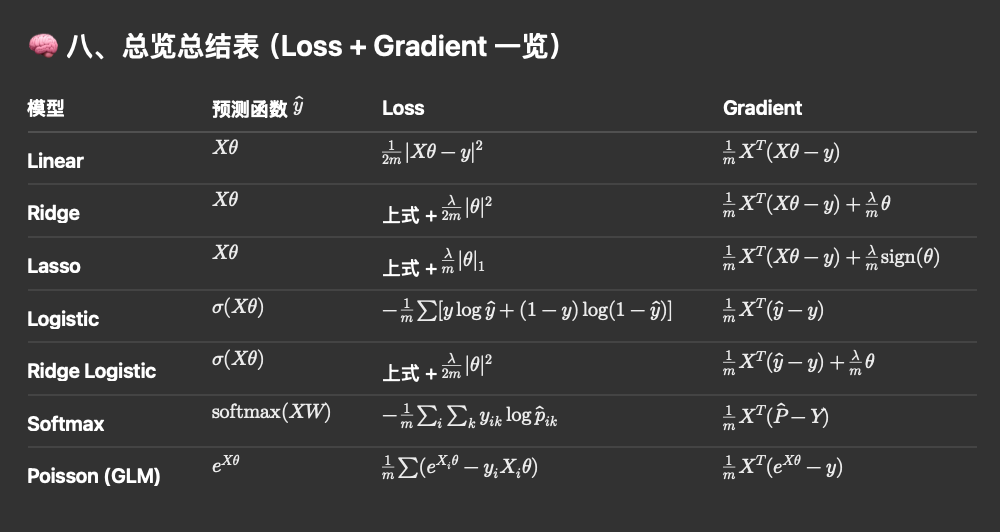

🧩 1️⃣ Linear Regression （最基本模型）

🧮 Loss（MSE）

$J(\theta) = \frac{1}{2m}\|X\theta - y\|^2$
或
$J(\theta) = \frac{1}{2m}(X\theta - y)^T(X\theta - y)$

⚙️ Gradient

$\nabla_\theta J = \frac{1}{m} X^T(X\theta - y)$

✅ 说明：
	•	优化目标是最小化均方误差；
	•	可以用解析解 $\theta = (X^TX)^{-1}X^Ty$，
也可以用梯度下降；
	•	损失函数是凸函数，所以 GD 一定收敛到全局最优。

⸻

🧩 2️⃣ Ridge Regression （L2 正则化线性回归）

🧮 Loss

$J(\theta) = \frac{1}{2m}\|X\theta - y\|^2 + \frac{\lambda}{2m}\|\theta\|^2$

⚙️ Gradient

$\nabla_\theta J = \frac{1}{m}X^T(X\theta - y) + \frac{\lambda}{m}\theta$

✅ 说明：
	•	额外项 $\frac{\lambda}{2m}\|\theta\|^2$ 是 L2 正则；
	•	可以防止过拟合，使权重变小；
	•	解析解为 $\theta = (X^TX + \lambda I)^{-1}X^Ty$。

⸻

🧩 3️⃣ Lasso Regression （L1 正则化线性回归）

🧮 Loss

$J(\theta) = \frac{1}{2m}\|X\theta - y\|^2 + \frac{\lambda}{m}\|\theta\|_1$

⚙️ Gradient / Subgradient

$\nabla_\theta J = \frac{1}{m}X^T(X\theta - y) + \frac{\lambda}{m}\,\text{sign}(\theta)$

✅ 说明：
	•	L1 正则项的导数不是连续的 → 用 subgradient（符号函数 sign）；
	•	会产生稀疏解（部分权重变 0）；
	•	常用优化器：坐标下降 (Coordinate Descent) 或 Proximal GD。

⸻

🧩 4️⃣ Logistic Regression （二分类）

🧮 Sigmoid

$\hat{p} = \sigma(X\theta) = \frac{1}{1 + e^{-X\theta}}$

🧮 Loss（Cross-Entropy / Negative Log Likelihood）

$J(\theta) = -\frac{1}{m}\sum_i [y_i \log(\hat{p_i}) + (1 - y_i)\log(1 - \hat{p_i})]$

⚙️ Gradient

$\nabla_\theta J = \frac{1}{m}X^T(\hat{p} - y)$

✅ 说明：
	•	MSE 在 sigmoid 情况下收敛慢，Cross-Entropy 是标准形式；
	•	梯度与线性回归形式相同，只是 $\hat{y}$ 不同；
	•	损失是凸函数，GD 可收敛到全局最优。

⸻

🧩 5️⃣ Ridge Logistic Regression（L2 正则 Logistic）

🧮 Loss

$J(\theta) = -\frac{1}{m}\sum_i [y_i \log(\hat{p_i}) + (1 - y_i)\log(1 - \hat{p_i})] + \frac{\lambda}{2m}\|\theta\|^2$

⚙️ Gradient

$\nabla_\theta J = \frac{1}{m}X^T(\hat{p} - y) + \frac{\lambda}{m}\theta$

✅ 说明：
	•	常用于工业实践（防止过拟合）；
	•	L2 正则不会让权重为零，但能控制规模；
	•	如果希望稀疏，可以改成 L1。

⸻

🧩 6️⃣ Softmax Regression（多分类 Logistic）

🧮 Softmax 函数

$\hat{p}{ik} = \frac{e^{z{ik}}}{\sum_j e^{z_{ij}}}$, $\quad z = XW$
其中：
	•	W 的形状是 (n_features, n_classes)
	•	\hat{p}_{ik} 是样本 i 属于类别 k 的概率

🧮 Loss（多类 Cross-Entropy）

$J(W) = -\frac{1}{m}\sum_i \sum_k y_{ik}\log(\hat{p}{ik})$
其中 $y{ik}$ 是 one-hot label。

⚙️ Gradient

$\nabla_W J = \frac{1}{m}X^T(\hat{P} - Y)$

✅ 说明：
	•	跟 logistic regression 几乎一样，只是 sigmoid→softmax；
	•	Y 是 one-hot 矩阵；
	•	这就是神经网络最后一层 softmax 的梯度公式。

⸻

🧩 7️⃣ (Bonus) Poisson Regression（计数型 GLM）

🧮 假设

$y_i \sim \text{Poisson}(\lambda_i), \quad \lambda_i = e^{X_i\theta}$

🧮 Loss（负对数似然）

$J(\theta) = \frac{1}{m}\sum_i [e^{X_i\theta} - y_i(X_i\theta)]$

⚙️ Gradient

$\nabla_\theta J = \frac{1}{m}X^T(e^{X\theta} - y)$

✅ 说明：
	•	又是同样的形式： $X^T(\hat{y}-y)$，只不过 $\hat{y} = e^{X\theta}$



✅ 九、一句话总结

所有这些模型都属于 广义线性模型（GLM） 框架：
g(\mathbb{E}[y|x]) = X\theta
它们的梯度都具有类似的结构：
\nabla_\theta J = X^T(\hat{y} - y) + \text{(regularization term)}
唯一区别在于：
	•	link function（linear / sigmoid / softmax / exp）
	•	loss 的形式（MSE / Cross-Entropy / NLL）
	•	正则化项（L1/L2）


# 🙋1 GRADIENT DESCENT TYPES
========================

There are three main variants of Gradient Descent used in optimization:

1️⃣ Batch Gradient Descent (BGD)
--------------------------------
- Uses the **entire training dataset** to compute the gradient at each step.
- Update rule: θ ← θ - α * (1/m) * Xᵀ(Xθ - y)
- Pros:
    • Produces an exact gradient (no noise)
    • Converges smoothly and stably
- Cons:
    • Very slow for large datasets (one update per epoch)
    • Requires full data to fit in memory

2️⃣ Stochastic Gradient Descent (SGD)
-------------------------------------
- Uses **a single random sample** to compute the gradient and update parameters.
- Update rule: θ ← θ - α * ∇J(xᵢ, yᵢ)
- Pros:
    • Fast updates (one per sample)
    • Can escape shallow local minima due to noise
    • Suitable for online learning
- Cons:
    • Noisy convergence (loss oscillates)
    • Sensitive to learning rate
    • May never fully converge, only fluctuate around the optimum

3️⃣ Mini-Batch Gradient Descent (MBGD)
--------------------------------------
- Uses a **small random subset of samples** (e.g., 32, 64, 128) per update.
- Update rule: θ ← θ - α * (1/batch_size) * X_batchᵀ(X_batchθ - y_batch)
- Pros:
    • Trade-off between speed and stability
    • Works efficiently on GPUs (vectorized computation)
    • Most commonly used in deep learning and large-scale ML
- Cons:
    • Requires tuning of batch size
    • Still introduces small gradient noise

🧠 Summary Table
--------------------------------------
| Method | Gradient Computed From | Noise | Convergence | Speed | Use Case |
|---------|------------------------|--------|--------------|--------|-----------|
| Batch | All samples | None | Very stable | Slow | Small datasets |
| SGD | One sample | High | Noisy | Fast per step | Online / streaming data |
| Mini-Batch | Small subset | Moderate | Smooth | Fast + stable | Deep learning standard |

⚙️ Practical Tip
--------------------------------------
In modern ML systems, "SGD" almost always means **Mini-Batch SGD** — 
each iteration uses a small random batch to approximate the full gradient.

All three follow the same core update rule:
    θ ← θ - α * ∇J(θ)
but differ in how the gradient is estimated per iteration.
"""

# 🙋 2 Principal Component Analysis (PCA) — Full Summary

## 1️⃣ Problem Definition
Given a data matrix  
$X \in \mathbb{R}^{m \times n}$
where:
- \(m\) = number of samples  
- \(n\) = number of features  

**Goal:** Find a low-dimensional representation $(Z \in \mathbb{R}^{m \times k}) (where (k < n))$ that preserves as much variance (information) as possible.

We seek a transformation matrix:
$U_k \in \mathbb{R}^{n \times k}$
such that:
$Z = X_c U_k$
where \(X_c\) is the **centered** data (zero-mean).

---

## 2️⃣ Center the Data
Since variance is computed around the mean, first subtract the column-wise mean:
$X_c = X - \mathbf{1}\mu^\top,\qquad \mu = \frac{1}{m}\sum_{i=1}^m x_i$

---

## 3️⃣ Optimization Objective
Find a unit vector \(u\) that maximizes the **variance** of the data projected onto \(u\):
$\max_{u}\ \mathrm{Var}(X_c u)\quad \text{s.t. } \|u\|=1$

For each data point \(x_i\), its projection onto \(u\) is a scalar:
$z_i = x_i^\top u$

Since the data are centered $(\bar z = 0)$:
$\mathrm{Var}(z) = \frac{1}{m}\sum_{i=1}^m (x_i^\top u)^2$

Matrix form:
$\mathrm{Var}(z) = \frac{1}{m}u^\top X_c^\top X_c\, u \;=\; u^\top \Sigma u$
with the covariance matrix:
$\Sigma = \frac{1}{m}\, X_c^\top X_c$

---

## 4️⃣ Lagrange Multiplier ⇒ Eigenvalue Problem
Maximize $(u^\top \Sigma u)$ subject to $(\|u\|=1)$:
$\mathcal{L}(u,\lambda) = u^\top \Sigma u  - \lambda (u^\top u - 1)$
Set derivative to zero:
$2\Sigma u - 2\lambda u = 0 \quad\Rightarrow\quad \Sigma u = \lambda u$

**Therefore:**
- $(u_i)$: eigenvectors of \(\Sigma\) (principal component directions)  
- $(\lambda_i)$: eigenvalues = variance explained by each component  

Sort eigenvalues in descending order, take the top \(k\) eigenvectors → $(U_k)$.

---

## 5️⃣ Dimensionality Reduction & Reconstruction
- **Projection:**
  $Z = X_c U_k$
- **Reconstruction:**
  $\hat{X} = Z U_k^\top + \mu$

---

## 6️⃣ Why Use SVD Instead of Eigen Decomposition
Directly computing eigenvectors of \(\Sigma = \frac{1}{m} X_c^\top X_c\) (shape \(n \times n\)) can be unstable or expensive when \(n\) is large.

Instead, perform **SVD**:
$X_c = U\, S\, V^\top$
Then:
$X_c^\top X_c \;=\; V\, S^2\, V^\top$

Hence:
- **Principal directions:** columns of \(V\)  
- **Variance per component:** \(S_i^2/(m-1)\)  
- **Explained variance ratio:**  
  $r_i \;=\; \frac{S_i^2}{\sum_j S_j^2}$

---

## 7️⃣ Selecting the Number of Components (k)
Cumulative explained variance ratio:
$R_k \;=\; \frac{\sum_{i=1}^{k} S_i^2}{\sum_{i=1}^{r} S_i^2}$

Choose the smallest \(k\) such that \(R_k \ge 0.95\).

```python
svals = S  # singular values from SVD
explained_var_ratio = svals**2 / np.sum(svals**2)
cum_ratio = np.cumsum(explained_var_ratio)
k = np.searchsorted(cum_ratio, 0.95) + 1
```

---
## 8️⃣ Minimal PCA (SVD) Implementation
```
python
import numpy as np

# 1) Center
Xc = X - X.mean(axis=0)

# 2) SVD
U, S, Vt = np.linalg.svd(Xc, full_matrices=False)

# 3) Explained variance ratio
explained_var_ratio = (S**2) / np.sum(S**2)

# 4) Choose k (e.g., 95%)
cum_ratio = np.cumsum(explained_var_ratio)
k = np.searchsorted(cum_ratio, 0.95) + 1

# 5) Project
V_k = Vt[:k, :].T       # (n, k)
Z = Xc @ V_k            # (m, k)

# (Optional) Reconstruct
X_rec = Z @ V_k.T + X.mean(axis=0)
```

## 9️⃣ Geometric Intuition
	•	Principal components are orthogonal axes pointing along directions of maximum variance.
	•	Components are uncorrelated.
	•	Early components capture most information; later ones are often noise.
---

## 🔟 Key Takeaways (Cheat Sheet)
| Concept | Expression | Meaning |
|----------|-------------|----------|
| Projection of a point | $z_i = x_i^\top u$ | Coordinate of \(x_i\) along direction \(u\) |
| Variance along \(u\) | $\mathrm{Var}(z) = u^\top \Sigma u$ | How widely data spread along \(u\) |
| Optimization | $\max_u u^\top \Sigma u \ \text{s.t.}\ \|u\|=1$ | Find the most informative direction |
| Eigen equation | $\Sigma u = \lambda u$ | \(u\): direction; \(\lambda\): variance |
| SVD link | $X_c = U S V^\top$ | \(V\) gives principal directions |
| Variance from SVD | $S_i^2/(m-1)$ | Variance explained by component \(i\) |
| Explained var. ratio | $S_i^2 \Big/ \sum_j S_j^2$ | Fraction of total variance |
| Cumulative ratio | $\sum_{i\le k} S_i^2 \Big/ \sum_j S_j^2$ | Info kept by first \(k\) components |
| Projection matrix | $U_k \in \mathbb{R}^{n\times k}$ | New basis (orthonormal) |
| Low-dim data | $Z = X_c U_k$ | Shape \((m, k)\) |


# 🧠 Machine Learning Model Evaluation Summary
_From Cross Validation → Grid Search → Bias–Variance Tradeoff_

---

## 🧩 1. Cross Validation (CV)

### 💡 What is CV?

Cross Validation is a **model evaluation technique** to estimate a model’s ability to **generalize to unseen data**.

Instead of relying on a single train/test split, CV rotates multiple “train–validation” partitions
so that every sample gets a chance to be used for validation.

---

### ⚙️ K-Fold Cross Validation

**Steps:**

1. Shuffle the data.
2. Split into `K` equally sized folds.
3. For each fold `i`:
   - Train on `K−1` folds.
   - Validate on the remaining fold.
   - Record the validation metric.
4. Compute the average score across K folds.

$[ E_{cv} = \frac{1}{K} \sum_{i=1}^{K} L(f_{\theta^{(i)}}(val_i))]$

---

### 🧮 Example (K = 3)

| Iteration | Train Folds | Validation Fold |
|------------|-------------|----------------|
| 1 | Fold2 + Fold3 | Fold1 |
| 2 | Fold1 + Fold3 | Fold2 |
| 3 | Fold1 + Fold2 | Fold3 |

The final score = mean of 3 validation results.

---

### 🧩 Leave-One-Out (LOO-CV)

- Special case of K-Fold where `K = N` (N = number of samples).
- Each iteration:
  - Train on N−1 samples.
  - Validate on the remaining one.

| Property | K-Fold | Leave-One-Out |
|-----------|---------|---------------|
| Validation size | N/K | 1 |
| Training size | N×(K−1)/K | N−1 |
| Training rounds | K | N |
| Bias | Slightly higher | Lowest |
| Variance | Lower | Highest |
| Computation | Moderate | Expensive |

---

### ⚠️ Common Mistakes (Data Leakage)

❌ Wrong:
```python
# Normalizing before split (leaks info)
X = (X - X.mean()) / X.std()
```

Correct:
```
# Normalize inside each fold
scaler.fit(X_train)
X_train_scaled = scaler.transform(X_train)
X_val_scaled = scaler.transform(X_val)
```

### 🧭 When to Use Different CVs

| Task | Recommended CV | Explanation |
|------|----------------|-------------|
| **Classification** | StratifiedKFold | Ensures each fold preserves label distribution (e.g., class balance). |
| **Regression** | KFold | Regular K-Fold works since outputs are continuous. |
| **Time Series** | TimeSeriesSplit | Keeps chronological order — training only on past to predict future. |
| **Very Small Dataset** | Leave-One-Out (LOO) | Maximizes training size; each sample validated once. |
| **Grouped or Hierarchical Data** | GroupKFold | Ensures samples from the same group never appear in both train and validation. |

---

### 🧠 Bias–Variance Effect of K

| K Value | Bias | Variance | Notes |
|----------|------|-----------|-------|
| Small (e.g., 3) | High Bias | Low Variance | Coarse estimate, faster. |
| Large (e.g., 10) | Low Bias | High Variance | More stable, slower. |
| Leave-One-Out | Lowest Bias | Highest Variance | Best use of data, but very slow. |

- Larger K means training sets are bigger (→ lower bias),  
  but validation sets are smaller (→ higher variance).  
- Leave-One-Out (K=N) gives the most unbiased estimate, but has high variance and computational cost.

---

## ⚙️ 2. Grid Search + Cross Validation

### 💡 Purpose

Grid Search systematically **explores hyperparameter combinations**,  
while Cross Validation **evaluates** each combination’s generalization performance.

```python
for θ in parameter_grid:
    mean_score = average_of_Kfold(model(θ))
select θ* = argmax(mean_score)
```

### 🔹 How They Work Together

| Component | Role | Relationship |
|------------|------|--------------|
| **Grid Search** | Adjusts model hyperparameters | Controls model complexity and Bias–Variance tradeoff |
| **Cross Validation** | Evaluates each configuration | Estimates model stability and generalization variance |

---

### 🧩 Example: Ridge Regression

$[J(\theta) = \text{MSE} + \lambda \sum_i \theta_i^2 ]$

| λ (Regularization) | Model Complexity | Bias | Variance |
|---------------------|------------------|-------|-----------|
| Large λ | Simpler model | ↑ | ↓ |
| Small λ | More flexible | ↓ | ↑ |

CV evaluates which λ yields the **lowest validation error**,  
achieving the best balance between bias and variance.

---

### 📊 Example Result

| λ | Mean CV Error | Std (Variance Indicator) |
|---|----------------|--------------------------|
| 0.001 | 0.12 | ±0.09 |
| 0.01  | 0.09 | ±0.05 |
| 0.1   | 0.07 ✅ | ±0.03 |
| 1.0   | 0.09 | ±0.02 |
| 10.0  | 0.15 | ±0.01 |

✅ **λ = 0.1** gives the lowest mean validation error and acceptable variance.

---

## 🧠 3. Bias–Variance Tradeoff

### 🧮 Formula

$[E[(y - \hat{f}(x))^2] = Bias^2 + Variance + Irreducible\ Noise]$

| Term | Meaning |
|------|----------|
| **Bias²** | Systematic error — model too simple (underfitting). |
| **Variance** | Sensitivity to training data — model too complex (overfitting). |
| **Irreducible Noise** | Random data noise — can’t be reduced. |

---

### 🎯 Intuitive Analogy (Target Board 🎯)

| Pattern | Bias | Variance | Description |
|----------|------|-----------|-------------|
| Darts far from center but close together | High | Low | Underfitting |
| Darts near center but scattered | Low | High | Overfitting |
| Darts tight & near center | Low | Low | Ideal |

---

### 📈 Tradeoff Curve

```
Error
^
|
| \            Total Error
|  \        /
|   \      /
|    \    /
|     \  /
|      /    Variance
|      /\
|     /  \    Bias^2 
|––/––-—————–> Model Complexity
```

- Left side → Simple models: **High bias, low variance**  
- Right side → Complex models: **Low bias, high variance**  
- Middle region → **Best tradeoff, lowest total error**

---

### ✅ Practical Guide

| Scenario | Bias | Variance | Recommended Action |
|-----------|------|-----------|--------------------|
| Underfitting | ↑ | ↓ | Use a more complex model / reduce regularization |
| Overfitting | ↓ | ↑ | Simplify model / add regularization / use more data |
| Balanced | Moderate | Moderate | Ideal generalization |

---

## 📊 4. Classification Metrics

### 🔹 Basic Terms

| Term | Meaning |
|------|----------|
| **TP** | True Positive |
| **FP** | False Positive |
| **FN** | False Negative |
| **TN** | True Negative |

---

### 🔸 Common Metrics

| Metric | Formula | Interpretation |
|---------|----------|----------------|
| **Accuracy** | (TP + TN) / (TP + TN + FP + FN) | Overall correctness |
| **Precision** | TP / (TP + FP) | Of predicted positives, how many are correct |
| **Recall (Sensitivity)** | TP / (TP + FN) | Of actual positives, how many were found |
| **F1 Score** | 2×(Precision×Recall)/(Precision+Recall) | Balance between precision & recall |
| **AUC (ROC)** | Area under ROC curve | Overall ranking ability of classifier |

---

### ⚖️ Precision–Recall Tradeoff

| Model Behavior | Recall | Precision | Example Use Case |
|----------------|--------|------------|------------------|
| Predicts most positives | High | Low | Disease detection, fraud detection |
| Predicts cautiously | Low | High | Spam filters, recommendation systems |
| Balanced | Moderate | Moderate | General classification tasks |

---

### 🧩 Choosing the Right Metric

| Scenario | Goal | Recommended Metric |
|-----------|------|--------------------|
| Disease / Fraud detection | Avoid missing true positives | **Recall** |
| Spam / Ad click prediction | Avoid false alarms | **Precision** |
| Balanced classification | Balance both errors | **F1 Score** |
| Ranking / Probabilistic models | Evaluate discrimination power | **AUC (ROC)** |

---

## 🧭 5. Summary Table

| Concept | Purpose | Affects | Notes |
|----------|----------|----------|-------|
| **Cross Validation** | Evaluate model generalization on training data | Estimates Bias & Variance | Internal validation mechanism |
| **Grid Search** | Tune hyperparameters systematically | Controls Bias–Variance tradeoff | Uses CV for evaluation |
| **Bias** | Systematic error — model too simple | ↓ with complexity | High bias → underfitting |
| **Variance** | Sensitivity to data — model too complex | ↑ with complexity | High variance → overfitting |
| **Metrics** | Quantify model performance | Depends on task | Precision/Recall/F1/AUC for classification; MSE/R² for regression |

---

## 🧠 Interview Tip

If asked:

> “What’s the relationship between Cross Validation, Grid Search, and Bias–Variance Tradeoff?”

You can say:

> “Grid Search adjusts model complexity (thus controlling bias–variance).  
> Cross Validation evaluates each configuration’s stability and generalization (revealing variance across folds).  
> Together, they help select the hyperparameters that minimize total generalization error.”

---

✅ **In one sentence:**

> Cross Validation estimates performance,  
> Grid Search tunes complexity,  
> and Bias–Variance Tradeoff explains *why* their balance determines generalization.


## Cross entropy loss
🧩 一、Cross Entropy 是个“大框架”

Cross Entropy（交叉熵）是一个通用的分布差异度量函数：

$H(p, q) = -\sum_i q_i \log(p_i)$

	•	q_i：真实分布（真实标签 one-hot）
	•	p_i：模型预测分布（经过 softmax / sigmoid）

它衡量：

模型预测分布 p 距离真实分布 q 有多远。
当 p=q 时，交叉熵最小。


## geometric median
🧩 一、题目理解与背景

给定二维空间中 N 个点：
$P = \{(x_1, y_1), (x_2, y_2), \dots, (x_N, y_N)\}$

求一个点 Q = (x, y)，
使得它到所有点的 欧几里得距离之和最小：
$f(x, y) = \sum_{i=1}^{N} \sqrt{(x - x_i)^2 + (y - y_i)^2}$

这个点叫做 几何中位数 (Geometric Median)。

⸻

⚠️ 二、为什么不能用 K-Means 的均值更新？

K-Means 的优化目标是：
$J(c) = \sum_i (x_i - c)^2$
它是 平方距离 (L2 norm squared)，
求导后得到线性方程：
$\frac{\partial J}{\partial c} = -2\sum_i (x_i - c) = 0$
于是闭式解为：
$c = \frac{1}{N}\sum_i x_i$

⸻

但是几何中位数的目标函数是：
$J(c) = \sum_i \sqrt{(x_i - c)^2}$

对 c 求导：
$\frac{\partial J}{\partial c} = \sum_i \frac{c - x_i}{\|c - x_i\|}$

这时 c 出现在分母中 → 非线性方程
没有闭式解，只能用 迭代法 求近似。

⸻

⚙️ 三、Weiszfeld’s Algorithm

Weiszfeld 算法是几何中位数的标准迭代求解法。

更新规则如下：

$c^{(t+1)} = \frac{\sum_i w_i x_i}{\sum_i w_i}, \quad  \text{其中 } w_i = \frac{1}{\|x_i - c^{(t)}\|}$

逻辑解释：
	•	离当前点 近 的样本权重 更高；
	•	离当前点 远 的样本权重 更低；
	•	每次根据这些权重重新加权平均；
	•	当新旧 c 的差距很小时，停止迭代。